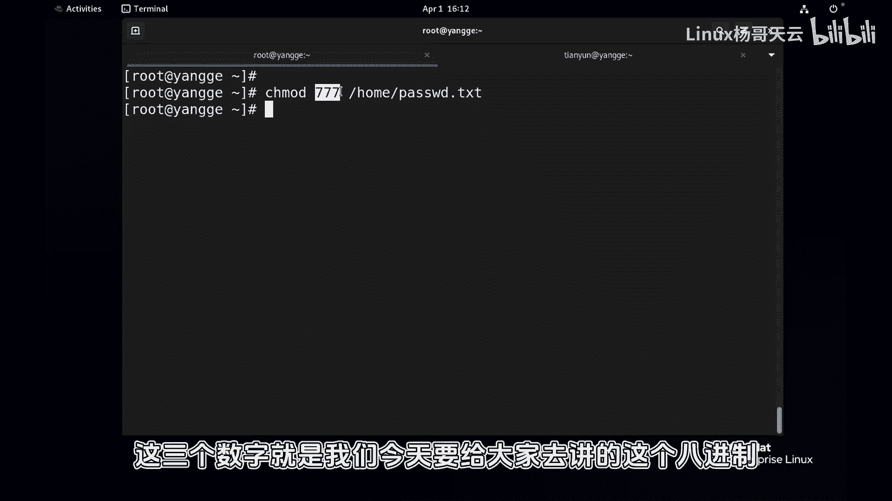
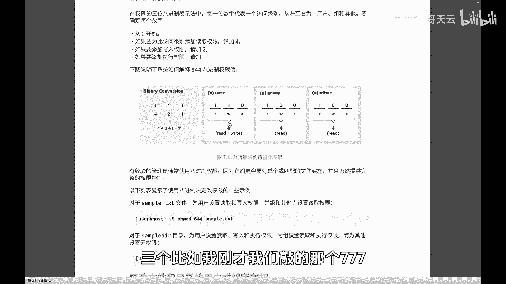
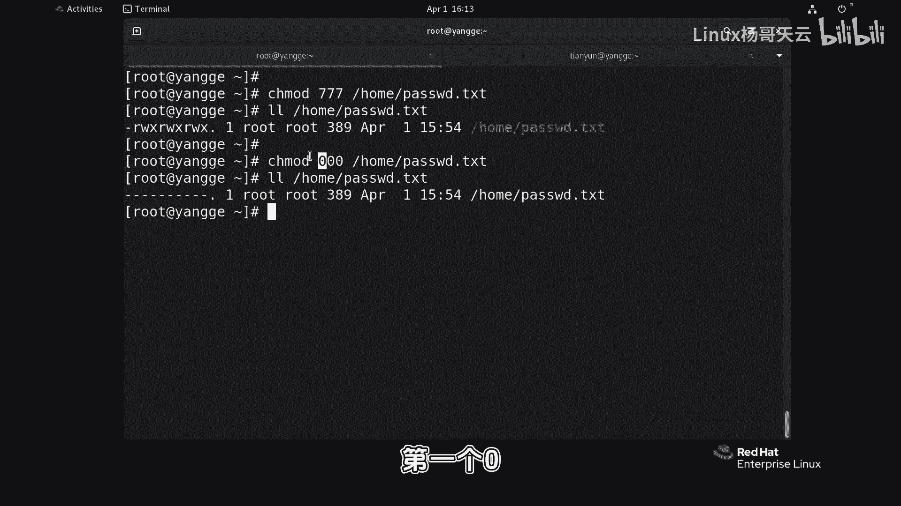
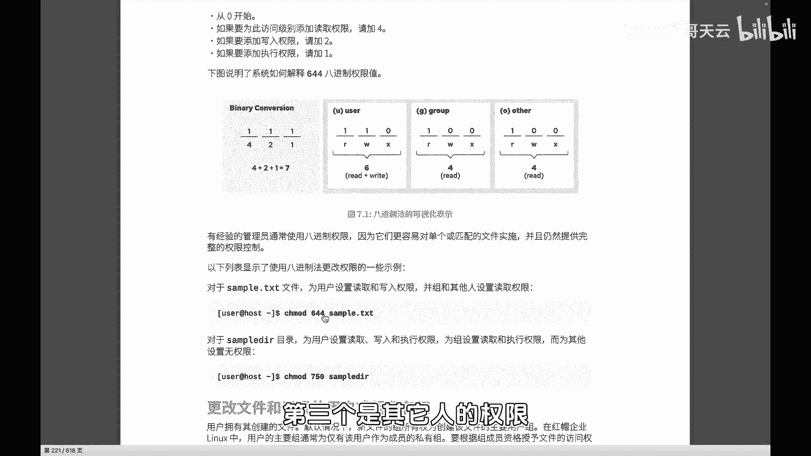
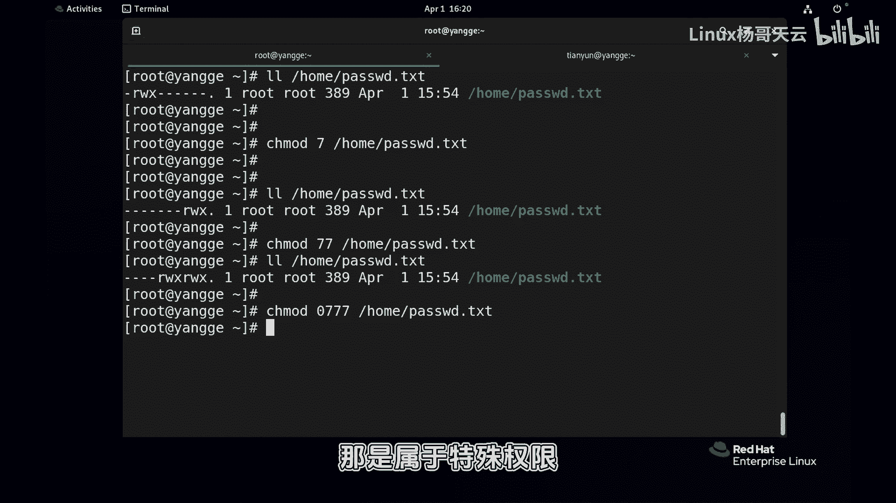
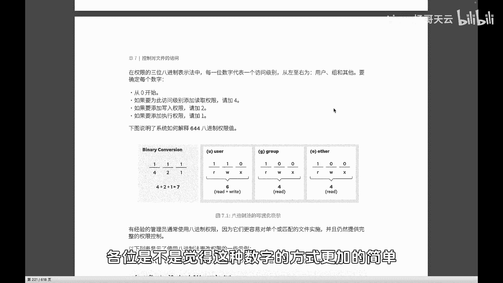

# 史上最强Linux入门教程，杨哥手把手教学，带你极速通关红帽认证RHCE（更新中） - P53：53.通过数字法更改权限 - Linux杨哥天云 - BV1FH4y137sA

那接下来我们来看一下，使用数字的方式设置权限，这个数字呢就是八进制，比如说我们现在通过CHOMOD，home下的这个password，这就是数字，这三个数字呢，就是我们今天要给大家去讲的这个八进制。

每一个数字呢代表了一个对象的权限，这个数字呢我们看一下啊，三个啊。

比如我刚才我们敲的那个777啊，777我们可以看看结果，先给大家看看结果，home下的password，首先呢这个七那代表的就是所有者的权限，也就是我们的user的权限属主啊。

然后第二个七呢它表示的是这个组的权限，第三个七其他人的权限，再或者说我们设置为比如说000home下的password，那这个结果大家看一下啊，先关于这个结果，第一个零呢就是我们的所有者的权限。

第二个里呢所属组，第三个联其他人的权限，那这边一共呢我们看到，比如说咱们这个示例当中的三个数字，644C644怎么来的呢，第一个一这个位置如果有有的话，就是一没有的话，那就是零。

那第一个一表示的是读的权限，第二个位置如果有一的话呢，那就是起的权限，第三个位置呢如果有的话，就是X啊，没有的话就是没有，就是哪个位置有一，那相相较于这个位置的权限就相当于有呃，这个位置呢表示的是四啊。

这个位置也就读的，读呢表示四血呢表示的就是二啊，然后执行权限呢就是一零的话，就是没有的话没有权限，那如果这三个位置都有标记111，那它的这个数字加起来就是4+2加一得七啊，大家只只要记住读是四，显示二。

执行就是一就可以，那我们这样的话呢，就可以来很容易的算出来这三个权限啊，比如说我们看到这个图例啊，比如说有毒有血啊，这这整个九个位置就是读写执行读写执行，读写读写执行啊，这几个位置三组嘛。

user的GB还有other那有权限的地方，他才有这个相应的数字，那对应转换来的就是我们的421好，那第一个就是我们说的四读，然后加上写二就是六，第三一个没有的话就是零嘛。

所以呢我们整个user他的这个权限就是六六，就是其实就是读和写，读是四，写的是二，那同样组的话呢，组由于它只有读权限，也就是在R这个位置上是有标记的，读权限，其他两个地方没有，那就是四后面是零嘛。

4+0再加零还是四啊，后面也是一样啊，所以这样的话就非常的简单，来获得这样一个曲线，如果都有的话，那就是读写执行也就4+2加一，4+2加一，4+2加一七，所以我们使用数字的方式来设置的话。

啊啊比方说我们看看这个下面这个例子，644刚才给大家讲过，第一个六就是谁的权限呢，是所有者的权限，那六是谁构成的呢，六就是四和二，四和二的分别是读R和写W，第二个四呢是组的权限，那不用说了，四就是毒嘛。

第三个呢是其他人的权限。

那也是读，OK那我们试一下，那这个数字权限，像刚才我们说644home下的password txt，第一个六是所有者的权限，六我们还记得是由什么和什么组成的吗，由读四和写二组成的。

所以相当于我们的所有者是由读和写，这两个呢就是毒毒，看到了吗，第一个六是他们三个加起来的和所有者的，第二个寺呢是我们这三组加起来的，和第三个字是这样的好，同样我们现在比方说随便设置一个，设置一个叫什么。

我们一起来看看755，大家想一下看回车，那755的话呢，第一个清呢就是所有者的权限，七是由4+2加一，也就相当于所有者是有毒有血，还有执行，第二个五呢是4+1的这样一个结果，也就是有毒和有执行。

但是没有写，因为写成二嘛好，所以结果你看就是这样的一个效果，所以数字摄取型呢非常简单啊，但是数字设权限呢，它跟那个字符设置不太一样，他不用考虑加还是减，他设置的就是一个居中权限啊。

你只要考虑居中权是什么就可以，那有同学问我说，那能够不写三位吗，理论上讲是不可以的，就是你设置权限的时候，你必须要同时考虑所有者组，还有其他人啊，假如说我们就设置为700也可以啊。

home下的password，我们验证一下这个结果，七零表示的是第一个七，就是我们的所有者是读写执行权限，后面那个零零呢指的是组成员和其他人，是没有权限的，其他人成圆的，但如果说你写个七。

理论上讲也是可以的，那它的是什么结果呢，你看这个权限，刚才那个七相当于007，就实际上啊他还是这个三位，那也就是说你写个777也是可以的，但这样的话不直观，那个七七就是0077。

那当然有同学说这个权限能不能写成777呢，实际上可以的，我们的权限实际上是什么，四位我们刚才那个777，严格讲应该是这样写的，0777到那个第四位权限呢，我们在后面给大家讲，那是属于特殊权限。

好数字的方法，大家看到其实呢更加的简单，你只需要去记得读是四，显示这个二，然后执行的是一，然后你分别呢用习惯以后，你就知道这个我要读写，那就是六，我要读写，执行呢那就是七，我要读呢，那就是四就可以了。

三组user group和other都设置就可以好，这是关于这个数字的方式好，各位是不是觉得这种数字的方式更加的简单呢。

