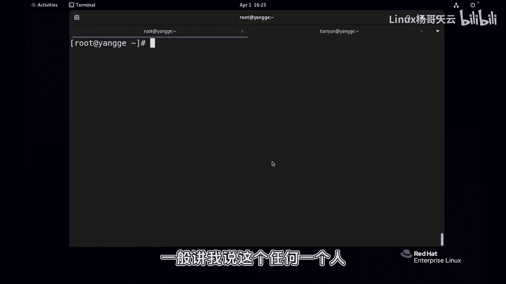
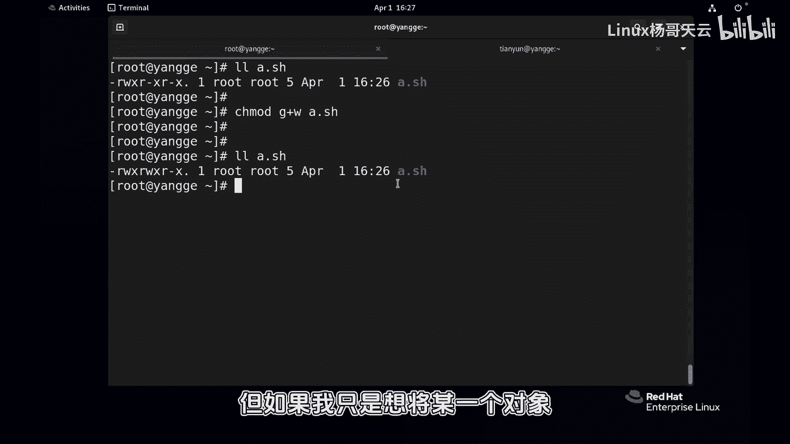
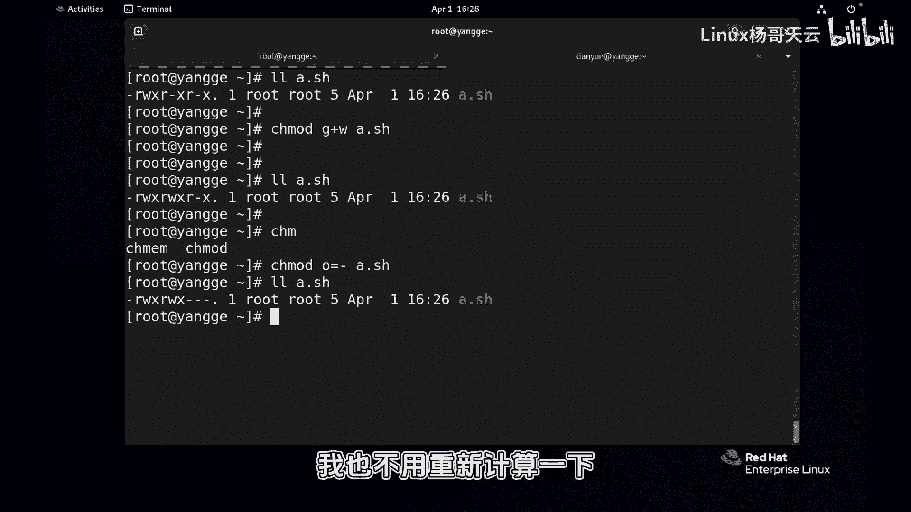

# 史上最强Linux入门教程，杨哥手把手教学，带你极速通关红帽认证RHCE（更新中） - P54：54.更改权限到底是符号还是数字靠谱 - Linux杨哥天云 - BV1FH4y137sA

好各位小伙伴。

那我们在前面给大家讲到了权限的设置方式，一个是通过符号，一个是通过数字的方式。

那到底哪一种方法常用一些呢，或者好一点。

这两种有没有各自的一些使用的场景，那一般讲我说这个任何一个人。

之所以能够在这个世界上生存，肯定有它存在的价值，那对于我们的数字和字符来讲也是这样子。

各位看这两种啊，首先使用符号的方式设置的话呢，呃有同学可能觉得使用数字的方式设置。

更加简单，比方说我要将这个文件的权限设置为所有者。

表示，也就是属主能够读写，其他人呢能够只读，还有呢组能够只读，那就644就可以了吗，home下载password点TS就可以，这个多简洁，你看同样吗，如果我想要所有人都有权限，那就777啊。

而且是那个独立执行。

那如果我想要只有所有者有权限，所有权限。

其他是没有权限，700就可以好，确实这个数字是真的挺方便，但是有一点大家别忘了。

那比如说我现在写了一个脚本，我写了一个脚本，比如像A点SH这个脚本。

脚本呢就执行一条命令data啊，这就是我一个脚本啊，现在它没有执行权限。

所以我们直接A点SH或者点极限A点SH，这是肯定不可以的。

当前的权限呢你要使数字的话呢还挺麻烦，你使数字的话呢，你还要先考虑它当前是什么权限。

或者说你你还要重新计算。

这个所有的对象的权限啊，数组数组其他人那数如果使用符号的话。

就直接A加X或者说加X就可以了，你看不需要考虑我们原有的点斜线系，当前目录下的A点SH执行没问题，那同样呢如果我只是想给什么。

我现在想给这个组成员加一个写权限。

那肯定呢最简单的方法G加W就可以了，ADSH没必要去考虑那么多。

如果使数字你还要重新去计算原有的数字啊。

它最终是什么权限，所以没有没有说绝对的。

这个数字的方式一定比符号的要强，这个不是你就看什么场景，简单的讲就是如果说你前面的权限都推倒重来。

不要了，也不用关心原的什么权限，你连看都不用看，我就是最终告诉你就是什么什么人。

什么人，什么是什么权限就可以了，那使用使用这个数字，但如果我只是想将某一个对象。

比如说我只想给所有者什么权限，我只想减掉这个O减掉O等于什么。

等于杠杠也行啊，杠的话表示没有权限啊，或者说就相当于减一样啊。

看其他人就没有权限，我完全不用考虑原有的权限，我也不用重新计算一下啊。

如果不小心计算错的话，那还挺麻烦，所以这个这两种都有它的场景。

我有时候觉得使用这个符号的话更加严谨一点，应该明确的给到了。

说谁能get数字的话呢，当然也非常方便，这段的话两种方式，各位看大家自己的一个场景。

一个需求就可以啊，总的来讲，如果说你想一切原来的权限不管了。

三个对象都不管了，我要新的数字挺快的啊，或者说符号也也可以啊。

符号A等于读写执行也可以，然后你要想只是一些某一个对象的一个灵敏改。

局部的一个改变，那我觉得符号呢也是非常棒的一种方式。

就像刚才一样的举的一个例子。

