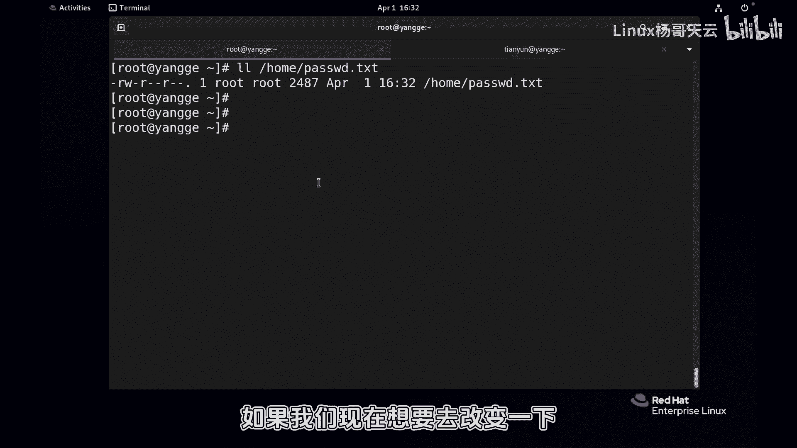

# 史上最强Linux入门教程，杨哥手把手教学，带你极速通关红帽认证RHCE（更新中） - P55：55.更改文件属主属组chown chgrp - Linux杨哥天云 - BV1FH4y137sA

好各位小伙伴，我是杨哥，那么在前面给大家讲到了，数字和符号的两种方式更改文件权限，那实际上呢我们在改文件权限的时候呢，还会配合另外一个模式，就是改文件的属主和属组，这个大家听明白了吗。

就是这个文件我们可能要改变它的，比方说我现在重新啊，把那个home下的password文件先删一下，再copy一个过去，新的过去啊，etc password到home下的password点TXT。

OK就这个home下的password DC好，当前我们看到这个文件的所有者是root组呢，是这个root组啊，如果我们现在现在想要去改变一下啊。

改变一下所有者，比如改成天云，那这个时候呢天宇用户的权限就变了，那么在改之前呢，我们先通过天翼用户好，这是这是天用户啊，看一下home下的password读，没问题，写的话呢应该是不行的。

好比如说打开home下的password txt写实只读，看到下面的吗，各位因为他现在的权限作为天翼用户来讲的话。

他是个锁，他是其他人，Other，他不是所有者，也不是组成员，OK那现在我们怎么改呢，我们要改的是文件的这个叫做输入，还有输入，这里其实会涉及到两个命令，一个是CHGRP，一个CHOWN。

但是我个人觉得有一个命令就够了，CHGRP呢从字面意义上大家可以看得出来，它只是改文件的属组的，当然这个组必须存在，好比如说我们可以看看啊，在EDC下有没有呃，group里面有个叫i it的组吗。

好有我这边有个it的组，里面恰好还有这些用户，可现在这个组存在，如果我们单纯的只是改组的话呢，那就使用CHGRP后面跟上我的名字，IT再跟上我们要改的对象，也就是根下的home下的password。

password啊，好清下屏，我们再看一下当前这个文件，大家看到这个组就变了啊，这个组变的话呢。

这个组中的成员也就是会一会得到相应的权限，呃，这个组当中应该是。

刚才我们看到是没有这个天云的吧，呃这里面没有天云用户，所以天宇呢也不可能从这儿获得这个权限，那现在如果来改改组的话呢，就是这么简单，CHGRP是它只是改组的。

那我们下面这个命令呢，CHOWN这个命令呢是既能够改组，也能够改所有者，同样让大家先见证一下这个文件的啊，这是那个文件啊，然后我们CHGRP你先改回来吧，改成root组，先把它改回来。

还原到那个最初的状态好，现在看看啊，CHOWN它来改所有者，所有者是天云用户，同样呢组了是IT组，这边就我又喜欢用点儿，但是很多人喜欢是冒号，这两者没有啥区别，结果是都是可以的，你换成冒号也可以啊。

他就是你相当于这个点儿了，就是楚楚河汉界一样，左边是新的所有者，右边是新的祖，各位看看这个结果，看到了吗，现在我没有设置权限，我没有改权限，刚才我们也看到天云用户是读是写不了的。

现在我们天翼用户能不能写呢，同样我们发出我们的灵魂三问，天云用户对这个文件有什么权限好，首先天音乎是所有者吗，是那他就有读写权限，那就不用往后看了呀，对不对，他已经是所有者了。

所以天鹰用户现在能够读这个文件home下的password，点TST也能够呢去写这个文件啊。

怎么写呢，那你用任何的写工具都可以。

home下的password，你看现在删除删除删除删除，我们删到最后几行可以了。

看到了吗，这是改了文件的所有者，同样这个也是根据我们的需要来改，比方说我们想将这个文件的所有者还是天语音，但是呢我将它的组呢不是it呢，而是改为root，那当然有同学们说可以使用CHCHGRP，没问题。

刚刚也给大家试过了，CHOW能不能改呢，那像这样写成root可以可以吗，不可以，因为这样的话它区别不开，这是左边还是右边，其实呢这就是左边啊，因为你没有写点儿，也没有写冒号。

他就认为你写的是前面的所有者，所以这个时候呢我们可以在这加个点或者冒号，那前面相当于不改，不改的话就留着呢，猫后面是新的组，这大家看明白了吗，所以CHOWN这个命令叫change owner。

它可以同时改变属组，还有属组，它也可以改变呢，属组就是组啊，我说的主是主人啊，owner组呢是group，你看看这个结果，那它当然也可以改什么呢，它也可以只改前面的这个叫所有者，没问题，你看结果没有写。

后面呢他就改成爱丽丝，这大家看明白了吗，那我们现在有这样一个要求，比方说我们这是一个新建的一个文件，我们出于安全的需求，我们将这个文件的所有者改成天云，然后组呢不改了，然后我们的权限是什么呢。

我们权限是只有所有者天翼云能够读写执行，其他任何人没有权限好，那我们就做两步，第一步是通过CHOWN，将所有者改成天语音啊。

组不变吗，看到了吗，组变这是第一步，第二步呢我们通过数字的方式更简洁，700好，最后两步完成这个效果好，我们的要求就是这个文件，天云用户有读写执行权限，其他人没有任何权限。

那我们就把这个文件的所有者给天云就可以了，好那这样的话呢。

就是我们刚才刚刚才给大家讲到的，就是用到的CHOWN和CHGRP，来更改文件的这个属组或者数组。

GRP只能改组ow本呢既能改住那个所有者，也能改属组，当然各位实际在使用的时候没有那么简单，我们会遇到各种各样的问题，所以呢在接下来我会给大家去详细再讲一下，书上一些没有讲到的点啊。

