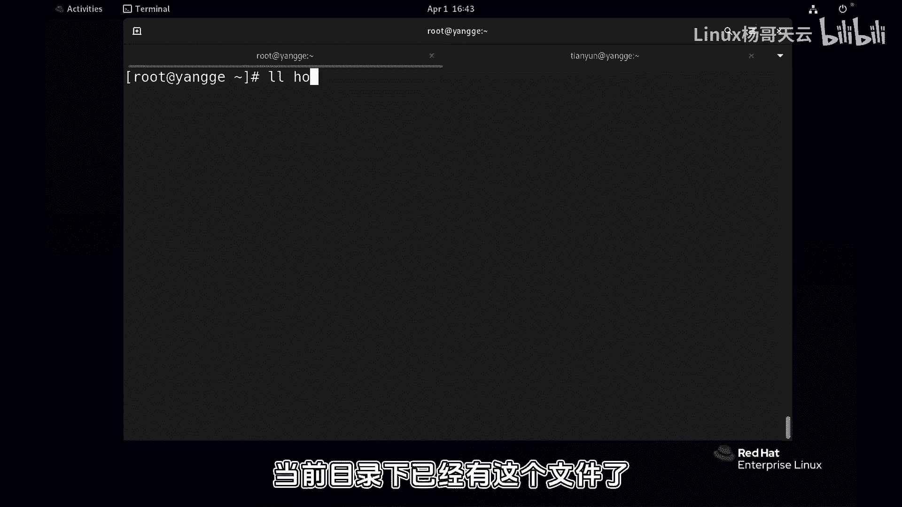
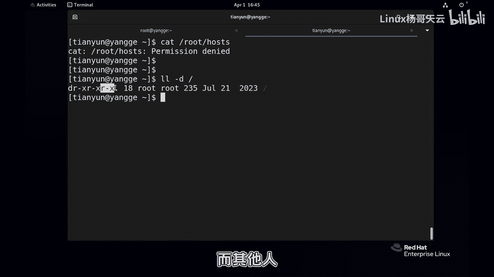
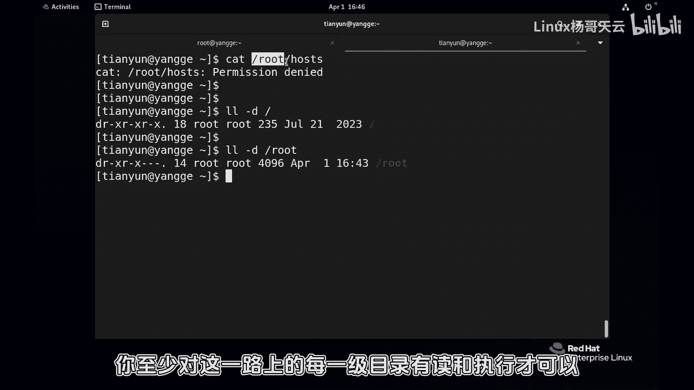

# 史上最强Linux入门教程，杨哥手把手教学，带你极速通关红帽认证RHCE（更新中） - P56：56.灵魂拷问一：有权限就一定能访问？ - Linux杨哥天云 - BV1FH4y137sA

好小伙伴们。

我是杨哥，接下来我们进入到权限设置的灵魂拷问一，有权限一定能访问吗。

首先我们来建一个建一个场景，在这边呢我们拷贝一个文件，简单一点到当前目录看到了吗，好当前目录下已经有这个文件了啊。

现在呢我们比如说问一下天元用户。

对该文件有没有读权限呢，答案是肯定有的，因为第一他不是所有者没关系，他不是左上员也没关系，但是他其他人其他人的权限呢是可以读的好。

这个文件在哪个地方呢，它的全路径在这儿，在root下的这个叫做host。

这个文件看到了吗，全路径，OK那我们来试着cat一下root下的hosts。

好，直接给我们一个permission delight。

这就回到我最初说的一个问题，你要想访问，首先得经过这样一个步骤，第一你要想进到我家里面，拿到我家里的钱，院子开开，有钥匙，你还能进到我的门啊，啊保险箱钥匙就算给你也没用，因为你得先进院子，然后再开门。

然后呢保险箱钥匙给你了啊，OK我们先看根。

就是一步一步的，你也就是说你要访问到这个文件，不管你是读还是写还是执行。

你首先得访问到这个路上的一切第一根目录，然后呢再是root目录，然后再是这个，也就是说这相当于我们家的院子，这相当于我们家的小门呢。

这相当于最终那个保险柜的那个那个位置，这个位置是给到你权限的，看到了吗，兄弟们是不是给到你权限的。

但是前面我们看看能不能给到呢，好看目录的话，请使用杠D好，同样我问大家，我们的天运用户刚才是被根给阻拦了吗，他对根没有权限吗，那天翼用户首先不是这个根目录的所有者，那这个权限跟他没关系。

也不是这个偶数组的成员。

那这也没关系，但是我们天翼用户是什么，是其他人。

那对于一个目录来讲，各位读和执行并不可怕，读的话呢表示可以看到目录里面的内容，而执行呢表示可以进入到这个目录，如果说连这个读和X都没有的话呢。

那基本上你对一个目录是进去看的，权限是没有的好，所以刚才可见并不是这一层阻止的。

哎我们接着往下看，杠d root是这个地方吗。

啊首先还是我们的灵魂提问呢，来第一个天音用户是所有者吗，不是所以这个权限跟他没关系，那天翼用户是这个组成员吗。

也不是，所以跟他没关系，那天元用户只不过是其他人，所以你想要访问这个文件。

你得这一路上全部开挂才可以，你至少对这一路上的每一级目录。

有读和执行才可以，否则的话你连目录都进不去，何谈访问你终极的那个位置呢。

这是我跟大家要强调的，所以我们不能在我们的家里面。

通常我们在家里面呢这个加目录，任何一个用户的加目录，包括我们在新建的用户。

在home下面新建的每一个用户，不管是test01还是天运营还是user01，他们的加目录都是一个默认。

给到一个比较什么私密的权限，别的用户是仿不了的，只有所有者不去执行，其他用户没有权限，所以这是我给大家讲到的。

有权限一定能把握吗，不一定，你得从根开始，每一集，直到我达到我们这个文件的这个位置，至少每一级目录我们都有读和执行权限。

好注意这个执行对于目录来讲不是执行，而不是那个像像那个脚本一样执行，是进入目录，所以我们认为对于一个目录来讲，如果这个目录呢，我们是需要用户访问下面的内容。

