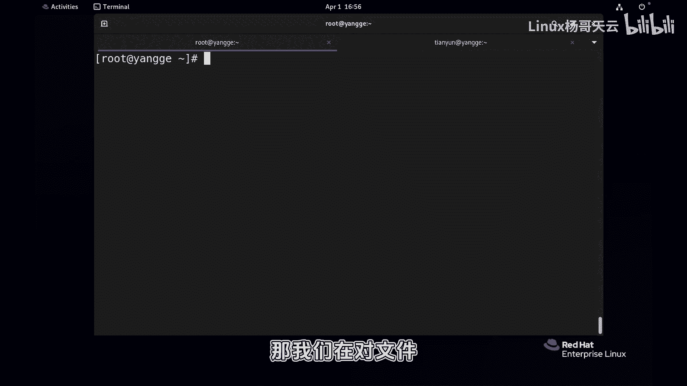
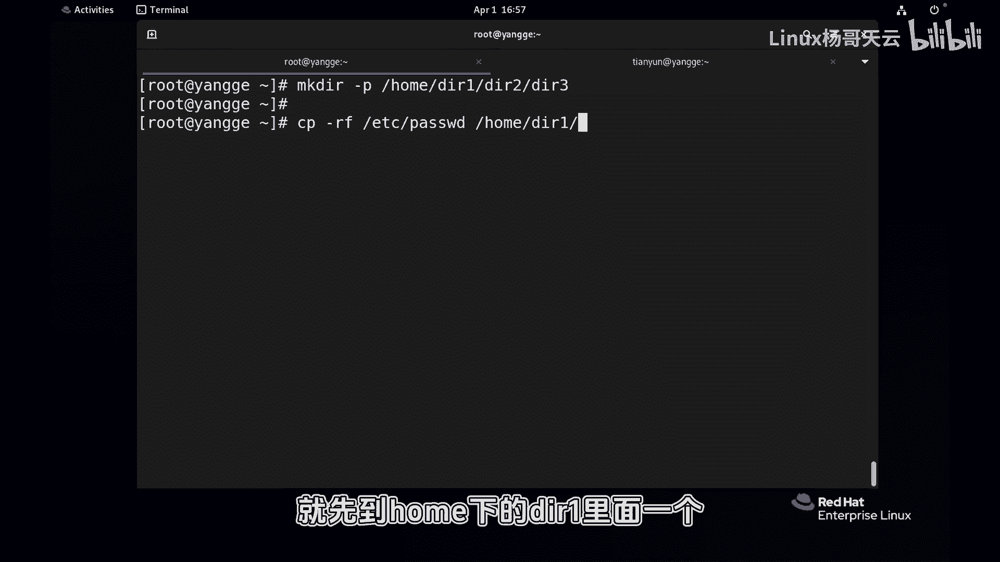
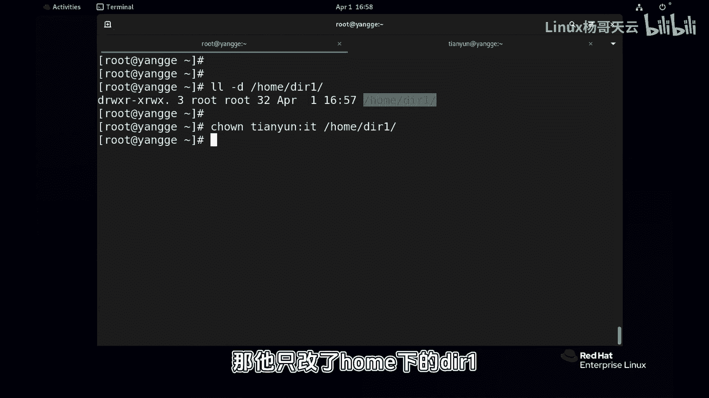

# 史上最强Linux入门教程，杨哥手把手教学，带你极速通关红帽认证RHCE（更新中） - P58：58.更改文件权限别忘了-R - Linux杨哥天云 - BV1FH4y137sA

好，各位小伙伴，杨哥再来讲一下文件权限的一个注意事项，也就是递归。那我们在对文件，无论是改文件的所有者和所有组的时候呢，还是在设置权限的时候呢，都有可能有这样一个场景。

比如说有一个目录，它下面有很多文件，还有目录。那我们希望整个目录，包括下面的这个文件都能够设置相应的权限，或者说这个改相应的组合输入和输组，这个时候用到递归。好，先准备一下场景。

比如在home下建立1个DR一在下面建立DR2，先建DR3啊，然后这个目录啊不可以，因为这个用到了这个附目的一块创建啊。好，先建立好。然后紧接着呢。

我们拷贝一下文件到里面去拷贝1个EDC还的pass word到哪去呢？

就先到home下的DR一里面一个啊，然后再拷到DR1下的DR2里面一个再考到DR3里面考一个。好，这什么什么效果啊？我们可以使用train命令看一看啊，TREE这个home下的DRE好。

就现在于是这么一个一个股。在DRE下面呢有一个paswordDR下也有一个D3也有一个好，那相当于模拟了一下这个场景啊。😊。

嗯，然后呢我们如果说要改鼠主属组，首先看目录的话是杠D啊，home下的DIE。

它是这个输入输组默认。其他的下面的目录肯定也是这个谁创建的话，就是谁？我们现在如果说改数组数组，把数组改成天翼云组改成了这个IT那你要这样改没问题。那他只改了home下的DR一，我们可以来再看一下。

是不是？那DR一下DR2呢没有改。😊。

那这个时候就可以用到递归。如果说你希望整个目录到下面全能改递归啊，递归之前cobe的时候也见过，从当前目头下面所有的目录递归。好，我们可以再看一下这个结果。

DR2也是包括下面的DR2下的password也是全部都是的啊，从反正是从DR一下面呢。

全都改了啊，这个大家能听懂吗？所以我们在改文件的，包括CHGRP也是一样，同样是的杠R递归啊，没问题啊，这是改文件的数主数组的时候。那如果改权限的时候呢，也是一样啊，不管是数字还是字符。

我们就拿这个数字来讲吧，CHMD比如说75500啊这样一个权限。😊。

home下载DR一你回收的话呢，它肯定也只是作用于这个目录700这多好。你看它只是作用于DR一目录本身。你往下再看的话呢，DR2没有改。

啊，如果说有这样一个需要的话，我们希望整个都能改的话呢好递归一下。

再看看DR2改掉了，DR下的DR3也改掉了，包括DR3下的password也改掉了。所以递归的话呢，针对文件文件肯定是没有用的。因为文件下面是没有内容了，主要针对文件夹如果我们希望针对文件夹。

还有下面的这个相应的文件，有这个统一的设置。无论是这个统一改成新的数组数组还是呢去改权限，那我们都可以用到杠R递归啊，这个递归和之前是一样的。好，所以大家别忘了这个杠R这个选项递归。😊。

