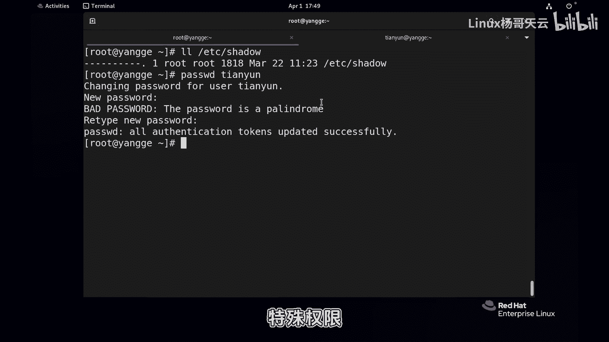
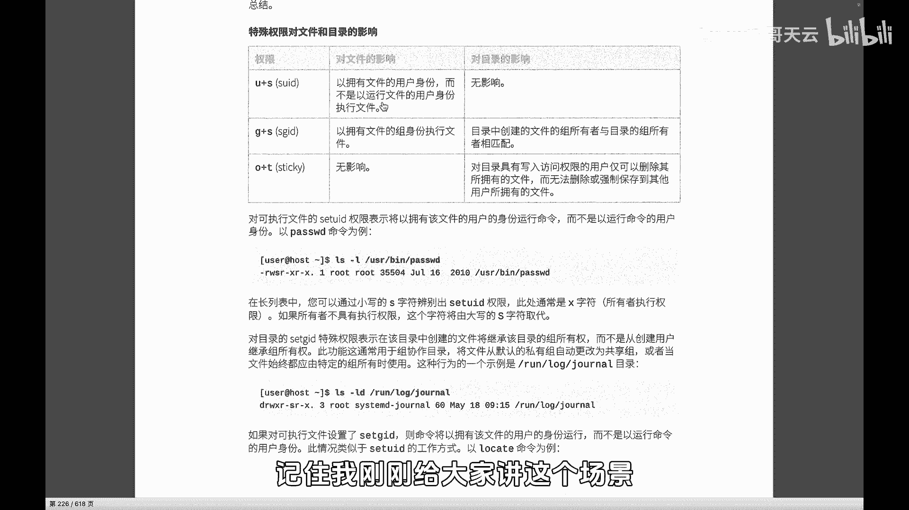

# 史上最强Linux入门教程，杨哥手把手教学，带你极速通关红帽认证RHCE（更新中） - P59：59.为什么普通用户可以改密码suid - Linux杨哥天云 - BV1FH4y137sA

🎼哦，各位小伙伴们，我们继续来看文件权限TTC下的sder文件。这个文件大家应该都很有印象啊。这个文件呢是保存用户密码的一个文件。大家看它的安全等级真的是很高，没有人有权限，是吧？🎼当然。

文件的所有者这个除外的啊，那这里就会有一个问题。我问大家，普通用户如果改密码，他能成功吗？这是一个普通用户啊，原始密码啊是多少，应该是一样。然后不知道的话，我现在改一下嗯，天约用户。🎼一好，我改了一下。

管理员改肯定没问题。我想问的是，普通用户他能改吗？他能像这样回车去改吗？如果他能改，这好像不对，好像两个地方说不过去，因为改的话呢，肯定最终呢是要去改的是这个叫shale文件。

他的密码肯定是要去改这个文件的。而这个文件本身作于普通用户来讲，是没有权限的。🎼连读的权都没有，你可以看一下，可以甚着看一下啊，看一下EDshaow啊不说写连读的权限都没有。所以呢理论上讲是改不了的。

好，回车普头一我改掉要强壮的密码啊，强健的密码才可以啊。所以它的这个密码的安全性是要求很高。那这边我就改一个复杂的啊，我输了很多，确保两次数字是一致的。好，回车了。😊，大家看到密码是更新成功了。😊。

🎼那可见他应该是改了这个文件，他肯定是改了啊。刚才我忘了给大家看一下这个shader文件的MD5值啊，原始的MD5值。他应该是发生变化。🎼所以呢他是怎么做到的呢？各位，这就是今天我们要讲到的特殊选项。

😡。

🎼首先，特殊权有三种，一种叫啊SUID一种叫STID，还有一个叫take特殊权限。🎼那么也就是说这个特殊权限呢，它是在我们基本的属主属组，还有其他人的之外的第四种权限。这就是我在一开始给大家讲过。

权限并不是三位，而是4位。🎼那，我们就算输的777，它其实应该叫0777，那还有特殊权项。好，刚才是怎么做到的呢？我们来一探究竟，大家可以想象一下，我在这边给大家这样来梳理一下，刚才我们看到的是。

筛到我这个文件连看都看不了，对吧？😡，🎼他用的是哪个命令看呢？他用到的是cat这个命令啊，ca在这儿。所以我们可以这样理解啊，我刚才那个一开始那个现象，我们整个来讲解啊，大家仔细看天明的一个用户。

他使用的是USR下的B下的cat。🎼来查看EDC下的sha文件。最后呢结果是no6权限，为什么？因为我们这个sha文件权限非常的严格，你看了看不了。🎼那各位这能改变什么才能达到这个效果？改变用户。🎼对。

如果我们使用SUID啊，如果我们使用那个速速度，这肯定可以。我们现在不使用我们现在这个用户也本身也没有这个权限啊，这个用户改变不了，也就相当于我现在你想要让我特别有钱。😊，🎼第一，改变我的身份。

我一出生就是出生在这个豪门，这个做不到。我没有那样的一个场景，所以这个改变不了。🎼那你说那你能不能不要有钱，你留点别的行吗？我说那也不行，我就是想有钱。😡，🎼所以你看啊用户改变不了。

最终的这个要做的事情改变不了。好，那唯一改变的是什么？工具就是那个程序大家可以这样理解啊，就是我们现在是一个普通的老百姓，然后呢我们现在去这个工具去审判审判一个贪官，我们是没有权限的那怎么办？好。

如果说现在中间这个工具是一把上方宝剑呢，这就不一样。以我们接受不能改变的改变能改变的大家有没有听懂用户我我是一个普通用户我就想看那个shaow文件我改变不了我身份改变不了了。

那这里呢这个shadow呢我不可能切换成入用户吧？文件的权限，这个我也做不到，因为但是我想看那我就改变工具。好，这边我的操作肯定不能在这操作啊，我在这边操作各啊，刚才那个sha在哪？刚才那个是好。

各位请请仔细看啊，定下现在他是没有特殊权限的。好如果我给他加一个特殊权限。😊，🎼这个U加S定下的cat，大家观察一下这个地方呢，咱别说它红不红色的问题，这儿变成了S，也就是我们的第四种权限的介入了。

现在如果再来看，你看啊，我这边conr一下啊，各位再来看一下sha可以看可以成功了。也就是说我们刚才还是填语音。然后呢，紧接着呢用到的工具还是USR并下的cat，看到的文件是一个我们都无法企及的文件。

但是呢工具换成了上方宝剑。听明白了吗？🎼换成了商务宝剑，你在用这个工具的时候，就不是以你的身份在运行，而是以文件的所有者的身份，不是以以你的身份，而是以什么文件的所有者的身份。

🎼相当于他有一个我金的所有者是谁呀？我们看看文金的所有者是root呀。

🎼那所以呢你在任何用户在执行这样一个程序的时候，他并不是以他自己的身份的权责运行，而是以这个文件的所有者的身份运行。🎼那大家明白了吗？就是我们你看这个整个里面用户没有变要做的事情，看这个文件没有变。

变的是工具，把一把普通的工具变成了上方宝剑。所以你可以了啊当然要改过来的话呢，就是相反的UGS看到了吗？结果右变这个样子，那这个道理就说得通了。天音用户是那个pass word的时候，他要改筛的文件。

那我们就可以看看我们的pass word这个命令啊，不是那个ca啊，是pasword，也就是天音用户他要使用了USR下的啊。😊，🎼并下的password，然后去最后呢改密码的话呢，肯定要去写文件。

不还不是读是写是W这个文件它成功了吗？yes成功了，我们看到成功了。因为这个文件上面就有一个自带的SUID换句话讲，任何用户在运行这个程序password程序的时候，注意这个程序呢。

它并不是以用户本身的身份运行，而是以这个文件的所有者身份，一般情况是root。所以我们可以大概的理解为我们在一个普通用户在运行这样一个工具的时候，相当于我们拿的就是上方宝剑，我们就有皇帝的权利。

这大家听明白了吗？那同样如果说哥们，你敢把那个RM命令也搞一个，也就是把那个USR下并下的RM这个命令，你也加一个SUID的话，那后果就不堪设想。就任何用户在执行RM的时候。

它的就是什么权利呢指ro的这大家有没懂就是SUID能干嘛呢？能够让你在执行一个程序。😊。

🎼时候啊不是一个普通文件，而是在执行一个文件的时候，你能够不管是一个脚本不行啊，是一个一般指的是这种二进制程序。你在执行这样一个二进制文件的时候，那么它会以文件的所有者的身份运行。一般情况是ro的。

而这个功能对目录没有影响。你只要记住对文件就行。你只要像刚才杨哥讲到的，你去给这些个工具增加这样1个SUID那自然呢这个工具就变成了一个超级。😊。

🎼好，所以我们一定要刻别小心。那有同学可能会问我一个问题说那这么说的话，那我还能改入的密码呢？是这样的吧，答案是不可以。😊，🎼这个并不是这个工具不能用，而是这个工具系统有限制。

🎼只允许root用户可以指定用户名。换言之，你就算是天云用户，你也不可以这样用。🎼比如说这是干嘛呢？这是防止。🎼你使用一个超级工具，你去指向皇帝，这是不可以的，就是皇帝有规定，你拿着上方宝剑。

但是对皇帝没有效。好，各位这个听明白了吗？我们系统当中有很多这样的一些程序。那么这样的方法其实也是在给普通用户提权，就是让某一个程序在运行的时候。

你可以找到USR并下的很多我说的是你可以对根据需要啊来设置这样的一个SID设置方法，刚才给大家已经展示过了。我们刚才使用的是这个叫做加方式实际上呢它是有数字的啊，它的数字也是421怎么讲呢？

这样给大家来看啊，我刚才它是也有数字SID它的推的数字就是跟那个一样好，我们可以这样来看啊，你看我假如说随便创建一个文件有了，是当时可能是设置过的。

当时应该是这样一个设置就是用的是77774个7第一个的位置就是我们的第四种权限啊，也就是我们的第四种权。😊。

🎼呃，四种学里面呢，相当于把我们的三种。

🎼SUIDSGIDO加T全用上了421，同样支持数字，也可以支持符号的方式。这个我后面再给大家强调一下啊。好，大家记住这个SUID是干什么的。记实我刚刚给大家讲这个场景。

