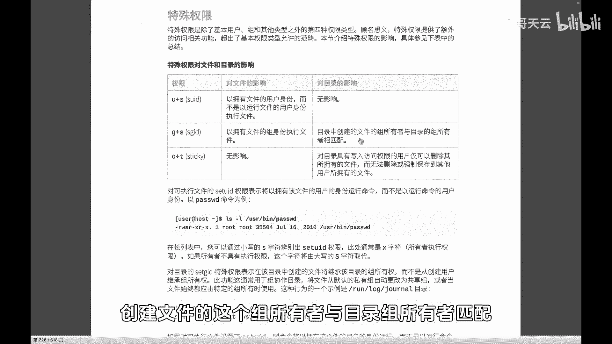
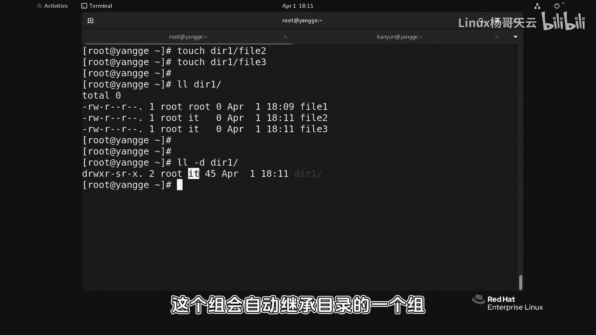
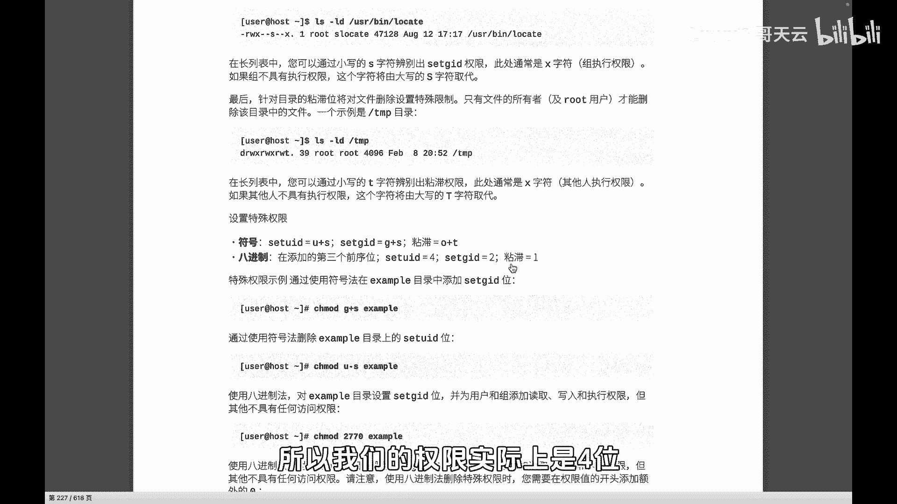

# 史上最强Linux入门教程，杨哥手把手教学，带你极速通关红帽认证RHCE（更新中） - P60：60.怎么才能让新文件跟他爸姓？sgid - Linux杨哥天云 - BV1FH4y137sA

🎼好，各位小伙伴，那我们刚才给大家讲到了SUID主要针对文件。然后用户呢对这个文件在执行的时候，一般是二性制文件，在执行的时候呢，能够以这个文件的所有者身份，通常当然就是root身份去运行，相当于提全。

🎼然后SGID呢，它也可以针对文件。但一般情况呢，我们可能使用的场景偏多的是针对目录。按照这个字编解释，就是目录中创建文件的组创建文件的这个组所有者与目录组所有者匹配啊，感觉读了也跟没有读一样。好。

那下面我们准备一个场景。各位我们在这创建一个目录啊，这个目录呢，大家看我们把这个目录的所所熟的组改一下，改成IT这个组，我们来检验一下。

🎼现在呢已经改成了ID这个组。此时此刻我们在DIE下面创1个fill一的文件。好，这个没有问题。我们再来看一下DIE下fillE文件的一个权限啊，权限呢好像大家看到没有什么X啊。

这个一会儿我们会讲到那个默认权限，咱别管那个先管后面这一点，大家看到他并没有继承他爸的这个信儿。😊，🎼这个目录呢，他的爸爸是DRE，他的所属组的是ID组，但是他没有继承，但是我们想要继承。

这个时候就可以请上我们的G加S就是SGID注意针对目录啊，针对文件我刚才讲过这种有很少，场景很少。我们对DIE目录设置。🎼设置完以后的效果呢，看看DIE目录本身啊。

它这边多一个S就给我们的S接那个UID1样。SUYD是这个地方变成S而这边它是这儿变成S。你但别忘了后面还有X权限，因为没有其他位置可以显示嘛，所以他们挤到一起抱团取暖。好，我清一下屏。

各位再次来在在DI一下面创帘fi2，甚至是不3。好，我们仔细来看一下三个文件。🎼好，我们看到会耀一那是之前创建的，因为那个时候目录上没有SGID。🎼而2和3是在后期创建的。

是这个目录已经有了这个SGID的这样一个权限。所以呢从字面意字上也可以看得到，就是当一个目录它具有SGID的这个权限的时候，它下面创建的新文件，新的文件或新的目录它的这个组这个组会自动继承目录的一个组。

这大家明白了吗？它会自动继承目录的组，所以这是这样一个意思，我们一般很少对文件。那这种场景我也给大家后面找一个大家主要记住SUID针对的是文件GID主要针对的是目录在目录里面创建新文件的时候。

自动继成目录的组啊，我们一直使用的是符号的方式设置UID是加SID呢是G加S那还有一个特殊权限。我们后来给大家讲加这种方式数字的话呢就是421就相当于我们的读写执行所以我们的权限实际上是4位。

