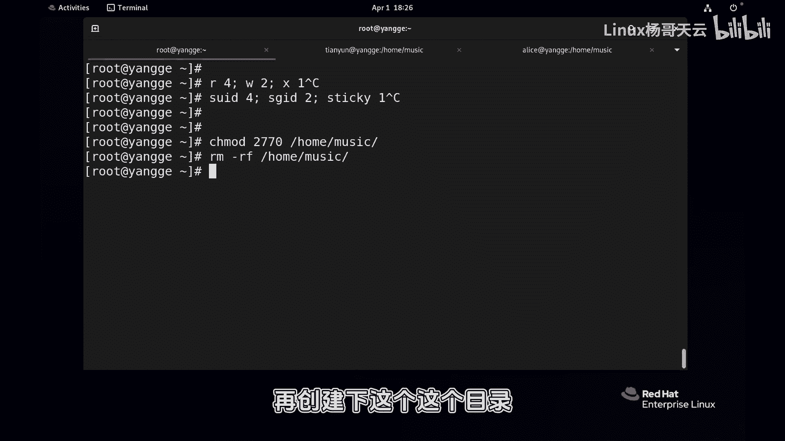
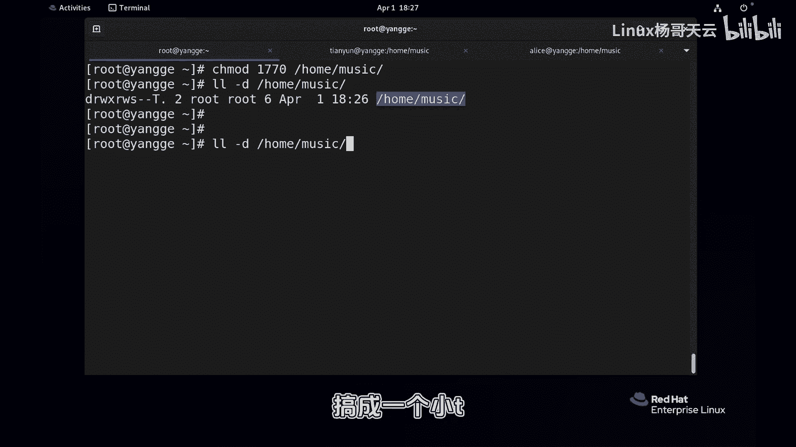
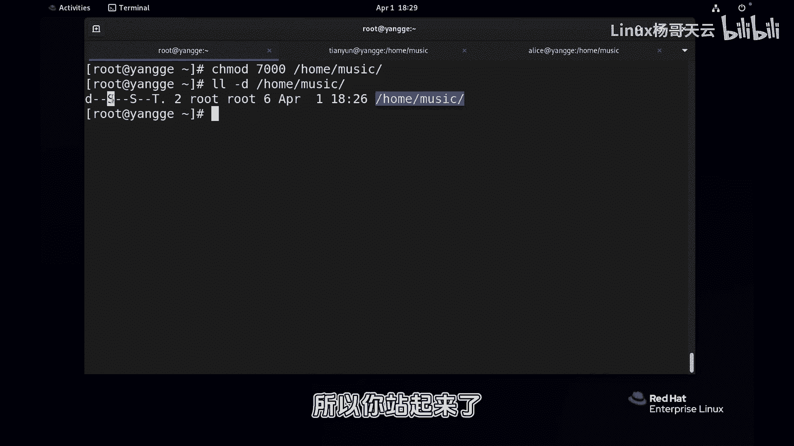
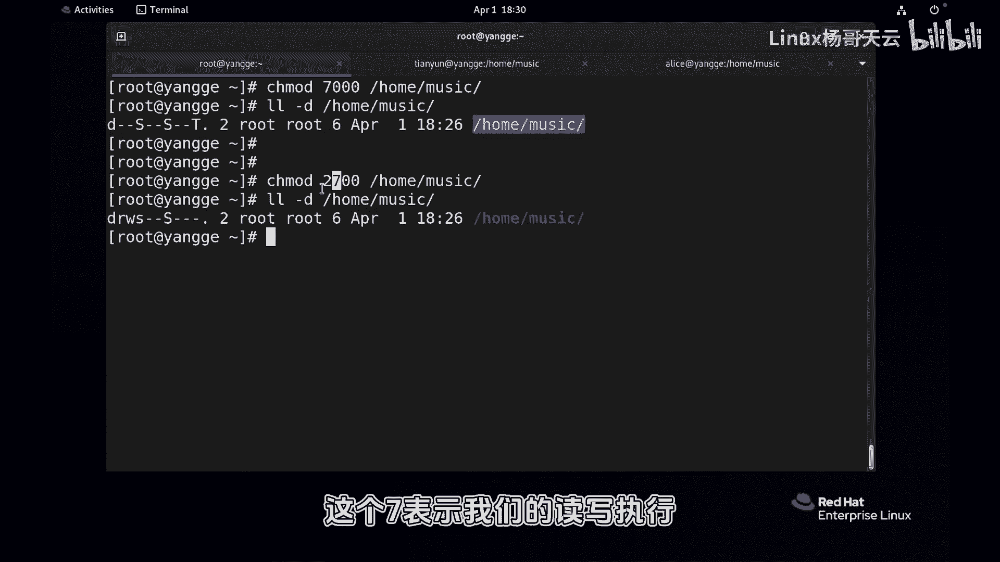

# 史上最强Linux入门教程，杨哥手把手教学，带你极速通关红帽认证RHCE（更新中） - P62：62.再谈基本权限和特殊权限 - Linux杨哥天云 - BV1FH4y137sA

🎼浩哥小伙伴，我们在前面讲到了文件的基本权限。

🎼啊，然后还有文件的这个特殊权限。呃，下面我们再把这个两种权限呢结合起来给大家看一下啊。嗯，大家应该记得读权限呢，它是4写权限的话是。

🎼2。

🎼执行权限是。🎼一加起来是4217，对吧？那我们的特殊权项也是一样，呃，分别是SUID如果是这个数字的话呢，4，然后SGID数字呢是。

2。🎼STICKCKY我们叫年制位哈，它的这个数字是一加起来同样是7。所以我们的权限实际上是4种4种权限。好，比如说现在我们跟大家解读一下啊，然后之前我们用到的是U加S，这是符号的方式。

或者是呢G加S或者还有呢O加T，这是符号数字的方式呢，比如说2770对一个目录，对home下的music的这个目录。这大家应该能看懂2770，首先第一个7啊是我们的属主的读写执行都有。

第二个7呢是组的读写执行都有。第三个零呢表示的是其他人没有权限。而这个二就是我们的SU7ID。😊。

🎼看到了吗？或者我们重新删除一下，再创建一下这个这个目录。这个目录刚才我们用过啊。

🎼新的啊各位新的来，我们在创建完以后，首先看一下home下的music是这样一个权限。CMOD2770home下的music。

🎼再看看第一个期读写执行。第二期呢读写执行。有同学说没有看到执行被压住了啊，被S给盖住了。第31个0呢是没有权限。而这个所谓的二就是我们的SGID。

🎼那同样如果说给到一个文件给给到这样1个1770，这个我是覆盖了啊，大家应该能看懂什么意思吗？1770先说这个基本权限，三位出助叔住其他人的多业执行还没有权限。一就是我们说的那个stake。😊。

棉质位好，结果就是个T，有如说怎么是个大T呢？有没有可能是个小T呢？

🎼有有可能那我你看啊我现在给它搞搞成一个小T啊，我把这个770换成比方说775，各位再看一看它T就变成小T了。到底什么时候是大T，什么是小T，同样也可能前面是大S。😊。

🎼你看啊这边我来个极端的吧，7000这很极端喽。那表示基本权限谁都没有特有权限呢都有。这个时候大家看它就是大S大T。那这里呢不是说这是错的，不是这个意思。大S表示什么意思？他后面没有执行权限。

组也没有执行权限。大T表示什么意思？其他人也没有执行权限，所以有同学说他到底是有还是没有呢？我以前讲课的时候举过这样一个例子。我说之所以是小S，是因为后面有人拽着你，你坐那了你起不来把你拽着的。

是因为他后面有X权限，所以你呢你也你也站不起来，把你拉住的那由于后面没有人拉着你拽着你的衣服，所以你站起来了变成大S大T这大T明白了吗？所以大S大T并不说是错的，是这个位置有没有X权限。

就原来传统的X权限。😊。

🎼好，这就是我们的特殊权限。所以呢同样大家见到大T大S这的时候也不要感到害怕，这是正常的。当然我们设置目录权限肯定没这么设置的，这个是比较极端的这种设置方式。这样的话，我们的用户也没法访问你们的文件啊。

🎼啊，这是关于这个数字，还有了符号的方式啊，然后那数字的话你就得算，我们没有4个7的这种场景，嗯，没有意义啊，最多就是2770或者2700啊，类似于这样的一个设置方式。

你看看第一个是这个这个7表示我们的读写执行，所者的读写执行。哎，这个怎么变成了这个。

🎼各，好像好像他那个不对啊，看到了吗？😊，🎼第一个SUID好像没有被删除删除啊。🎼所以有时候呢我们发现数字并不是万能的那我们可能还需要通过U键S这种方式来把它给去掉啊，它本来应该是这个效果。

但是我们发现。

🎼数字呢它也有变角的地方。所以针对特殊权限的时候呢，你还是要仔细检查一下，看看你这个结果是不达到你想要的这个效果。所以这是一个小的一个注意事项啊，无论是数字还是字符，我们都要搞清楚，权限实际上是4位。

