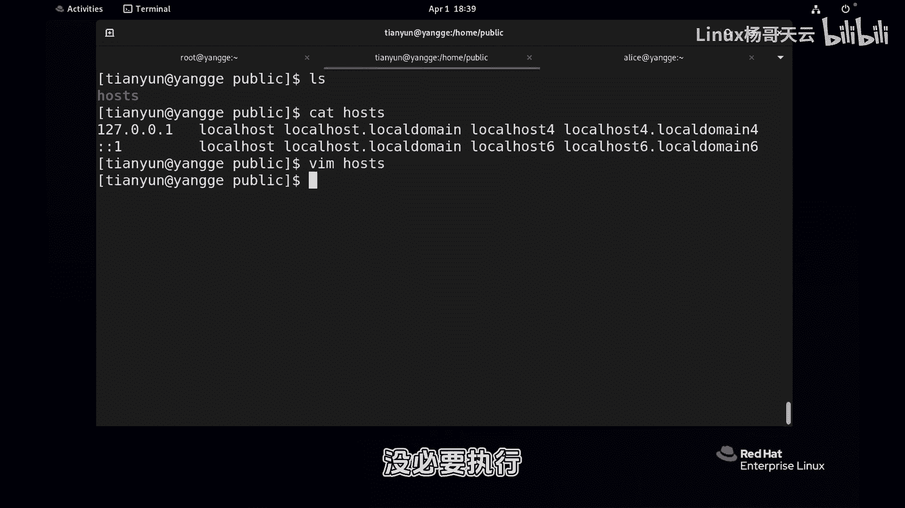
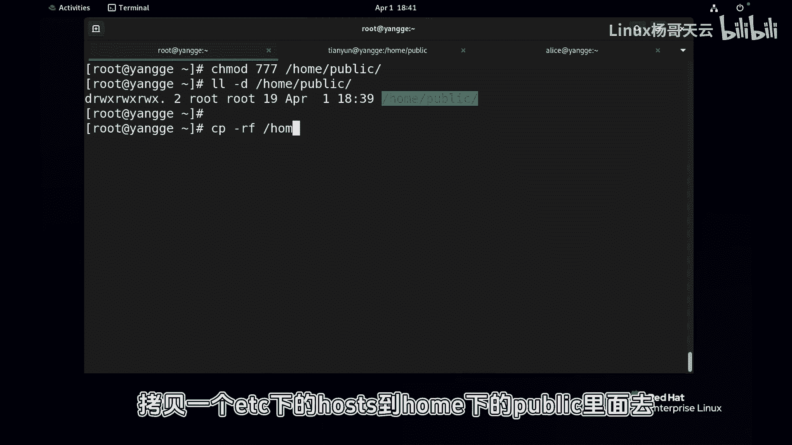

# 史上最强Linux入门教程，杨哥手把手教学，带你极速通关红帽认证RHCE（更新中） - P63：63.灵魂拷问三：对文件有所有权限就能删除吗？ - Linux杨哥天云 - BV1FH4y137sA

🎼啊，各位小伙伴，我是杨哥。我们接下来再做一次灵魂拷问，也就是一个普通用户，当你对一个文件有所有权限读写执信，你一定能删除这个文件吗？我们看一下，首先先准备一下这个场景，home下比方建一个叫。

🎼public的目录，然后在里面呢创建一个文件啊，无论是怎么创建home下的public，然后拷到这里面去，然后给这个文件一个高权限。我相信这个文件所有用户都应该有权限访问了对吧？下面我们就使用。

无论是使用天云还是alice都可以。那这是普最普通用户啊，它没有什么特别的权限，先进到home下的public里面去。好，我们看看这个文件看看内容可以改一改也可以，没问题，如何写都可以。

执行的肯定也没问题，但是这不是脚本没必要执行。那我能不能把它删除呢？各位想看能不能删除呢，我们先试一下。😊。

扣s。

🎼答案是不可以，那为什么不能删除？我们在前面给大家讲过，我们只有对一个目录有写权限的时候，我们才能够在这个目录里面创建文件以及删除文件。所以说一个文件它能不能被我们用户所删除，跟文件本身的权限没有关系。

这大镜头没有关系，而是跟文件夹有关系，跟它所在的目录有关系。

🎼而对于他所在的目录，也就是home下的public这个目录，我们的普通用户是没有写权限的。换言之，我们的普通用户既没有办法在里面创建文件，同时也不能删除文件。而刚才呢我们house的是可以写可以呢读。

但是因为你对文件的权限，你想把它删除，你得看它bu同不同。

🎼也就是你对他爸有写权限才可以。好，现在我们来看一下啊，我们给到一个，比方说给到1个777home下的public。这个时候呢我们看到天云用户对于我们的public目录是有写权限的。

🎼所以呢它第一能够在里面创建文件。同时呢它也能够删除所有文件，看到了吗？很刚有同学说，那我不能删除，我能把内容给它干掉吗？可以，你针对内容没问题，你想怎么蹂躏没问题。但是呢你要想删除它。

你哪怕是把它内容改搞光了都可以。但是你要删除这个文件本身就是不可以。同样的道理呢，我们也来看一下，我们来举一个更反面的一个一个例子。现在我们重新来拷贝一个文件。

拷贝一个亚的hos到home下的public程序，我现在给这个文件一个000的选限home下的public下的hos可别看现在这个文件还不了。

🎼但是别忘了啊，这个目录我们刚才可是设置的有写权限的，至少对于天翼用户来讲，实际上是这样的。所以你看他现在呢能看到里面的内容是因为它对文件夹有独何执行权限。文件内容呢看不到，因对文件没有权限。

他也写不了，也不用尝试写啊，那他能不能删除呢？如果说你回答是他不能删除。那说明根本就没认真听。因为我刚刚讲过删除一个文件，跟文件权限本身没有关系，而是跟它所在的目录有关系。你只要对它所在的目录有写权限。

你就可以创建，也可以删除。所以这点是大家一定要记清楚的。😊。

