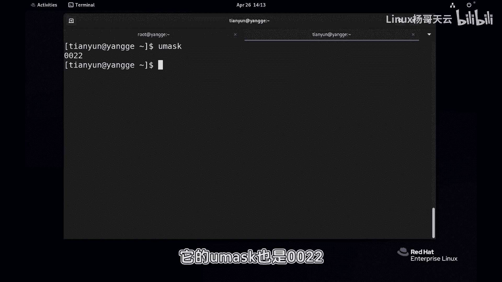
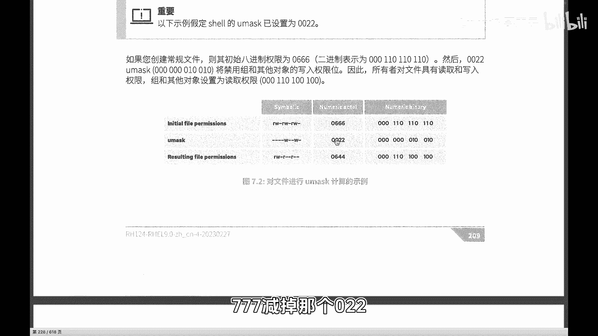
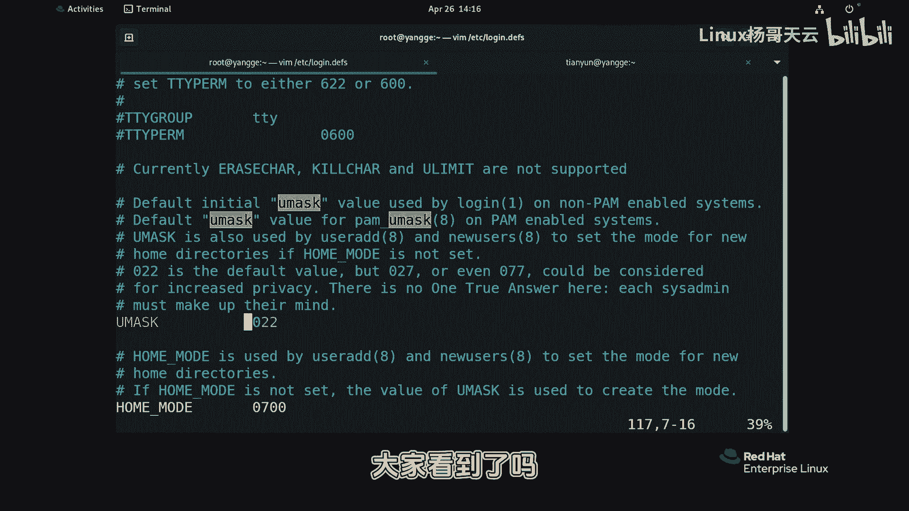
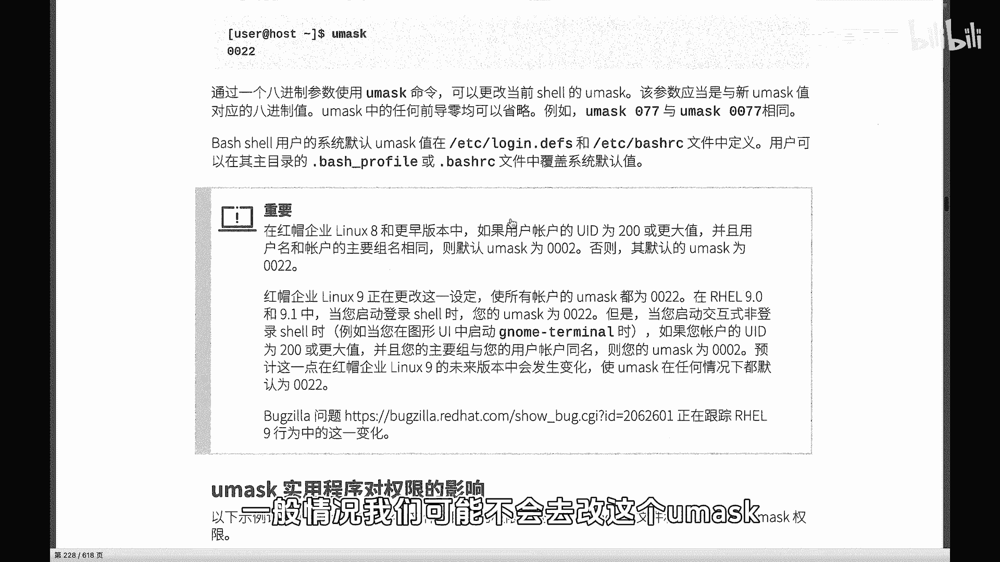
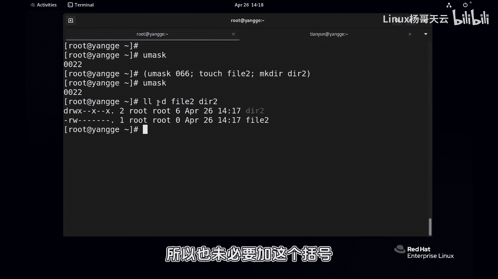

# 史上最强Linux入门教程，杨哥手把手教学，带你极速通关红帽认证RHCE（更新中） - P64：64.是谁决定了新建文件的默认权限_-umask - Linux杨哥天云 - BV1FH4y137sA

🎼朋友们，我是志阳哥。那下面我们给大家介绍一下默认权限。🎼啊，大家有没有想过我们在新建文件或者文件夹的时候呢，它有一个默认权限啊，这个是基本上是统一的啊，我们来看一下。🎼比如说我们现在创建一个文件啊。

fi的文件。然后各位我们看它的这个权限呢，好像默认就是644，对吧？你再创建一个也是普通用户呢，如果创建一个文件，这边是一个普通用户啊，哎，我们也创建一个叫fi2点TST文件。🎼好，看一下他的权限好。

他好像也是644，那文件夹呢？文件加的话呢，比方说DRE看文件夹的时候呢，大家要注意一下加杠D啊，不然的话看到是目录那个下面的内容，后面那个写项无所谓，有没有都可以啊。你要是觉得话不想看的话。

就删掉就行啊。一位同事把文件放上来。🎼啊，大家看到这个文件夹的权限呢，比文件权限多了一个X啊，因为我们知道X权限呢，对于文件来讲的话是危险的。但是对于文件夹来讲的话，是我们有权限进到文件夹里面啊。

这是一个比较简单的权限啊。然后。🎼也就是说默认情况下是这个权限，那到底是什么引起的呢？这个默认权限是在哪设置的呢？那这边就给大家介绍一个叫做Um的东西啊，各位看到那管理员我们看到当前是00224位啊。

第一位是特殊权限。然后普通用户呢它的也是0022。这个跟之前的版本有点区别。在早期的版本的时候啊，在早期8的时候呢，它这个呃分别是0002啊，还有0022前面那个零我一般没有读啊。

实际上是有的在九的时候呢，这个统一为啊022或者叫0022啊这样一个权限。那么这个它实际上是会影响到我们新建文件的权限那怎么解读呢？大家看看非常简单啊，我们这是我们的这个符号啊。

文件夹刚才我们看到的是啊是相应的权限。这个是啊啊，这个是我们的这个初始的一个权限。文件来讲的话呢，一般是就是我们的这个。

🎼叫做666啊初始权限。🎼呃，因为X选项呢，这个是比较的重要注意的，它会让文件有执行权限，是初始权限。然后我们就看到了这是一个8金制的这个0666386啊，就是默认最高的。然后U mask呢。

我们刚才看到的是0022对吧？022。那这个其实呢U mask mask呢就是面具的意思嘛，就是你可以理解为减掉，那就说这个权限它不具备拿掉。🎼那我们一做这个相应的这个一个解呢，比方6减24倍角24啊。

当然不能是单纯的是这种方式啊，你可以认为you mask就是不具备的权限。就像带面具一样啊，你本来露出的是整个脸，你带面具以后呢，可能露出的只是眼睛啊，所以就会遮盖掉一部分，这是我们最终的一个权限啊。

所以 mask它将决定文件的初始权限。那文件夹的话呢就是默认是777啊，用文件夹那个X权限，我一直强调可以啊，717减掉那个02呢，那过来呢就是什么，大家应该很清楚了啊。

就是我们的这个默认77减掉我们02，也就是这两个位置的血没有啊，所以呢最后减掉的就是这个位置和这个位置的血分别对应的是它俩。

🎼好，那默认在哪个地方设置的呢？默认是在伊利亚的lowLOGIN啊这个文件里这个里面呢我们就能找到you mask这样一个啊这个位置在这儿大家看到了吗？默认情况下就是012啊。

所以呢当然我们也可以在其他的地方去设置啊，一般情况我们可能不会去改这个U啊。但是如果说我们想要临时的使用。比如说那现在呢我要创建一个文件，它的权限可能我现在比方说运行一个脚本，创建一个文件。

而这个文件呢只有管理员有权限，其他人没有权限。因为目前我们的Um02呢是其他用户是。

🎼有毒的权限的啊啊，因为只减掉了他们的血权限嘛，对不对？好，那我们可以这样做。呃，如果临时的使用的话呢，那就在子孝中执行了啊，我就不在当前孝中执行。🎼这个我们使用U mask重新设置。

要减掉它的所有权限，那一个2加4就是666呃，不用那个那个一啊，一的话呢就没必要了。因为一是文件夹权限啊。好，那这个时候我们假如说在里面创建1个TOU创一个2，我们再创建1个AR2好。

这边是敲了三条命令啊，那当然了，当前的Um是没有变的。因为我们并没有在当前 shell要当中去设置Um。但是呢我们是在这个子校中运行的。而这三条命令其实都是在同一个子校。那很显然是先改了Um。

那对于他们俩来讲的话，应该会受到影响。好，我们可以看一下，由于有文件夹，所以我们直接呢统一加上这个D的选项。🎼好，各位看到了吗？那么由于我们的这个0666就是减掉四和2减掉读和写，所以最终减掉了读和写。

减掉了读和写，减掉了读和写啊，文件文件的话你不用考虑，因为文件的初始权限最高是666。而我们的目录的效格权限的初始期7啊，所以目录本身有X，文件没有X啊，这就是一个U mask。

因此我们可以根据我们需要呢来在某些地方或者在全局或者在我们的这个啊某些的子子校脚本运行当中去运行一下这个Um啊，它本身我们在脚本运行，后面讲到的脚本运行呢，它就是在子校中执行。所以呢也未必要加这个括号。

它可以自己自己测试一下啊。

