# 史上最强Linux入门教程，杨哥手把手教学，带你极速通关红帽认证RHCE（更新中） - P65：65.Linux文件权限总结篇 - Linux杨哥天云 - BV1FH4y137sA

🎼同学们，我们简单对这一章做一下小结。那么在这一章呢，我们主要讲到了权限。文件权限的话，我们可以通过LS杠L的方式来看啊，因为它能够看到这个文件的详细信息，同时呢看到文件的权限。那文件权限呢。

我们会通过一些命令的方法去更改。包括我们使用CHMOD这个方式来更改。那这个CHMOD更改呢，就注意一下啊，它是有两种方法的，一种是符号啊，一种是这个数字啊，数字两种方式。

那么这两种方式呢它各有各的使用场景。因为符号的话呢啊比如说我们要给这个脚本增加一个执行权限，其实就是简单的加X就可以啊。

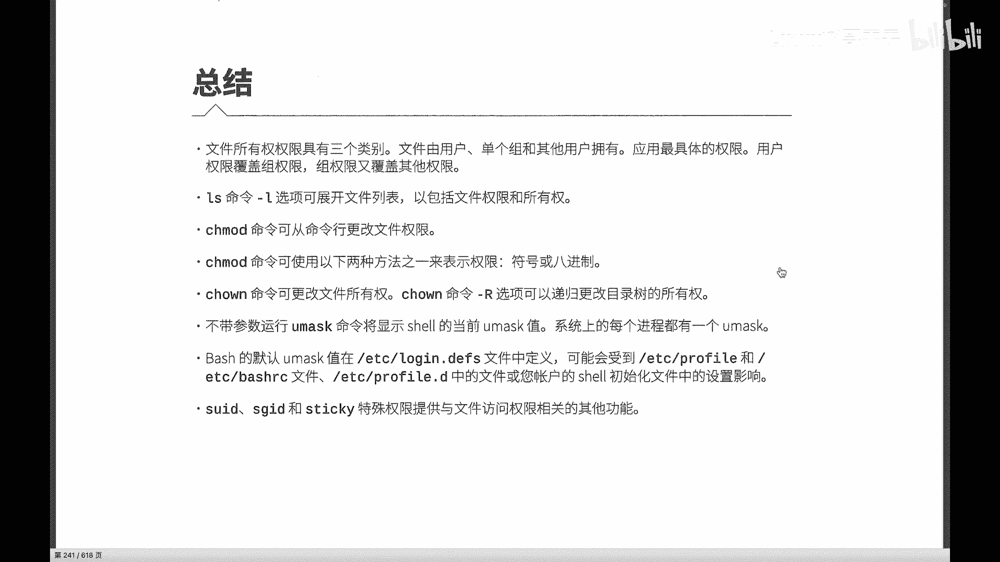

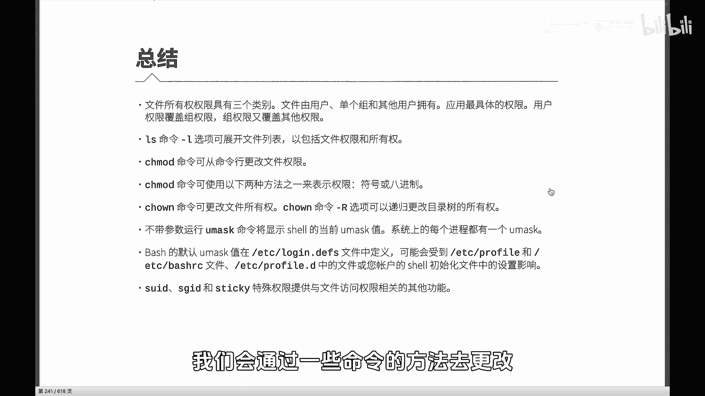

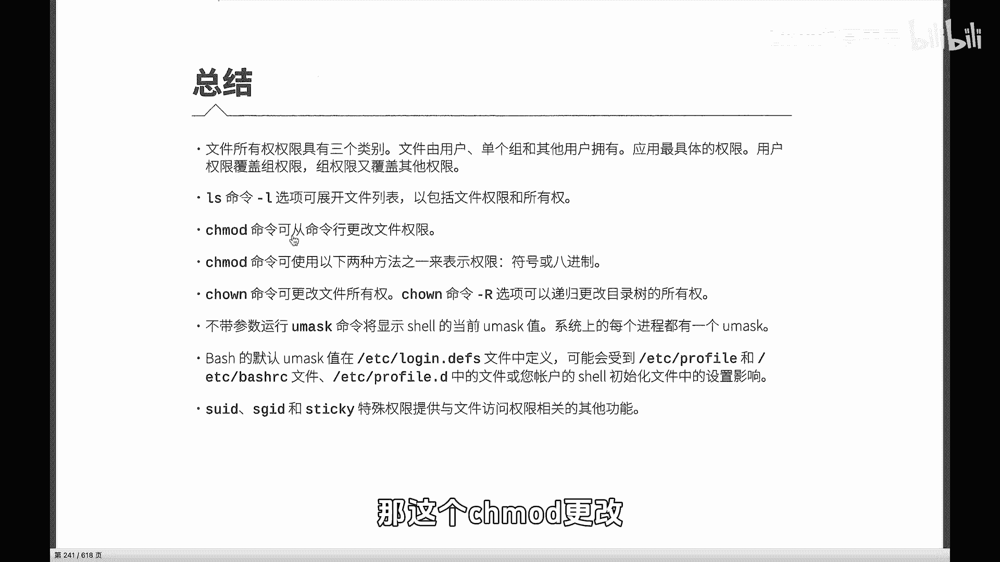

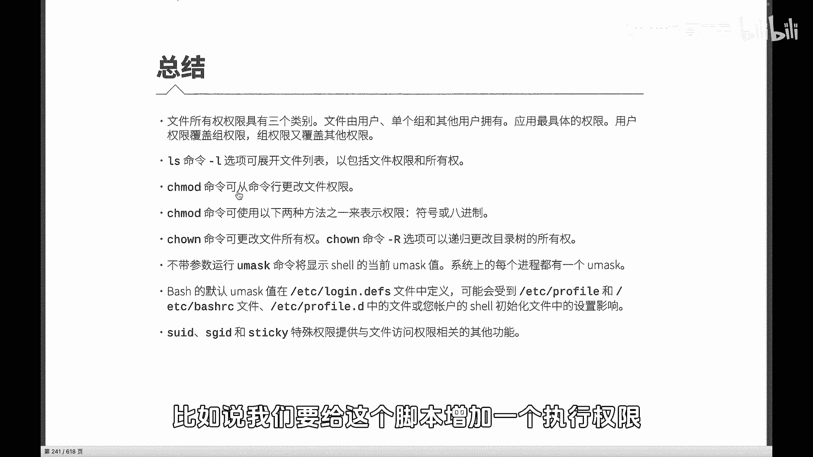

🎼啊另外呢我们也可能会根据需要拿来更改文件的所有者或者所属的组啊，这边其实有两个命令，一个是CHOWN那这个命令呢可以更改文件的所有者，还有属组。其实另外还有一个是个方式同时别忘了我们在对文件无论权限。

还有相关的这个组修改的时候呢，根据需要呢有可能会加杠递的方式为目录的话才有递啊文件本身呢没有递归啊，它具有单一的一个文件此以外呢在前面我们也讲到了它会影响到新建文件的默认权限以及呢我们的的设置呢可以在以下的一些位置进行设置。

除此以外呢有三个非常重要的特殊权限啊，就是我们的第四种权限。除了我们的组组其他人以的第四种权限分别是面这个是针对文件就是让一个一个文件在执行的时呢。

任何用户执行的时候都会以这个文件所有身份后者呢这个话呢啊我们主要是针对的是这个目录针对目录的话，可以呢让这个目。

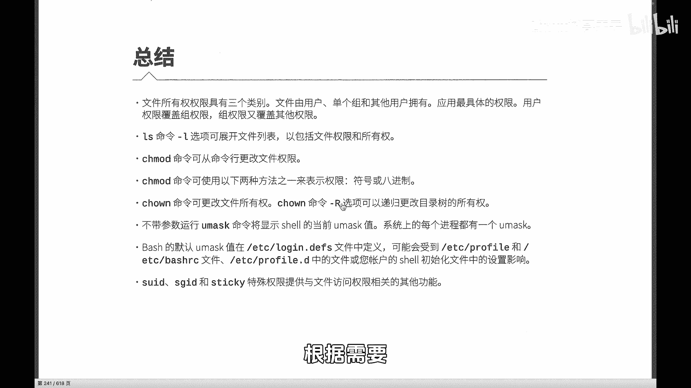

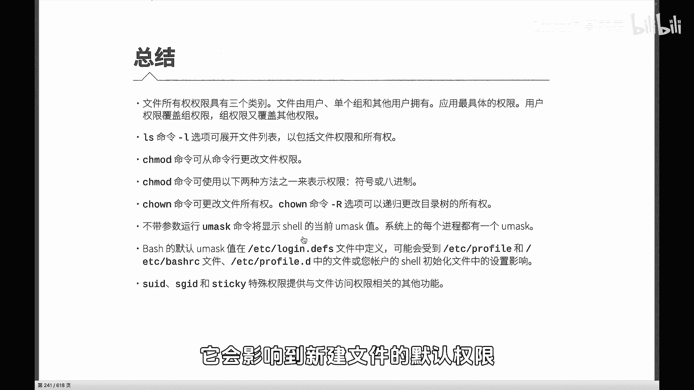

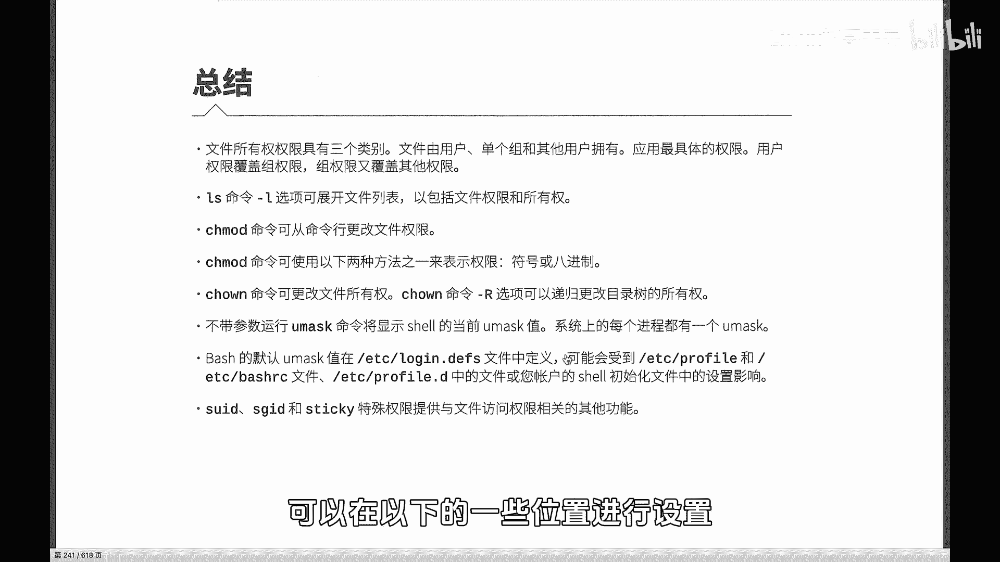

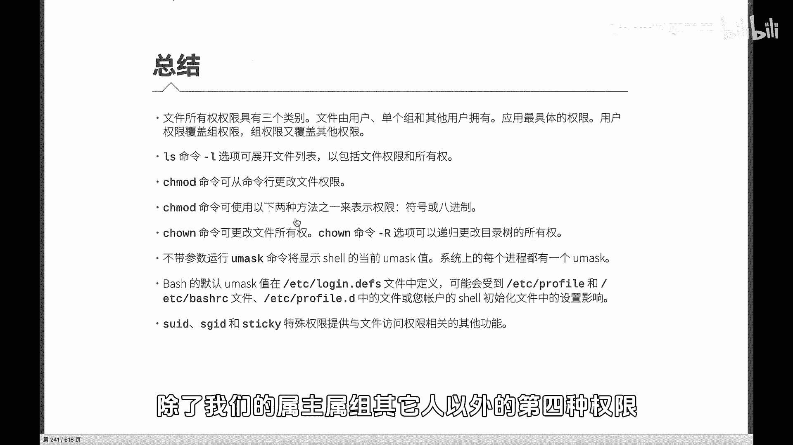

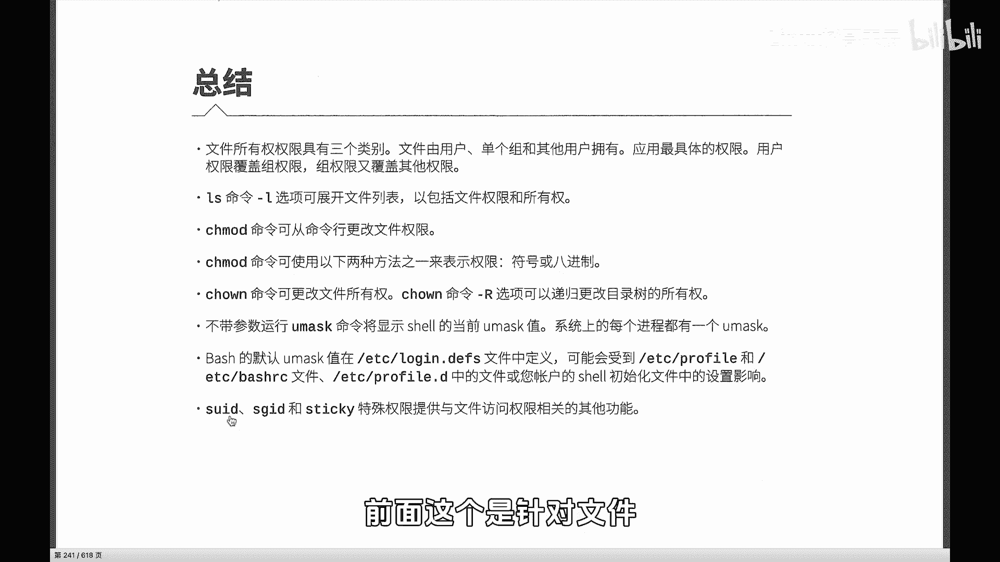

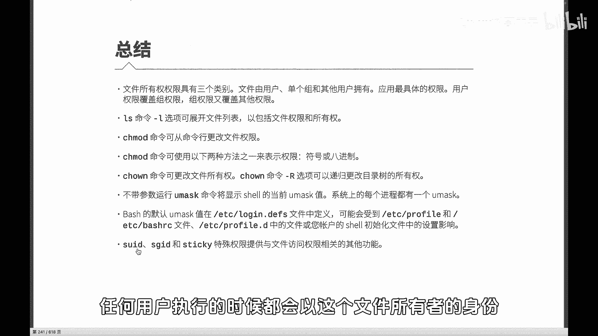

🎼录下面的啊文件继承目录本身的这个属组啊，注意是属组啊另外第三个权STICKYt这个权限它呢是防止呢就是同一个目录下我们都可以写，但是只有呢所有者可以删除。表说我们的临时目录啊，日志访问的临时目录。

这个是各个进程都可以访问，都可以往里面写。但是呢只有自己只有当前这个进程本身呢是可以删除的，其他的可以删除。好，所以权限非常重要。后面我们也会逐渐的在后面去使用。所以大家可以呢加强这一块的一个练习。

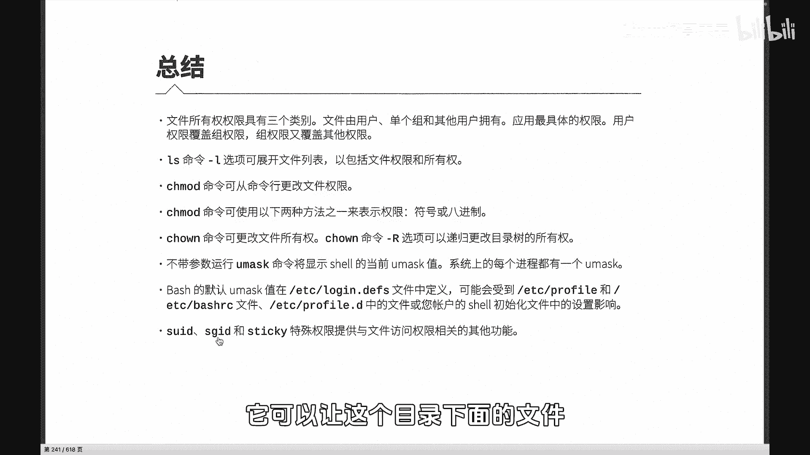

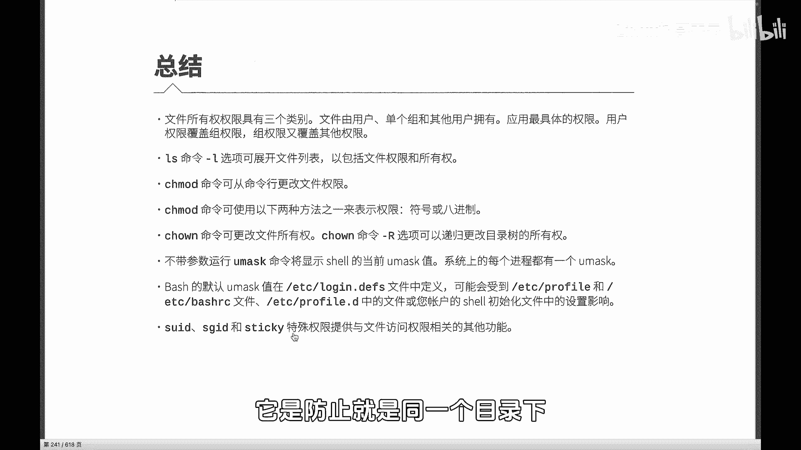

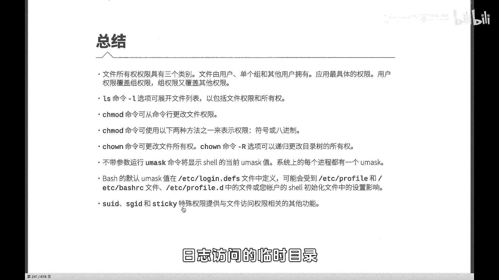

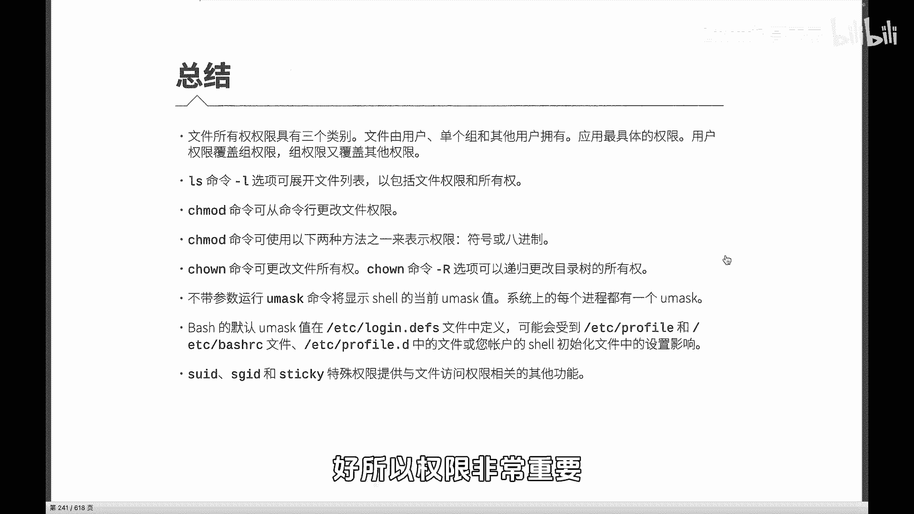