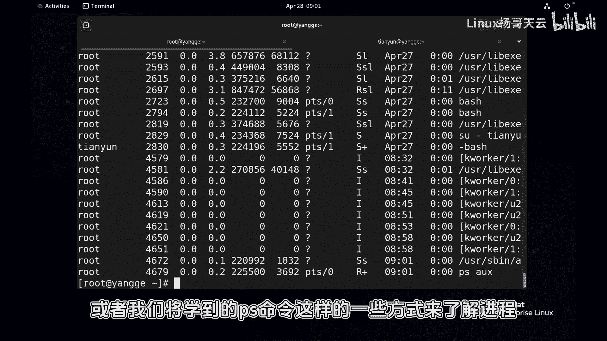
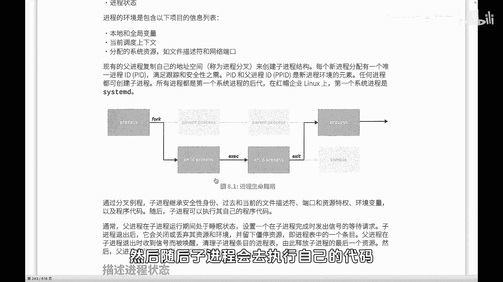
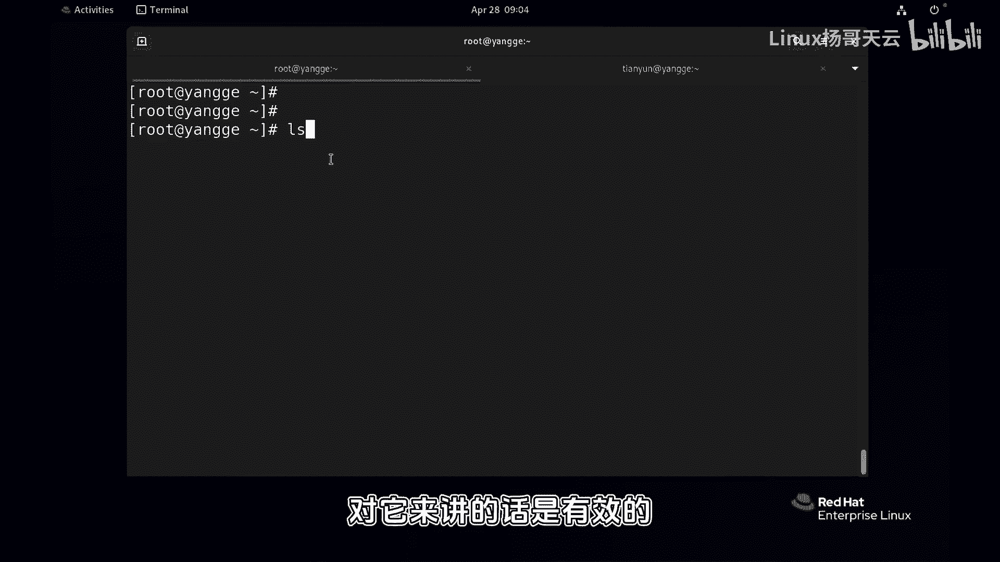
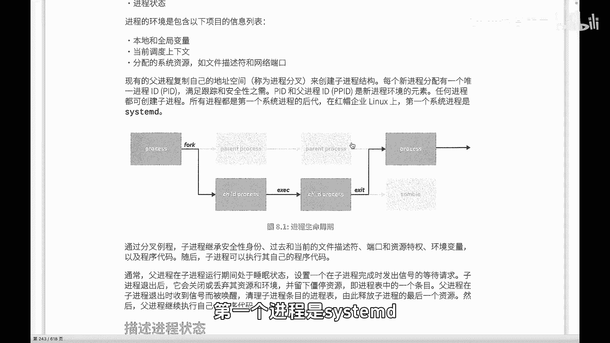
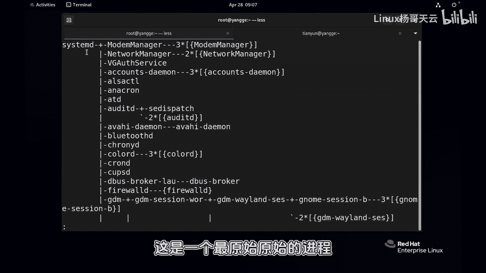
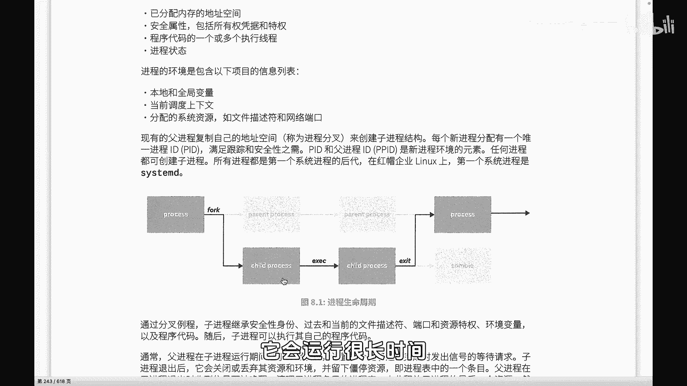

# 史上最强Linux入门教程，杨哥手把手教学，带你极速通关红帽认证RHCE（更新中） - P66：66.进程的状态 - Linux杨哥天云 - BV1FH4y137sA

🎼好，小伙伴们，我们下面开始学习进程的管理。那么进程呢可以说它是一个程序运行的过程。有些程序呢运营时间非常短。那比如说我们看一下像命令，那它本身也是一个进程，但是这个进程的运行时间非常的短。

那基本上我们可能没有办法再对它做一些相关的管理就结束了。但有一些进程的运营时间会很长，特别是像我们的系统进程，还有就是我们的一些后面学到的一些服务。不管是my还是我们的网站服务器NX等等等等。

那么这些进程呢它可能会长期运行，同样有一些进程可能会运行一段时间，在这过程当中，我们会涉及到对进程的相关管理。比如说我们会用到命令像top这个命令，那这个命令我们会看到当前系统当中启动了很多进程。

那比如说这边还显示有292个进程其中呢有什么一个在ning，还有291个leeping。那还有呢像那个是什么什么什么以及每一个进程，它的一些相关的一些信息，像进程的UID啊，还有了进程的这个。

🎼用户在运行啊以及进程的优先级等等等等。还包括我们的CPU使用时间。那么这样我们可以帮助我们判断或者找到哪些进程呢，对CPU的资源或者内存资源消耗比较重，我们可能会做相应的一些管控。

那特别是呢当我们的系统，比如说会有一些恶意的这种黑法的这样一些入侵。那也同样我们也需要通过像top命令，或者我们将学到的PS命令这样的一些方式来了解进程啊，那谈到这个进程的管理呢。

不仅仅是去查看了解进程的这种当前的一些状态。那还包括了对进程发送相应的信号啊等等等等啊，比较重启啊，或者说结束之类的那在正式进入到进程管理之前呢，我们还是简单的看一下进程的一些相关的概念。

当然这些呢可能更多的呢和开发呢是关系比较大一点嘛。那我们也需要了解。比如说我们看到进程呢，它其实就是一个程序运行的这个过程，我们也称之为运行中的实力。从进程在启动以后就会有一些相关的一些信息。

比如说这个每一个进程呢，系统会给他分配内存那地址空间。

🎼还有呢就是每一个进程呢会有安全属性，这个属性呢将决定该进程能够访问系统中哪些资源以及如何的访问哪些资源。还有呢这个进程的一些这个相关的一些这个啊状态。除此以外呢，还会给他分配相应的一些资源。

包括这个文件的描述服务，还有相应的端口。那谈到这个进程的这样一个运行过程呢，我们简单来看一下这幅图啊，这是一个进程的生命周期的一幅图啊。比如说每一个进程呢，它其实在启动的时候它是这样来运行的啊啊。

就是现有的副进程，它会复制自己的历史空间啊，会一份也之为叉子啊，来启动这个一个我们叫做子禁程然后每一个进程呢都会分配一个唯一的I也就是我们的进程的I当然了。

也就是这个进程的这个子禁程有一个除此以外呢这个I当然是用来跟踪我们的这个进程，包括对进程进行管理这I很重要啊就像我们的身份证号一样那除此以外，每一个进程它还有一个副进程那所以它除了以外。

还有一个这个呢就是它的父亲。🎼然后任何进程呢都是通过这种方式创建的。那么当禁程被的时候，也就是像这边用到的时候分叉但被出来的候，首先紫禁城会继承附禁城的安全身份。

还有它的一些文件描述服务端口和资源环境变量等等等等。也就说我们的每一个紫禁城在运行的时候，首先呢是从附禁城出来的它会继承附禁城的所有的一些包括权限资源。

然后随后紫禁城呢会去执行自己的代码那比如说我们刚我现在是一个我现在当这是一个的一个进程这个进程一直在运行对？这是他来接受我们的命令然后我们在这边敲了L那这个呢就是一个紫禁城，它就是它的紫禁城。

那他首先会继承这个的相关的一些地址空间环境变量等等等等啊，所以当前的一些东呢对这个紫禁城就是它的个紫禁城来讲话是有效的它也会继。那么当紫禁城在运行的时候。

附禁城这个时候会处于一个睡眠状态这我们后面会看到状态。那么。

🎼当紫禁城发出这个信号啊，它会设置一个这个发出一个信号等待请求。然后当紫禁城它的代码执行完成以后，大家看到这条是这条线啊，然后它会关闭或丢弃相应的资源环境，比如他访握的一些资源环境，并停留下来。

成为一个啊江江亭的或者僵尸的一个资源。这个时候啊他会把所有的资源被丢掉。但是这个时候紫禁城还没有并没有被被清除掉啊，然后它会有一个禁城的一个条目，也就是在附禁城这边呢，还会有一个条目。

这个条目就相当于是死掉以后是一个僵尸。这个时候紫禁城会发送一个信号给附禁城说我这边执行完成了啊，你来回收我吧。啊，这个时候附禁城呢，他会收到信号以后会被换洗啊，当前我们刚才说的，它是处于一个死状态。

然后换洗以后呢，会清理紫禁城的相关条目和进程表，到此为止呢就释放紫禁城的最后一个资源，也就是他的一个禁城的一个条目。然后附禁城继续执行自己的代码。这个时候大家看到这边是一个脏饼。当他被复核出来以后。

继城附禁城的所有的这个相关的资源地制空间。🎼文件描述等等等等。然后紫禁城再指入自己的代码，然后再执行。比方说L或者CD大家可以把这个理解为这个是是我们的这个呃然后执行的一个CD或者LS执行完成以后呢。

它自己呢会释放所有资源个叫状态，然发送信号给附禁程你一下程最后会给他做最后的理，这就是一个基本的一个过程所有的都是这样子各位我们系统当中呢，第一个进程是什么呢？第一个进程是sstem，我们可以看一下啊。

我们通过PS命令以看一下啊，我们下家看到了吗？所有的进程，所有的进程这是一个最原始原始的进程，这个跟之老的系统不太一这是我我们这是系统中的第一个进程号一下应该是最前面的最来讲就总结一下所有这个紫禁程都禁的自复制一然接着呢在紫禁程运行的过程中呢。

程状态。😊。

🎼状态紫禁城呢先是继承附禁城的所有的资源，但是呢他自己呢会有一些自己的建树，自己的一些代码嘛。因为我们这个是运行的紫禁城可能是LS可能是CD可能是别的。所以呢它继承以后相当于他从他父近这边继所有的权限。

然后装自己的代码执行。执行完成以后再通知附禁城呢给他回收一下。所有的禁程都是由附禁城创建，并且呢最终是由附近回收。好，这是一个最基本的一个概念。我们是需要了解一下啊。

否则的话我们后面呢可能没有办法去做相应的一些进程管理。这个一个特定的一个场景啊，就是我们如果把附禁城结束以后，那紫禁城啊也就结束了。当然紫禁城呢我们刚才看到紫禁城像LSCD呢好像运行的一下就结束了。

但实际上很多进程并不是这样，它会运行很长时间，甚至是呢一直会运行。好这大家需要了解。😊。

