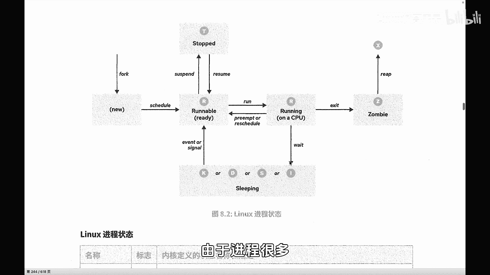
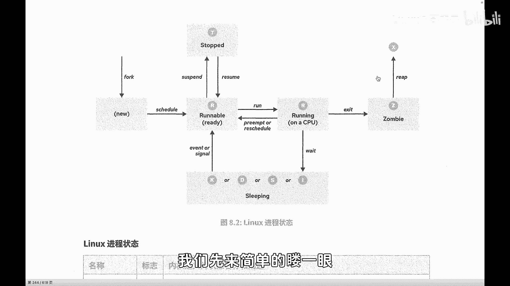
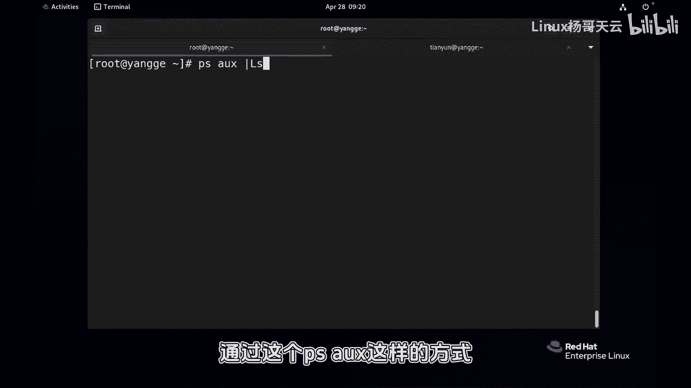
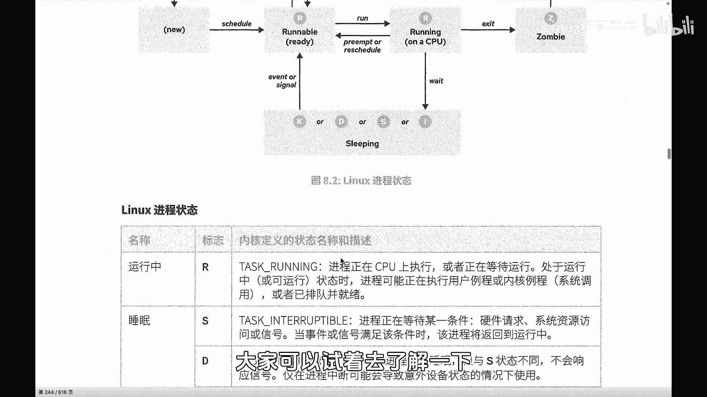

# 史上最强Linux入门教程，杨哥手把手教学，带你极速通关红帽认证RHCE（更新中） - P67：67.进程的生命周期（上） - Linux杨哥天云 - BV1FH4y137sA

🎼我们再来看一下进程的这个相关状态。那有一点是非常确定的，就是在我们的操作系统当中，对我们的操作系统呢是这种多任务的操作系统。换句话讲，它可以同时处理多个任务。每1个CPU可能有多个核心或者多个线程啊。

像这种超线程的CPU啊，总之呢最终我们有几个逻辑上的CPU啊，那它在同一时间只能处理多个任务啊。🎼那比如说我们就1个CPU，那在同一个时间，那就只能处理一个任务。那所有的进程。

那需要CPU来执行代码的时候，来运算的时候呢，这个时候都要进行排队啊，并不是所有进程都会都会在同一时间能够运行啊。🎼因此呢在进程运行的时候。

那么他们是对CPU的时间、时间片和资源进行分配的这个分配的过程呢呃比说我们现在在排队，有些有些人已经玩上了，有些人可能已经即将呢进入到过山车，有些人呢可能还在很长的队伍后面。

所以呢他们的这个状态是不一样的那这张图片我们来看看就是描述了进程的一个状态。那所以呢由于刚才我们讲到，由于进程啊很多，我们比方说有有这个好几百个进程。刚才给大家也看到哈。

我们系统当中有这个好几百个进程或者更多的进程，并不是所有进程都能够running。那很多进程，他们的状态可能是这个sleepy，也有可能是stop或者说装比这样一个状态。

因为同一时间我们一颗CPU或者一个逻辑上的CPU。

🎼只能够呢去运行一个竞程，但是它切切换时间很快，大家可以想象成。🎼我们所有的进程呢其实是在分享在轮这个CPU的时间。你可以想象成，哎，这个玩具现在有三个小朋友玩，你玩一秒，我玩一秒，他玩一秒。

🎼那么看起来的话，这三个小朋友都在玩。那这个我们把这个时间想的再极端一点啊。比方说这个三个小朋友每个人玩0。0001秒啊，他0。001秒，他001秒。那么在你看来呢，这三个小朋友都在同时在玩。

他都在running。🎼但如果说有多个玩具的话呢，可能小朋友玩玩的同时玩的更多了啊。好，所以接着上面我们的那个图，当一个进程被还记得这个for是谁的吗？是负进程对吧？那附近出来以后。

当然子进程呢就会进入到他的一个生命周期当中。注意啊这个进程不见得上来就开始能够享受CPU的资源CPU的时间片，那么这个是跟我们的调度有关系。那么这个调度呢，我们在后面会讲到，我们可以去设置。

那有同人说哎这个小朋友特权，我们就明确明确说了这个小朋友他能够他能够享受到特权，人家用0001秒，他能用000002秒用那个2倍或者3倍的时间，所以跟我们的调度策略有关系。

那今天我们暂时先不讨论调度策略的问题啊，啊总之呢大家知道这个是跟调度有关系。然后有很多这个进程嘛，那我们肯定要去遵循这个调度的一些规则。然后过来以后各位看到有一些状态呢。

我们统称为R状态running状态其实不见得啊，还有一些状态呢。🎼T还有一些状态，我们都叫其实叫sleeple啊，它但是可能是KDSI那么还有呢像这个G状态，还有呢X状态啊这些状态这状态在哪看呢？

我们先来简单的眼啊这个状态呢在这看到了吗？各位同学们可能看到刚才有两个其实在一晃的时候，两个R状态的进程两个R状态啊啊再看这边就是R状态就是我们running状态。

还可以呢通过这个PSX这样的方式啊不能说这边也能看到进程的状态，那我们回到这边来看一下，这边呢这R状态呢，它其实是有两个的看到了吗？一个是run啊，一个是呢这个running这个刚才我讲过啊。

那这个R状态表示他们调度过来以后呢，正在等待运行。但是在我们看起来的话呢，它就是已经在运行在在running它是在等待运行这里做好了准备ready准备等待运行。

然后紧接着呢它来执行它的这样一个相关的代码啊，running在CPU上跑来运行。

🎼运行完成以后呢，他又有可能会回到等待。因为不是说你这个进程，你独享CPU时间片，那这样肯定不行。我们是多任务的系统。那我们的这个每一个进程啊，根据它的优先级啊，或者根据我们人为的调度啊。

它都需要占用CPU的时间片。那这个时候可能你运行一下啊，你回来等一下你再运行，我再运行这样的一个状态。所以这个之间是可以切换的。那么对于这样的进程，是至少无论是等待做好准备等待马上运行。

在这个CPU的调度调度列表当中呢，以经啊，还是在running的进程都称为running好，这个我们来看一下下面有详细描述。这个R状态的进程。🎼啊。

它叫做什么running就是表示进程正在CPU上执行啊，因为它要运算嘛，比方我要运算一个复杂的什么东西啊，然后或者正在等待运行啊，这个都叫做running啊。

就是处于这种运行中啊或者可运行状态时或者已经排队就序的都称running然后紧接着呢这个进程运行完成以后可能会进入到下面的这样一些状态啊，比说这个叫做这下面这几个统称为。

但是我们常见的话呢可能以这个S呢多一点啊，还有一个然是D这两个都多一点这S呢它表示的是啊可中断这个中断就是它进程正在等待某一条件表硬件请求资源访问或者信号可中断啊。这个某个条件比说这个结束以后。

那我们进程呢就会进入到相应状态那另外一个是不可中断啊不可中断。这个进程是处于这种睡眠真的睡眠状态。它与刚才我们的S不同，它是不会响应信号的就比如说什么意思？

比说我们现在这个进程它其实正在读取磁盘上的数据，你是不可以去给它中断的。🎼啊，你不能打断他，你给他发信号，他也不会响应，因为他现在正在读取我们磁盘上的数据，那你怎么能容断它呢？

所以呢这两种进程其实他们相当于都是现在暂时不需要CPU，就是不需要CPU的这个时间。他们该做的事情做完了啊。

然后不同的是呢下面这个D呢啊他这个时候呢是可能是在比方访问我们的网络或磁盘资源而这个时候访问完了以后呢，然后在紧接着呢可能需要CPU的这个时间片。那我们有一种江湖中的说法，这个叫做浅睡眠。

这个叫深度睡眠啊，这两个是常见的。那么还有下面的这个K和I这两个状态呢，其实我们在啊运维当中呢，可能是相对来说比较的啊不是很常见啊，有一些跟开发可能关系比较大一点。大家可以试着去了解一下。

