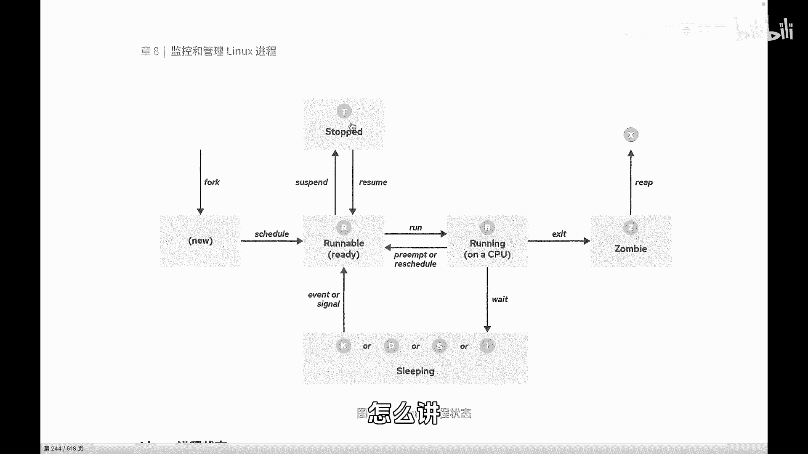

# 史上最强Linux入门教程，杨哥手把手教学，带你极速通关红帽认证RHCE（更新中） - P68：68.进程的生命周期（下） - Linux杨哥天云 - BV1FH4y137sA

🎼无论是sleeping还是running还是stop，这些进程都没有结束，都是在整个进程的生命周期当中的。好，这边是wait，也就是他在等待某个信号的这个结束啊。

然后这边呢我们stop呢是停止这个停止呢其实更多的是有带有人为的停止。我们相当于暂停和恢复，我们就给暂停一下。

方说我们发现某某一个进程它可能耗耗CPU的资源比较重而我们现在呢可能此时此刻希望其他的进程呢能够享享受，除了去调整调度策略以外，调整优优先级以外呢。

我们也可以呢去把某个进程给予暂停然后在适当的时候给恢复好这个时候它的状态呢就是stop状态啊，top状态进程被暂停通常是我们的用户或其他进程给他发出一个信号，我们给他发出一个暂停信号啊。

然后在到另外一个返回信号的时候呢，那继续会被执行啊，这是这几个状态。那么简单的讲就是R状态啊，只不过R里面有runbel和run在我们看来都叫R就可以了。好，另外呢就是我们的ep。

🎼这边呢有刚才我们说的这个叫什么里面有S的这种s啊，这种常规睡眠，还有这种D深度睡眠啊，是两个比较常见的啊，所以R这是一类啊，然后我们的S和D，然后紧接着T呢也是这一类T的话呢怎么讲啊。

我们可以其实也可以看到的这样一个状态啊，我们可以尝试来制造一个这样一个进程啊，比方说我们现在运行一个这样一个进程啊，trol加加G一下这个进程呢，它是要要运行1000秒啊，大家现在肯定还没有结束。

所以如果我们看的话呢，就有可能会看到这样一个带有这种T的这样一个进程PS。

🎼好，这个比较比较多好，我们可以找找找它，肯定是在这里面。🎼刚才刚才在那个位置呢能看到这是200多个进程。

🎼好，这边就有一个T看到了吗？它状态是T好，这几个这几个无论是TR还是我们的ST都是进程的整个运行当中，可能会被人为暂停，也可能会由于某一个资源在访问，暂时不需要CPU的这个时间。

它处于一个睡眠的一个状态，睡眠跟停止是不一样的，睡眠是随时可以洗的停止的话呢不给信号没法洗那么进城被运行完成以后，紫禁城在执行完以呢，我们刚才还记得上一幅。

它会释放自己的资源和空间然后呢还会留一个条目啊，这个条目呢它相当于在进城的这个傅进城那边有一个记录嘛，然后他会给付进城发送一个退出的信号，告诉傅进城说我这边结束了啊，你帮我来回收一下。好。

这个时候进城就会进入到一个脏闭状态，脏状态呢各位看一下就是状态这个状态际上一般情况很少见到啊，像这什么意思呢？就是他有一些情况，特殊情况就是傅进城无法回收紫禁城说这个进程可能就出了问题，回收不了。

当然这种他可能不会占用系统资源，但是呢过多。🎼脏脏这种状态的进程呢肯定还是会对系统有影响的。因此呢那我们可能会强制的通过一些信号去处理。然后这样的一个方式啊，这是我们的脏品。

然后最后当付禁城给他回收以后，这个时候禁城会进入到一个X状态。X状态呢就是最后的死亡的一个状态啊，最后被彻底被释放的一个一个状态，就是当付禁城清理紫禁城的这个结构时，禁城现在呢彻底被释放。

但是呢我们要注意一下，就是这个状态是无法被看到的，就像你在白天看不到鬼一样看不到。但是他有没有呢？我不知道啊，然后Z呢指的就是刚刚说的脏紫禁城在推出时向附近城发信号，除了自己的身份IPID以外。

所有资源已被释放。所以这就是几个比较常见的好，大家可以呢尝试结合我刚才的讲解去理解一下啊。

