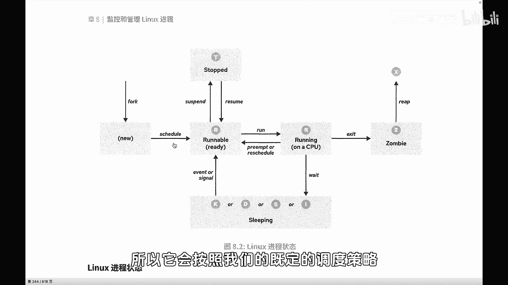
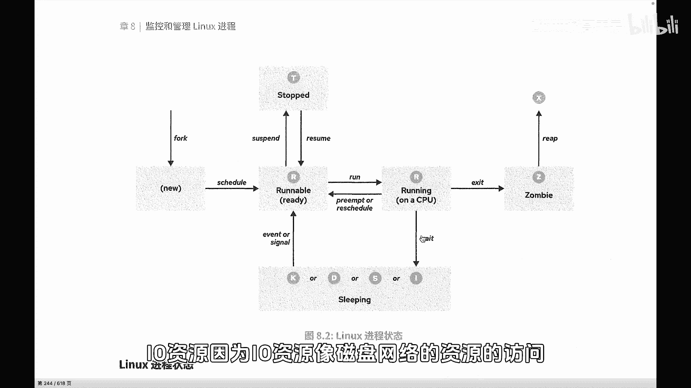
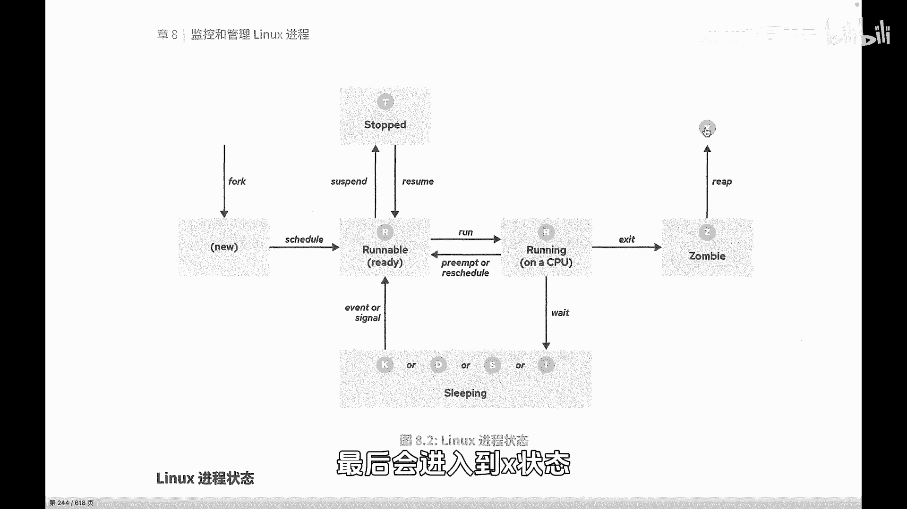
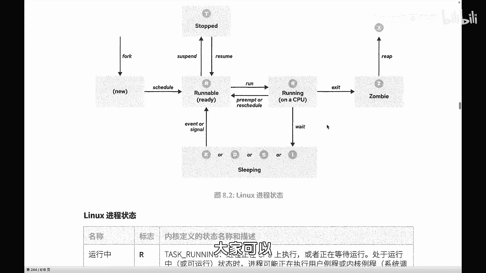

# 史上最强Linux入门教程，杨哥手把手教学，带你极速通关红帽认证RHCE（更新中） - P69：69.进程的生命周期（总结） - Linux杨哥天云 - BV1FH4y137sA

🎼当子进程被进出来以后，在这个时候进入到我们的，因为它是要用CPU的嘛，对不对？用CPU时间的哎，所有的进程都需要CPU来进行处理和运算，所以它会按照我们的既定的调度策略啊，调度策略是整体的啊。

还会根据每一个进程本身的优先级这个我设置的优先级从而进入到这样一个CPU的时间进行分配和轮循的这样一个大的环境当中，因为不止你一个人，对不对？然后这个时候如果说你排上了下一个概你啊。

或者马该这个时候叫ning或者是正在运行ning运行完成以后，每一个进程，比如说进程A它运行的时候需要CPU交3秒吧，但是呢不可能给它分3秒钟，让它的运行，因为别人怎么办而是让你运行。01秒运行以后。

再紧接着进入到么重新排队再进入到排队当中去然后再来运行你下一部分的运算，不是说你运行完以后，然再来让人运行这是不可能的。当中呢根据一些需要说网络资资。

因为IO资源向磁盘网络的资源的访问，那它这些是很慢的，它比CPU甚至是访问内存呢，它都是很慢的。所以呢可能会有一些进入到sleeping，然后来等待的过程了。🎼那也可能会被我们人为的暂停或者说恢复啊。

同样呢最后在进程结束的时候呢，那他会进入到脏饼，然后等待父亲成去回收他的PID最后会进入的X状态。好，这就是一个进程的一个整个的一个状态。好，大家可以呢呃尝试结合我刚才的讲解去理解一下啊。

