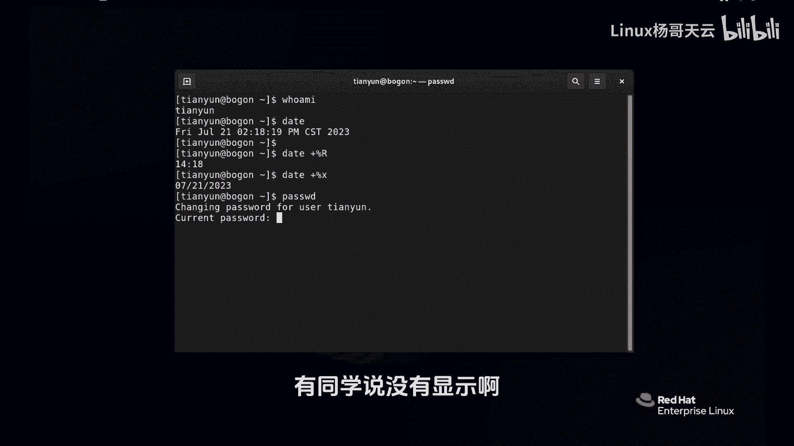
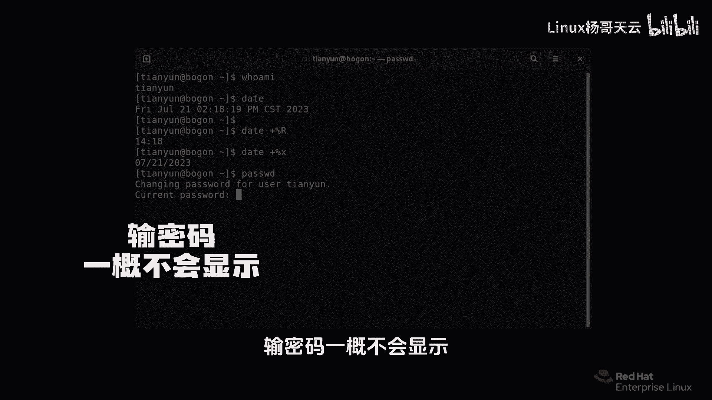
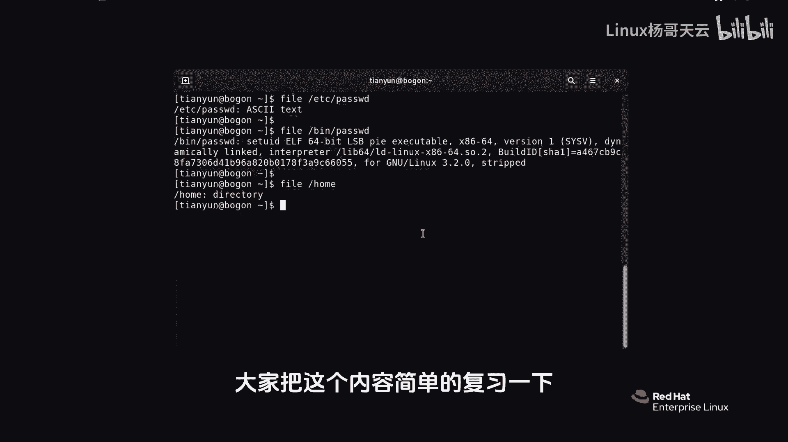

# 史上最强Linux入门教程，杨哥手把手教学，带你极速通关红帽认证RHCE（更新中） - P6：6.如何使用bash shell执行命令？ - Linux杨哥天云 - BV1FH4y137sA

下面我们就开始呢来正式的做一些示范了哈，就是我们如何使用batch shell来执行一些命令，就比如说那个who am i没问题，或者是那个data ta也没问题，当然有一些参数啊，很奇怪。

它是使用加号的，比方说加百分号R啊，这个大家先不用记啊，因为我们后面会教大家怎么去查看，帮助获得这些个相关的参数，那比方说百分R是干嘛的，好回收，各位看到现在是14。18分，他只看了时间。

因为默认情况下他看的是时间日期，还有呢这个星期月份都看了，那如果说你使用了data加号百分号X啊，小X注意在LINUX里面这个大小写它是区分的好，那这里看到的是二零237月21，它显示的是日期。

有人说这太无聊了，我们要看的日期时间还用跑到LINUX上来看吗，这你就肤浅了，各位如果我们在后面要使用一些脚本之类的，我们要获取当前时间，那就可以使用这个命令，当然如果是管理员的话呢。

他不只是可以使用这个命令来查看相应的时间，日期，还可以呢，哎设置时间日期好，那么再比方说PASSWD这个命令，注意不是你想象中那个password啊，这个时候回车，你看我们要干个什么事啊。

同学看他说你要改变用户天云的密码，就是你自己的，我要改我自己密码，请输入当前密码，当前密码是什么呢，那我们假如说输错了或者瞎输一遍，各位看看，有同学说没有显示啊。

大家注意在LINUX里面，特别是在我们的bash shell的这个提示符里面，输入密码一概不会显示。

不代表他没有收到，是他不回显在屏幕上而已，所以你看我输错了，他就是说你再输一回啊，再输一次那个当前密码行了，咱们不玩它了，然后ANG记忆天云啊，我对刚才那个密码已经很痛苦了，我受不了了，我改成杨哥吧。

Y a n g g e，他说要八个字符，密码太短，大家看一下，普通用户改密码还真的是让人觉得很受不了，我快崩溃了，没关系，这些东西呢我觉得也是系统给你的一个保护，来我们再改一遍，我就不相信你得改不明白。

YANGGE天云，那我现在改一个给大家不说的啊，反正我的密码肯定很复杂了，过去了啊，我现在不告诉大家猜也猜不出来，你也不是黑客提示说升级successful成功了，那这个命令这个结果达到了好。

我们刚才其实就使用password这个命令，来完成了一下改密码的这样一个行为，各位我们加没加选项没有加对吧，我们加没加参数呢没有加，所以呢我们不是说参数和选项一定要加的，这个不一定的啊。

我们给大家介绍一个很重要的命令叫file命令，我们下面使用file这个命令来做一些小小的动作，要给大家讲一下啊，这个windows上面呢，这个文件是通过所谓的那种扩展名，也就是后缀什么点DOC呀。

点TST啊，点EXE啊，这样的一些东西来确定文件的类型，但是在LINUX上面文件就没有扩展名这个说法，所以呢有时候你从表面上看，你还真看不出来他到底是个什么样的文件，就在我们偶尔在LINUX里面。

可能看到了一些所谓的扩展名，那也是照顾大家的感情加上去的，不要太在意，那如何看文件本质上是什么呢，我们非要这个mini让机械文件原形毕露，那现在呢注意啊，我们现在由于还没有讲一些知识。

所以我们有时候敲的很累，没关系，我们学习会越来越简单，一开始你觉得很复杂，越来越简单，但是你别忘了你别连着整就行好，etc下的password好，没关系，像我一样敲，现在原则上讲我没有讲别的命令。

没别的方式的时候，你那个我敲对了，好回车，看到了吗，这才是一个文本文件，哪有什么后缀，就你现在看到的位于根下的etc，下面的一个叫做这个文件，它是一个文本文件，你现在看到的B下的password文件。

在我没有敲回车之前，你能看出来他是什么文件吗，你还真看不出来，为什么他俩长得一样，都叫password，多一个字母都没有，但是这是一个二进制文件，是我们刚才用过的，用来改密码的那个程序。

这是一个可执行的文件，就相当于命令的这样一个东西，在windows里面相当于那个命令或EXE，你能看出来它们的区别吗，他也是password，它也是password，从表面上看，杨哥给你说的看不出来。

再比如说file，我们home这是个directory，是一个目录，就是个文件夹，在LINUX里面啊，我们把那个叫文件夹叫做什么叫做目录，这是一个基本的一个用法，所以大家要注意的是。

在LINUX里面是没有这个文件的扩展名，这也说的好了，大家把这个内容简单的复习一下。

敲一下我们，然后呢后面再一步步学习。

