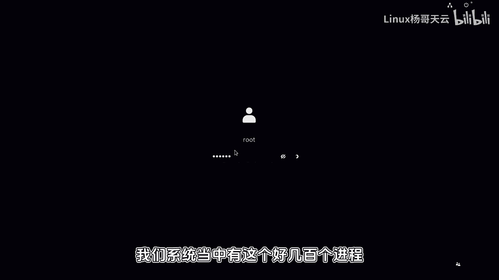
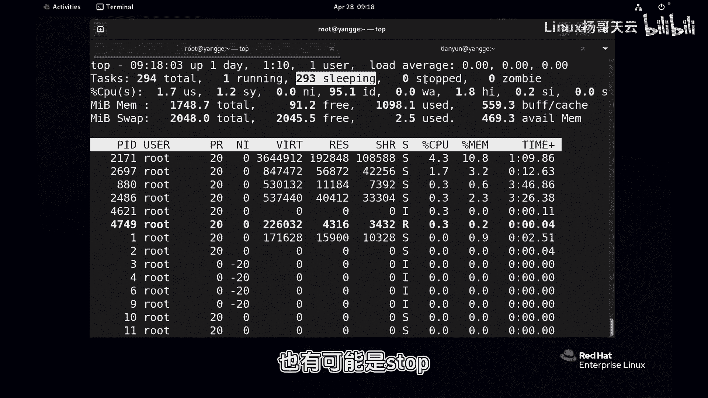

# 史上最强Linux入门教程，杨哥手把手教学，带你极速通关红帽认证RHCE（更新中） - P70：70.进程的生命周期 - Linux杨哥天云 - BV1FH4y137sA

🎼好，我们继续来看啊，刚才我们提到进程的生命周期。那另外呢我们再来看一下进程的这个相关状态。那有一点是非常确定的，就是在我们的操作系统当中，对我们的操作系统呢是这种多任务的操作系统。换句话讲。

它可以同时处理多个任务。每1个CPU可能有多个核心或多个线程啊，像这种超线程的CPU啊，总之呢最终我们有几个逻辑上的CPU啊，那它在同一时间只能处理多个任务啊。🎼那比如说我们就1个CPU。

那在同一个时间，那就只能处理一个任务。那所有的进程，那需要CPU来执行代码的时候，来运算的时候呢，这个时候都要进行排队啊，并不是所有进程都会都会在同一时间能够运行啊。🎼因此呢在进程运行的时候。

那么他们是对CPU的时间、时间片和资源进行分配的这个分配的过程呢呃比说我们现在在排队，有些有些人已经玩上了，有些人可能已经即将呢进入到过山车，有些人呢可能还在很长的队伍后面。

所以呢他们的这个状态是不一样的那这张图片我们来看看就是描述了进程的一个状态。那所以呢由于刚才我们讲到，由于进程啊很多，我们比方说有有这个好几百个进程。刚才给大家也看到哈。

我们系统当中有这个好几百个进程或者更多的进程，并不是所有进程都能够running，那很多进程，他们的状态可能是这个sleepy，也有可能是stop或者说装比这样一个状态。

因为同一时间我们一颗CPU或者一个逻辑上的CPU。

🎼只能够呢去运行一个竞程，当是它切切换时间很快，大家可以想象成。🎼我们所有的进程呢其实是在分享在轮这个CPU的时间。你可以想象成，哎这个玩具现在有三个小朋友玩，你玩一秒，我玩一秒，他玩一秒啊。

那么看起来的话，这三个小朋友都在玩。那这个我们把这个时间想的再极端一点啊。比方说这个三个小朋友每个人玩0。0001秒啊，他00001秒，他001秒。那么在你看来呢，这三个小朋友都在同时在玩。

他都在runing。🎼但如果说有多个玩具的话呢，可能小朋友玩玩的同时玩的更多了啊。好，所以接着上面我们的那个图，当一个进程被for还记得这个for是谁f的吗？是负进程对吧？那附近出来以后。

当然子禁程呢就会进入到他的一个生命周期当中。注意啊这个进程不见得上来就开始能够享受CPU的资源CPU的时间片，那么这个是跟我们的调度有关系。那么这个调度呢，我们在后面会讲到，我们可以去设置。

那有有同学说哎这个小朋友有特权，我们就明确明确说了，这个小朋友他能够他能够享受到特权，人家用0001秒，他能能用000002秒用那个2倍或者3倍的时间，所以跟我们的调度策略有关系。

那今天我们暂时先不讨论调度策略的问题啊，啊，总之呢大家知道这个是跟调度有关系。然后因为有很多子禁程有很多这个进程嘛。那我们肯定要去去遵遵循这个调度的一些规则。然后过来以后可不可以看到有一些状态呢。

我们统称为R状态running状态，其实不见得啊。🎼还有一些状态呢，那是T，还有一些状态，我们都叫其实叫sleeple啊，它但是可能是KDSI那么还有呢像这个Z状态，还有了X状态啊。

这些状态这状在哪看呢？我们先来简单的一眼啊，这个状态呢在这看到了吗？各位们可能看到刚才有两个其实在一晃的时候个R状态的进程个R状态啊看这边就是R状态就是就是我们的running状态还可以呢通过这个PSX这样的方式啊啊ps不能说X这边也能看到进程的状态。

好，那我们回到这边来看一下这边呢在R状态呢，它其实是有两个的看到了吗？一个是run啊，一个是呢这个running这个刚才我讲过啊那这个R状态表示他们调度过来以后呢，正在等待运行，但是在我们看起来的话呢。

它就是已经在运行在在running它是在等待运行它就做好了准备ready准备等待运行。然后紧接着呢它来执行它的这样一个相关的代码running。

🎼跑来运行。那运行完成以后呢，它又有可能会回到等待。因为不是说你这个进程，你独享CPU时间片，那这样肯定不行。我们是多任务的系统。那我们的这个每一个进程啊，根据它的优先级啊，或者根据我们人为的调度啊。

它都会去运行，它都需要占用CPU时间片。那这个时候可能你运行一下啊，你回来等一下等你再运行我运行这样一个状态，所以这个之间是可以切换的。那么对于这样的进程，是至少无论是等待做好准备等待马上运行。

在这个CPU的调度调度列表当中呢以经啊，还是在run的进程都称为run好，这个我们来看一下下面有详细描述。这个R状态的进程。🎼啊，它叫做什么running就是表示进程正在CPU上执行啊，因为它要运算嘛。

比方我要运算一个复杂的什么东西啊，然后或者正在等待运行啊，这个都叫做running啊，就是处于这种运行中啊或者可运行状态时或者已经排队就续的都称running然后紧接着呢这个进程运行完成以后可能会进入到下面的这样一些状态啊。

比说这个叫做这下面这几个统称为。但是我们常见的话呢，可能以这个S呢多一点啊，还有一个然是这两个都多一点。这S呢它表示的是可中断这个中断就是它进程正在等待某一条件表硬件请求资源访问或者信号可中断啊。

这个某个条件比说这个结束以后，那我们进程呢就会进入到相应的状态。那另外一个是不可中断啊不可中断。这个进程是处于这种睡眠真的睡眠状态，它与刚才我们的S不同，它是不会响应信号的。就比如说什么意思？

比说我们现在这个进程它其实正在读取磁盘上的数据，你是不可以去给它中断的。🎼啊，你不能打断他，你给他发信号，他也不可能去呃常规信号也不能够去除非发这种那种强制信号啊。常规信号的话呢，他也不会响应。

因为他现在正在读取我们磁盘上的数据，那你怎么能容断它呢？所以呢这两种进程，其实他们相当于都是现在暂时不需要CP就是不需要CPU的这个时间他们可能CP的用用用完了他们该做的事情做完了然后不同的是呢下面这个D呢啊它这个时候呢是可能正在访问我们的网络或磁盘资源而这个时访问完了以后呢。

再紧接着可能需要CPU的这个片。那我们有一种江湖中的说法，这个叫做浅睡眠，这个叫深度睡眠啊，这两个是常见的那么还有下面的这个key和I这两个状态呢。

其实我们在运维当中呢可能是相对来说比不是很常见啊有一些跟开发可能关系比较大一点。大家可以试去了解一下了这个sleeping以外呢。

还有一个就是当这些无论是sleeping还是running还是stop这些进程都没有结束，都是在整个进程的命。🎼当中的好，这边是，也就是它在等待某个信号的这个结束啊，然后这边呢我们stop呢是停止。

这个停止呢其实更多的是有带有人为的停止，我们相当于暂停和恢复我们就暂停一下。说我们发现某某一个进程它可能耗耗C资源比较重而我们现在呢可能此时此刻希望其他的进程呢能够享享受。除了去调整调度策略以外。

调整优优先级以外呢，我们也可以呢去把某个进程给予暂停然后在适当的时给恢复。好这个时候它的状态呢就是stop状态啊top状态进程被暂停。通常是我们的用户或其他进程给他发出一个信号。

我们给他发出一个暂停信号啊，然后在说到另外一个返回信号的时候呢，那继续会被执行啊，这是这几个状态。那么简单的讲就是R状态啊，只不过里面有run在我们看来都叫R可以了。

好另外呢就是我们的sep这边呢有刚才我们说的这个叫什么sep里面有S的这种这种常规睡眠，还有这种。🎼D深度睡眠啊，这是两个比较常见的啊，所以R这是一类啊。然后我们的S和D。

然后紧接着T呢也是这一类T的话呢呃怎么讲啊，我们可以其实也可以看到的这样一个状态啊，我们可以尝试来制造一个这样的一个进程啊，比方说我们现在运行一个这样一个进程啊，cttrol加加G一下这个进程呢。

它是要要运行1000秒啊，大家现在肯定还没有结束。所以如果我们看的话呢，就有可能会看到这样一个带有这种T的这样一个进程。PS看下。

🎼好，这个比较比较多好，我们可以找找找它，肯定是在这里面。🎼刚才刚才在那个位置呢能看到这是200多个进程。🎼好，这边就有一个T看到了吗？它状态是T好。

这几个这几个无论是TR还是我们的ST都是进程的整个运行当中，可能会被人为暂停，也可能会由于某一个资源在访问，暂时不需要CPU的这个时间，它处于一个睡眠的一个状态睡眠跟停止是不一样的。

睡眠是随时可以洗停止的话不信号没法那么进城被运行完成以后，紫禁城在执行完自以后呢，我们刚才还记得上一幅图啊，它会释放自己的资源和地址空间。然后呢它会留一个条目啊，这个条目呢。

它相当于在进城的这个附进城那边有一个记录嘛。然后他会给附进城发送一个发送一个推出的信号。那么发送一个信号呢告诉傅进城说我这边结束了，你帮我来回收一下好，这个时候进城就会进入到一个脏闭状态啊。

脏状态呢各位看一下就是状态这个状态实上一般情况很少见到，像这什么意思呢？就是他有一些情况特殊情况就是附进城无法回收紫禁城说这个进程可能就出了问题，回收不了当然这种。

🎼不会占用系统资源。但是呢过多的脏脏品这种状态的进程呢肯定还是会对系统有影响的。因此呢那我们可能会强制的通过一些信号去处理。然后这样的一个方式啊，这是我们的脏然后最后当附禁程给他回收以后。

这个时候进程会进入到一个X状态X状态呢就是最后的死亡的一个状态，最后被彻底被释放的一个状态。就是当附禁城清理紫禁城的这个结构时禁程现在呢彻底被释放，但是呢我们要注意一下。

就是这个状态是无法被看到的就像你在白天看不到鬼一看不到，但是它有没有呢？我不知道啊，然后Z呢指的就是刚刚说的脏紫禁城在推出时向附近城发信号，除了自己的身份以，所有资源已被释放。

所以这就是几个比较常见的我们后呢再来快速走一下当紫禁城被附进来以后，在这个时候进入到我们的因为它是要用CP嘛，对时间的所有的进程都需要CPU来进行处理和运算，所以他会按照我们的既定的。

🎼调度策略啊调度策略是整体的啊，还会根据每一个进程本身的优先级，这个我们是可以设置的本身优先级，然后从而进入到这样一个对CPU的时间进行分配和轮巡的这样一个大的环境当中，因为不止你一个人对不对？

然后这个时候如果说你排上了下一个该你或者马上该你啊这个时叫running或者是正在运行ning运行完成以后注意有一点刚才呢可能我没有交代清楚，就是每一个进程，比如说进程A它运行的时候需要CPU要3秒吧。

但是呢不可能给它分3秒钟让它来运行。因为别人怎么办而是那可能让你运行0。01秒运行完成以后，你再紧接着进入到什么重新排队再进入到排队的当中去，然后再来运行你下一部分的运算，而不是说你运行完成以后。

然后你再来让别人运行，这是不可能的。好，然后当中呢可以根据一些需要呢，比方说对网络资源IO资源，因为IO资源像磁盘网络的资源的访问。那它这些是很慢的，它比CPU甚至是访问内存呢，它都是很慢的。

以呢可能会有一些。到sleepy，然后来等待的过程啊。🎼那也可能会被我们人为的暂停或者说恢复啊。同样呢最后在进程结束的时候呢，那他会进入到脏比，然后等待父亲程去回收他的PID最后进入到X状态。好。

这就是一个进程的一个整个的一个状态。好，大家可以呢呃尝试结合我刚才的讲解去理解一下啊。

