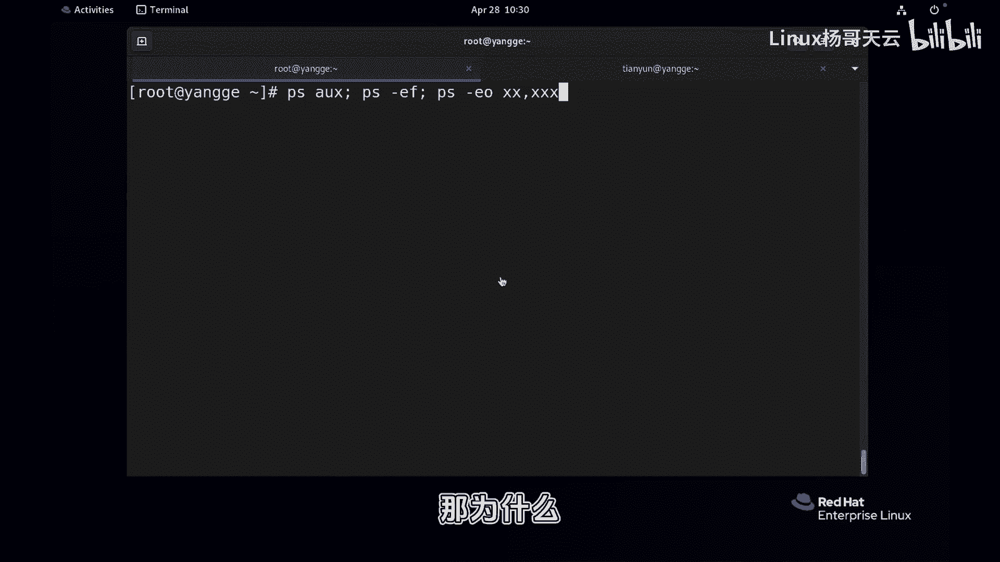
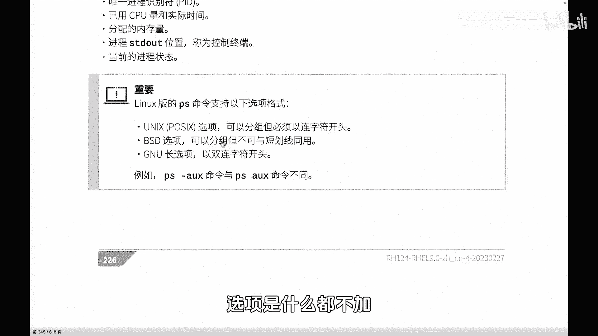
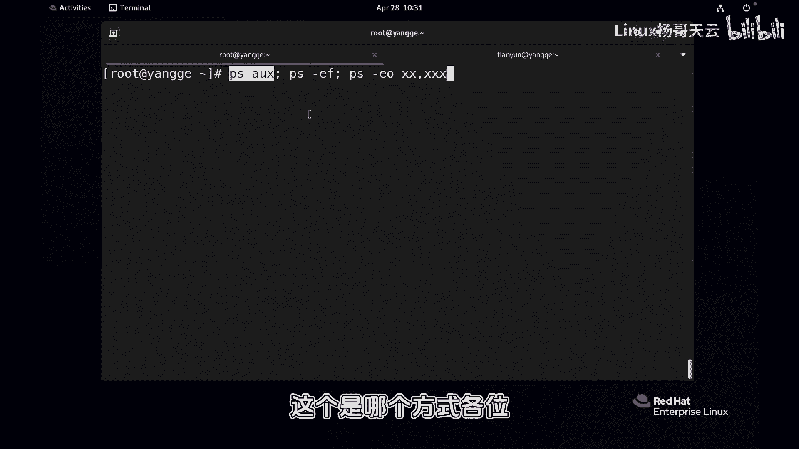
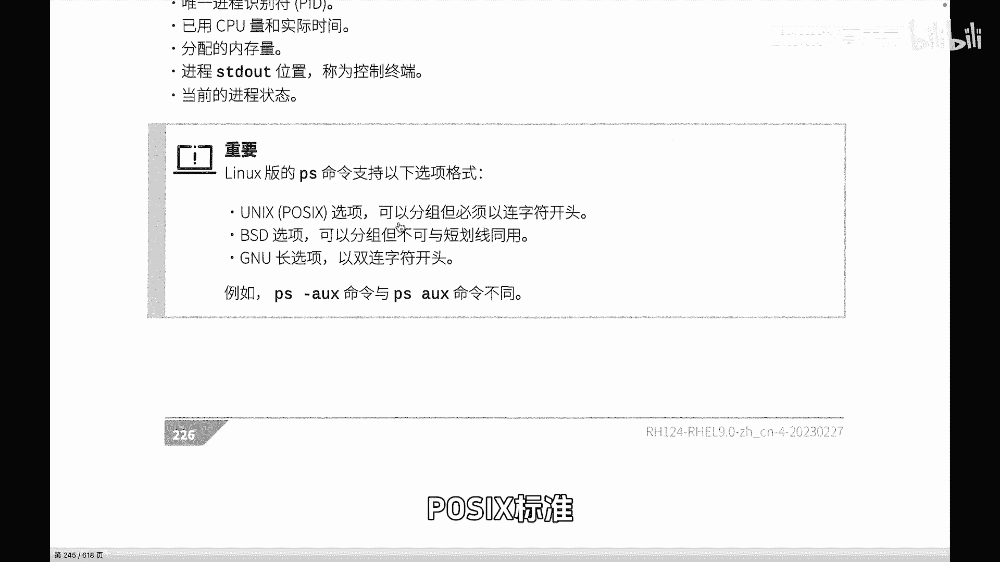
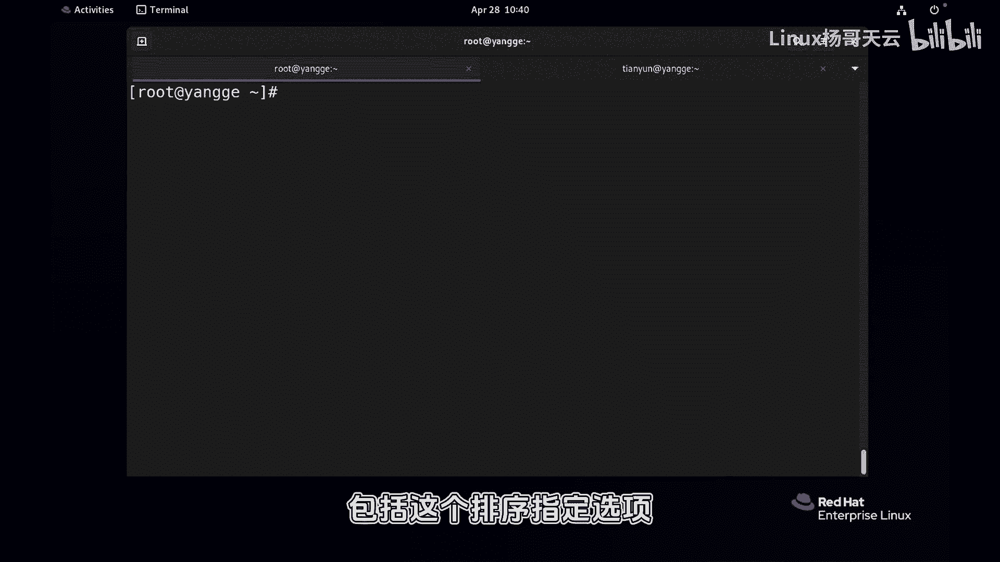

# 史上最强Linux入门教程，杨哥手把手教学，带你极速通关红帽认证RHCE（更新中） - P71：71.top-ps查看进程 - Linux杨哥天云 - BV1FH4y137sA

🎼接下来我们带大家详细查看一下进程。那么查看进程呢主要用到两个命令，一个是top，一个是PS。那么top呢它是实时查看PS呢是指是某一个时间的快照啊啊这两者都非常有用。因为实时查看的话。

对系统资源的消耗是非常重的。也就是说如果说我们在系统本身呢现在已经很慢了这个负载很重，我们在top的话呢无疑会增加负担。那不一定能够帮助我们解决问题啊，PS命令呢反而能够打印出某一个时间点的快照啊。

这个有时候是更加可用的首先top命令呢我们来看看top命令它不仅仅是看到进程的信息，还能看到啊一些CPU负载像上面我们会讲到了CPU的一个负载系统负载的信息，整体来看的话呢。

我们先来看一下这个就是咱们的进程相关的一些内容啊。那这一行呢是显示的是进程的整体状态，包括我们整个进程数啊以及呢他们的一些整个分布情况，包括running还有sleeping的以及stop还有的。🎼啊。

接下来我们详细来看看下面的这个呃显示内容哈，PID指的是我们进程的一个唯一标识符务啊，进程ID这个很重要。无论是我们对进程进行信号的控制，还是啊负进程之间的信号的一个控制啊，都是通过PID来完成的。

然后user是进程的启动用户PR和和NI呢都是我们进程的优先级。🎼啊，这三个呢是关于内存相关的虚拟内存啊，这里面包含共享内存和其他内存，还有实际内存，这个是共享内存。

这一类呢是我们内存的状态 state状态。还有呢这个是CPU的一个占比就是该进程当前所占CU时整体CP当中它的一个占比占多少这个是内存的一总占比这个它所花费CP个总时间。

这是这个命令命令呢我觉得更加灵活一点。实那么在用PS命令前呢大家一下，我们主要用到这个PS一个是X这是一种方式一个PS杠EF这样一个方式还有一个是杠E后面呢加上这个具体的一些内容啊这样一个方式。

那很显然PS命令呢是一个非常复杂的命令。果你助的话，你就完全觉得好麻烦。以呢我们约者不建议搞那么复杂，就学会这三个就可以了。

那为什么啊这三个呢我们要注意一下这三个的话呢为什么有有同学可能看到有时候我加了杠。

🎼杠啊，这有一个非常重要的一个提醒，就是它有三种格式，一种是unix这种选项，它必须是以连字符开始，也就是这种的连字符。另外是BSD选项呢。

它不可以以任何短线就像这的就是选项然后还有呢是我们长选项两个杠杠所以三种一个是杠一个是杠杠这个中间呢是选项是什么都不加所以刚才啊这边我敲的这个呢呢这个是个方式呢？

各这是我们的这个叫做选项可以短线然后还有呢就是EF呢就是我们的最上面那个当然大家也不用记那么多啊，没必要你就用就行了，你只要知道什么这个和杠果是不一样的就。不考虑那多，就这三个我们开始用当然回以后很多。

所以我我们一下。们先那个分一下看看这个内容就可以了。好情况下呢，他给到的我们的一些。

🎼显示呢是用户PID啊，就启动用户UID还是一样CPU的一个总占比。这内存的占比，还有我们的这个可能这个显示的方式不一样哈VS虚拟内存真实内存，这边显示了进程的一个启动终端，就该进程是从哪个终端启动的。

那当然这个很重要。我们知道这样的话就可以看到了这个进程是从哪个终端来运行的。当然以问号的话呢，它指的就是它不是依赖任何终端，特别是我们系统进程的，它是不依赖于任何终端的啊，还有呢这个是状态。

这个状态的话呢，大家看到它有一个大写的状态，还有一个小的这个位置。好，到底S还有呢呃小尖尖这个代表什么意思？好，留给大家呢去在评论区去给大家去那个共同探讨一下啊，这是一些子集啊，不妨告诉大家。

这里跟优先级有关系。这里跟进程的，它是一个是一个leader呢还是一个前台的一个进程呢前台进程组呢，还是一个线程有关系啊。好，这个是它启动的时间啊，什么时候启动的啊，然后以及呢CPU整个的一个。

🎼占用的时间，还有一个是这个进程的名字啊，这个进程是由哪个程序运行的啊一个名字。来，我们下面呢来再继续看一下啊，就是刚才我们用到的PSAUX再看一下PS杠EF。🎼所以大家先不用记那么多。

先简单的啊记住我们刚刚说的三个就可以了啊，同样呢我们less一下。🎼好，这个显示的风格大家看到又不太一样啊，这是他的呃UID还，还有他的PID啊UID就是他的用户嘛，就是以哪个用户身份。

还有他的PPID付进程，还有这个C什么意思啊啊，另外还有呢就是它的一个啊启动时间，还有一个终端啊，另外还有一个是占用的总的CPU时间，还有呢进程的名字啊，这是这两种。大家可能觉得我们在看的时候呢，其实。

🎼比方说IUX啊没问题。但是我们看的时候发现呢它的这个CPU内存占用的这个百分比呢，好像并不是排序的。我们很多时候比如说想要找到系统当中占用CPU多的或者占用内存多的一些进程。

这个时候我们就需要用到这个杠O的这个选项来自定义显示某个字段。比如说PS啊注意如果说是单纯的杠OPS这个命令的话，不加杠E的话呢，那它显示的是只是显示当前终端的进程。

所以我们一般会加个杠EE呢你可以认为显示所有进程啊。O呢就是我们自定义选项。刚才我们可以这样啊，先把上面一行显示一下，这些是我们可能用到的一些字段啊。🎼好，PS杠EO啊，刚才讲到EF。

那现在换了个EOOK那U呢后面呢我们要显示什么呢？我们要显示进程的PID我们要显示进程的PPID啊，然后我们要显示进程的呃，比方说注意这里呢百文号CPU我们可以这样写，注意不是大写是小写啊。😊，啊。

也可以写成注意也可以写成P。注意这里的P呢叫person，就是我们百分比的意思。所以你看到有些地方用到的是百分号，有地方用的是P，所以都可以，这个是一样的啊。

就相当于这两个是等价的百分号CPU和PCPU等价的啊，大得有一个。🎼呃，然后P memoryory注意大家不要蒙了啊，就这个地方啊，这个P可不是上面它就是CPU这个字段。

只不过这个P呢它指的是前面的版号，注意一下啊啊，所以你要是觉得蒙的话呢，你就改一下，像这样改一下就可以。OK好，然后呢回车以后呢。🎼嗯，有点多，我们就现在先这样显示哦，当然这个没有意思。

没有显示它的进程和名字。只有MAND。🎼好了，我们就能看到进程的相关的一些字段的信息。当然了，这个有同学说没有意义啊，对，这样显示确实呢可能没有意义，所以我们往往会加一个st来排序。按什排序呢。

我们按照百合号CPU来排序。好，同样我加个lets看一下，看什么效果。好板放CPU大家看到好像不对。🎼好像那个。🎼使用最多的应该是在一年。操，这这么多啊，好几百个啊，我不想翻了。

我们如果说想排到前面的话呢。🎼想这个到底现在是降序呢还是升序呢？我们可以加一个小杠啊，加一个减号啊。好，这边我们可以看到0。20。2啊，0。00。10。1啊，内存没有排序啊。

我们同样如果想按内存排序的话呢，就是减上呃MEM。🎼ns好看到的实现的是降序排列，大的在前面。如果说你把这个减号去掉的话呢，它就是升序排列，大的在后面。我觉得可能我们并没必要把那个大的放到后面去吧。

一般都是大的放在前面。🎼好，就是这样一个方式。这样的话我们就能够打印出，比如说。🎼但这个不是top10，因为前面第一行呢，它是第一行是123456789，应该是加这行1行。当然你可以呢去打印1一行。

然后再把这行干掉啊，都可以好，总之现在是相当于呢我可以看到前面的内存比多的多的个进程做个相排序刚才杨讲到了这是一杠E还杠注意这个E是所有进程的意思啊加的话呢。

注意这个时候就后面加上自定义的选项定义的这样一个字段的选项。刚我说到的，还有这个PCPU还有me这样一些内容。当然别忘了加一个你不的话，你这个就不知道是哪个进程。

然后还可以结合我们杠杠排序如果写等号后面加上这个杠分号C这也以不空格也是可以的也这是我们三种常见的用法再多的用法呢，大家可以去参照我们的这时。🎼就内容特别多，上来就告诉你有三种用法，看到了吗？啊。

然后这个是什么什么什么用法啊，然后下面呢还会有非常详细的一些帮助啊，这个太多了，我觉得一开始用的时候就少用一点。你看我刚刚用的是这个嘛PS杠EOPID啊，还有这个什么什么NIPRI这样一些这个字段啊。

大家可以用用起来就可以啊。这是关于这个好，关于我们的进程的基本的一个查看的话呢，包括这个排序指定选项啊，这个就是大家可以把这几个用起来就可以。

