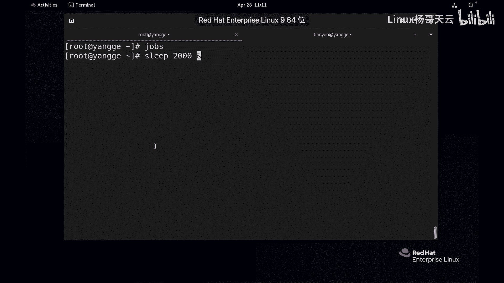
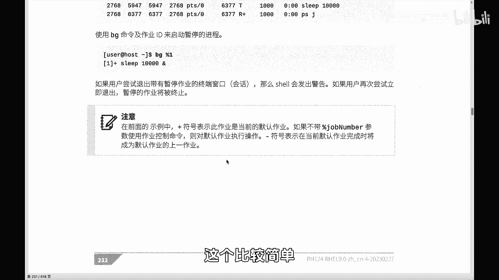
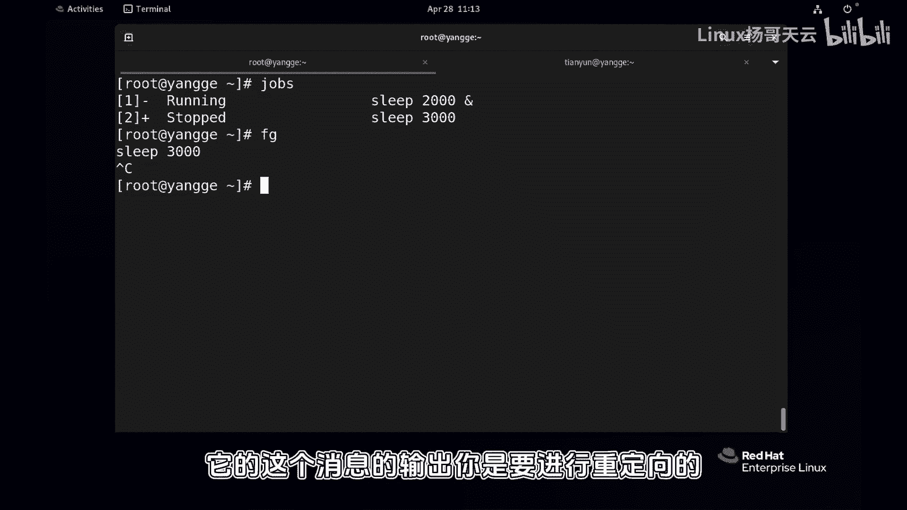

# 史上最强Linux入门教程，杨哥手把手教学，带你极速通关红帽认证RHCE（更新中） - P72：72.shell作业控制 - Linux杨哥天云 - BV1FH4y137sA

🎼hello，小伙伴们，我是杨哥。那我们下面呢来看一个现象。那这是一个shall的一个终端。下面呢我们运行一些命令。比方说LOS同样呢大家感觉到很快运行结束了。

而且这个时候呢我的终端可以再接受下一个输入，再运行另外一个程序。那比如说我现在运行另外一个程序sleep。🎼啊，十0当然现在它呢是会让这个程序会运行10秒钟，你可以理解为倒计时10秒以后才会结束。

在这期间，同样我我屏幕上是不可以输入的。这个当前这个终端被占据了，看到了吗？各位。🎼等到10秒钟以后，那我才可以再接着输入。那换言之，那我们在当前的这样一个sel下面，同样呢是不可以运用多个程序的。

那要想运行多个程序的话呢，我们就要学会作业控制。那比如说现在啊sleep我们把它放的长一点啊，1000吧啊，我们刻意的就把这个情程序放的长一点。大家知道我现在如果回车以后，肯定不能运行别的啊，对不对？

那我们可以两种方法，一种是直接在运行的时候就把它甩到后台去。我们在后面加了这个按的时候呢，就是到后台。🎼各位看到他给到了一个一个是一，这个一呢是他的作业号的名字，这个是他的PID的名字。啊。

这两个呢都可以对他进行管理。🎼那这是启动的时候。🎼那按照常理来讲的话，我们这个进程还没运行完，我们是不能够去行别的。同样这边不是卡住了，是人还在运行。我们可以呢通过cttrorl加G。

🎼把它暂停到后台去，我按了ctrorl加G，同样这边呢也给到了一个作业号，因为它没有运行。下面我们可以通过一个叫jobs来查看。在后台呢，在我们的这个当前sha呢有两个进程啊。

有一个是run runningning的，一个一个是那个啊stop。🎼那现在一个是加号，一个是减号啊，加号减号什么意思？🎼然后他也跑到后台去了，但是没有运行。那如果想让他在后台运行怎么办呢？

这个时候我们可以通过BG后面加上作业号。这个作业号呢，我们想它在后台运行的话呢，就BG，然后是啊BG2啊，版版号2，其实也可以写成2也可以啊。大家看到这个时候再jo的话呢。

那我们看到这个这个进程在后台就开始运行了啊。🎼但如果说想将某一个进程调回到前台，那我们可以通过FG啊FG的方式啊调到前台，同样后面加上作业号点一啊，也可以不加。刚才我讲过严谨要加啊。

因为这个作业号呢和进程号是有区别的。特别我们在后面讲的Q的命密的时候，Q后面是可以跟跟上一，也可以跟上百个号一，它这两种有本质区别。啊，百个号一呢是作业号。而没有百号呢，它指的是PID为一。

🎼跑回车来看到掉到前的来了。🎼那么在前台的进程，如果contrl C是可以终止的，这边就没了，看到了吗？后台的进程呢你是终止不了的啊，你可以先你看我们现在后台一个进程。这个时候呢你想终止的话呢。

两种方法，一种是把它调回前台crl C先拿到前面来，然后再杀杀掉。来也可以呢通过我们后面讲到的这种方式，你可以给它干掉，没问题啊。🎼这是作业的控制。那这样的话。

我们就可以在一个终端上面同时运用多个程序啊，我们可以习惯的呢在运行进程的时候加一个版分号。当然这里有一点要注意。🎼这个进程它是没有输出的。如果说你还要考虑到进程的输出的话呢，那我们可能要需要加上什么？

加上这个。🎼重令项的方式来将一些消息进行重令项，否则就算它在后台运行，但是它的消息呢依然会打到前台终端。这样的进程在设置的时候，你还要考虑到是不是要对它的输出消息进行重令项。注意只在后台的进程啊。

它是不能够接受键盘的信息的啊，也不能接受键盘的输入的，只有在前才可以。🎼好，这是关于我们的进程的一个这是关于我们作业的一个调度啊，做业的控制就是让我们一个效可以多多运营多个命令，多个程序。

最关键是加一个后台符。

🎼呃，这边有一个举了一个例子，他说如果说你有管道的形式的话呢，它显示的是最后一个进程的一个作业号和PID啊，反也没关系啊，这是PID。🎼啊，这个都比较简单啊，这里唯一要说明的是加号和减号的一个概念。

我再来强调一下啊。

🎼啊，是2000这个，我们再搞1个3000。🎼好，200个的话呢，这样你看我们先jos看一下它是加号，对吧？然后再搞1个3000。🎼那它就变成了刺。好，现在如果想调回来的话呢，如果直接输FG调到前台。

不加座业号的话呢，那它默认是这个就是默认的这样一个回车，你看就调回来了，对不对？cl后台去了。🎼想多少钱再来呢？FG就回来了。OK作业控制比较简单，那我们可以这一个是要同时跑多个程序，还是提醒大家一下。

它的这个消息的输出，你是要进行重定向的啊。

