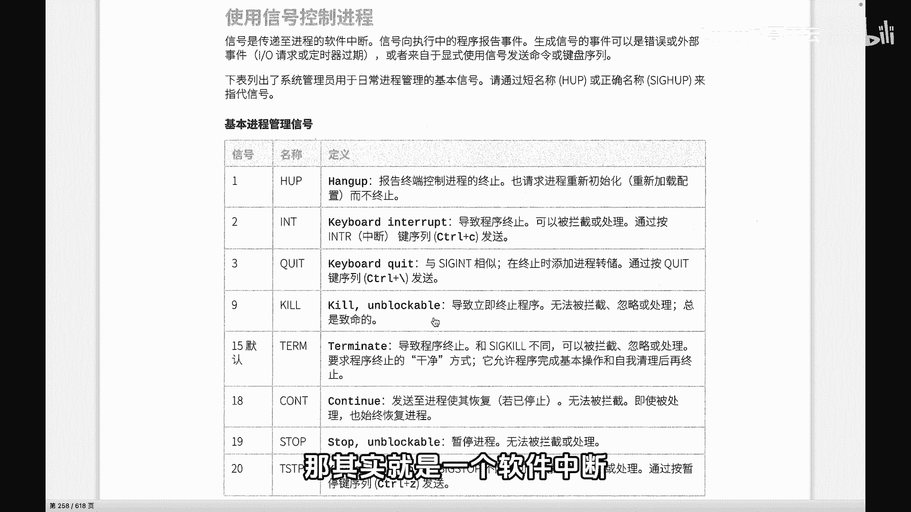
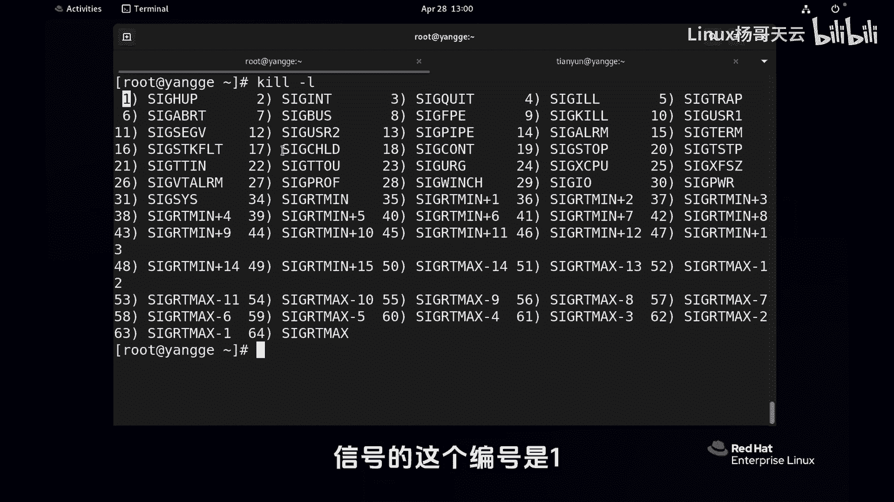
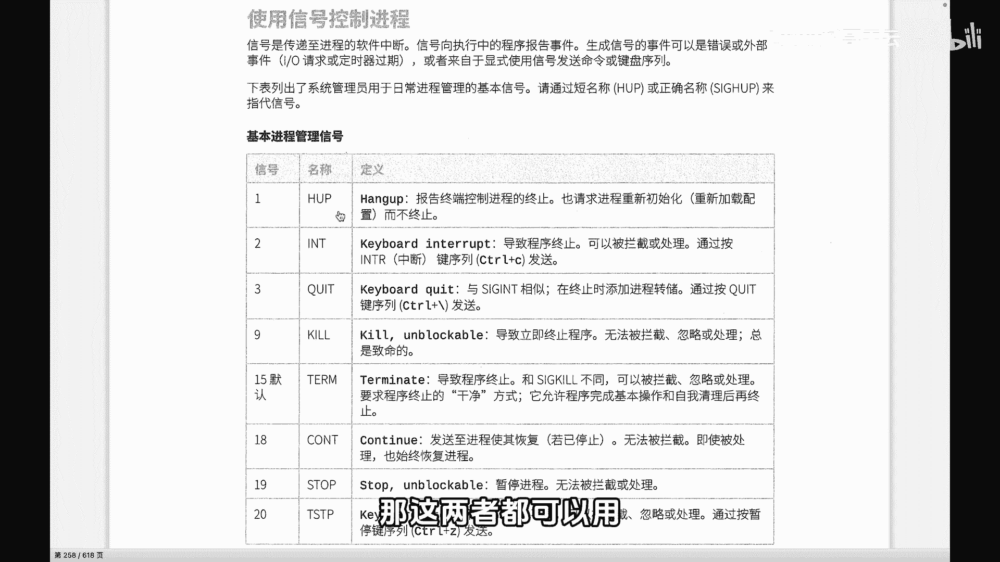
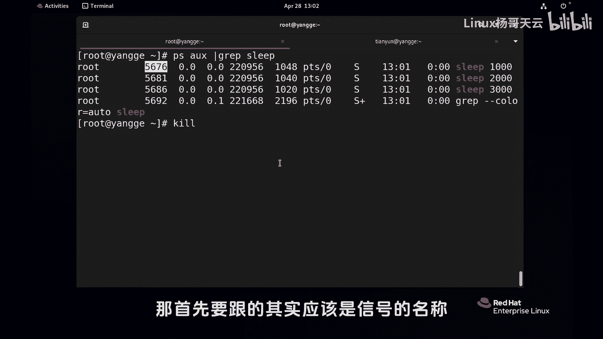
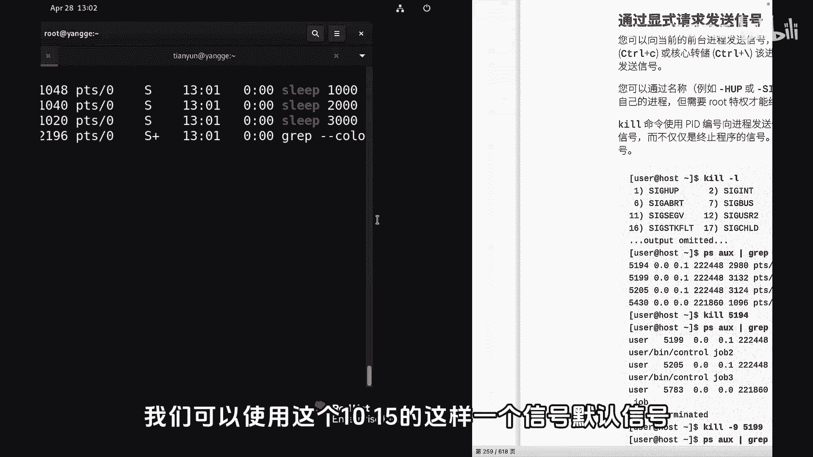
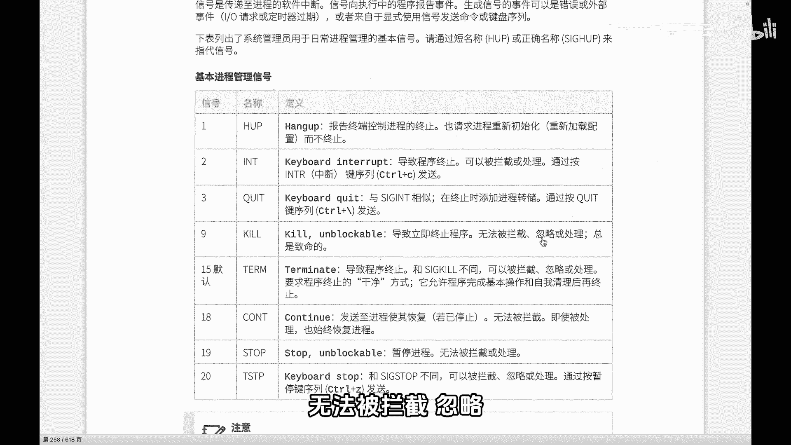
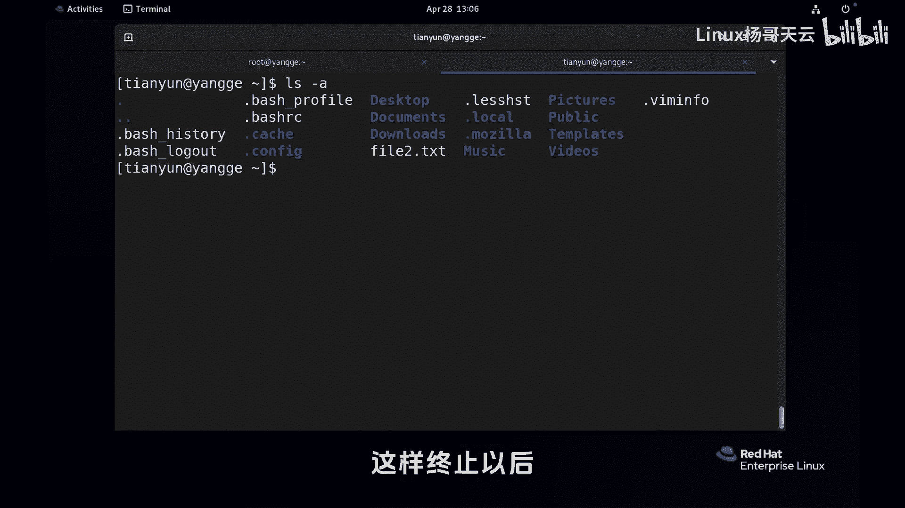
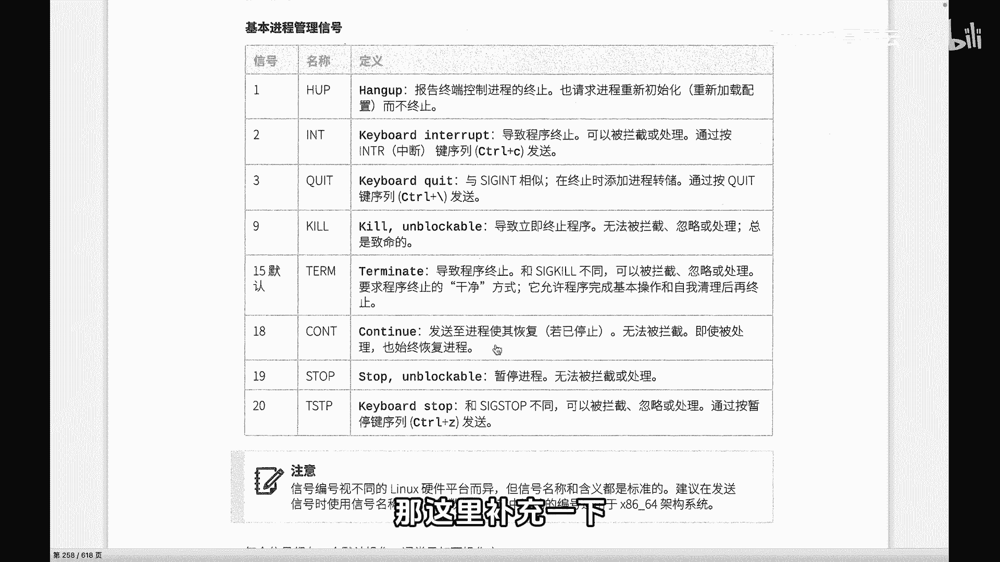
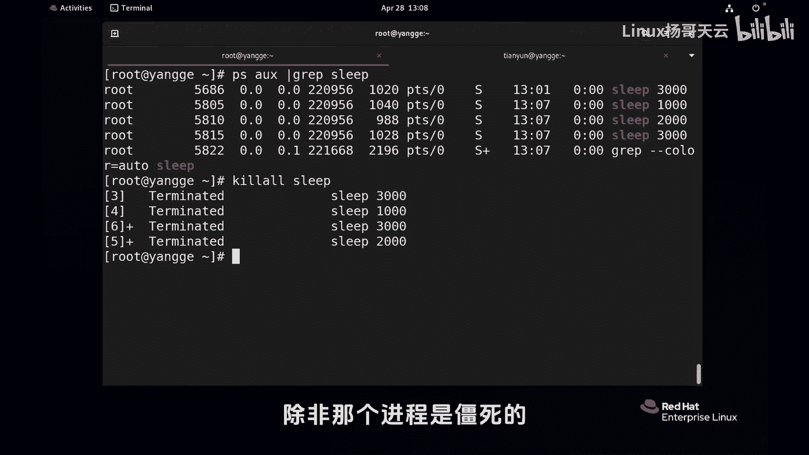

# 史上最强Linux入门教程，杨哥手把手教学，带你极速通关红帽认证RHCE（更新中） - P73：73.强制kill还是正常kill？ - Linux杨哥天云 - BV1FH4y137sA

🎼好，小伙伴们，我们接下来看一下进程的信号控制。🎼那么我们如何使用信号来对进程进行控制呢？首先要了解的就是咱们常见的一些信号。这里呢列出了一些比较常见的信号啊，包括一啊，还有咱们的这个95。

这些都是一些比较常见的信号。除此以外呢，还有像18，像这个contin，还有包括19stop，这都也是一些啊可以使用的一些信号。那信号呢就像我们的这个红灯停绿灯行一样啊，你可以给进程呢发送这种信号。

那其实就是一个软件中断。然后来告诉进程呢，它应该怎么做啊。首先呢我们来看一下。

🎼通过ca这个命令呢，这个对进程的这个信号发送有好多命令啊，其中比较常见的是ca和这两个命令。我们先来看ca。那先来列出一下当前所有的这个支持的信号啊，这些呢其实刚才我们给大家展示的只是其中一部分。

大家注意一下有信号的一个完整的名称什然编号呢是一信号的这个编号是一，所以它有两个名字啊，所以一个是信号的编号，一个是信号的名称。那这两者都可以用。首先我们来啊创建几个进程。

然后用用这个ca的方式来给他发送信号。当然在正式发送信号之前呢，我们也说一下，有一些可以显示的请求发送信号。

像我们可以直接对一个前台的进程按l加这个前面讲过l加C啊l加斜线这种方式来向那个进程发送显示的信号啊，也当前有一个进程，我们展示一下ep以这是一个前列进程。通过rl加加C。可能各位看到了哈。

这边我按了一个这个就是l加的一个。

🎼案件的结果好，然后这是一种显示的方式，我们将进行进行的终止啊，然后也可以通过呢。🎼因为如果他不在前台的话啊，不在我们的前端前台，那我们就只能够找到他的PID然后给他发送这个信号。

那我们现在都是拿sleep进行演示啊，实际上我们还有嗯很多其他的啊，比方说我一会儿给大家登录一下，从远端登录一下啊。来我们先开启几个进程作为演示啊，这是演示的进程。那第一步呢我们想要发送信号。

第一步要找到他的我们可以通过这个比较常见，然后过滤一下你这个时候大概的知道这个进程的名称啊，好我们可以看到sep1000这个进程呢，他的D的是5676这个时候我们可以给他通过的方式给他发一个发一个信号。

然后呢后面其实可以跟进程的也可以跟前面我们讲到那个作那个使用百号啊，所以百号和不号是有差别的好，这边用到的是5676那首先要跟的其实应该是信号的名称。比如说想要停止的话呢，我们可以使用这个1015。

🎼这样一个信号默认信号，你要是不写的话呢，默认也就是15，它是以干净的方式去那个死掉。那个九的话呢是立即终止，无法被拦截忽略，就直接就就就这是致命的啊。所以如果说使用的是没有加任何的信号的名字。

这个是加了信号的名字啊，信号的编号，没有加的话，那就是15，一般情况我们建议大家也不要想终止一个进程的话，不要随便的去强制终止啊，这样的话就可以，这个是等价语，你看它是终止了对吧？再来PS看一下。

这个时候两000就没有了啊，那也可以呢，我们再来看一下Q，然后杠9这是强制的终止啊，后面同样加5681回车，大家看到这个是Q掉，有没有说这个有什么区别呢哈，可能在现在看不出区别啊。

我们讲这个9和15信号，这个大家一定要注意，我们尽量不要用9，它是相当于是强制杀死，强制杀死的话，他可能连他的他自己的资源也来不及释放，就杀死了，就相当于通知他死，他立马就举刀自尽的啊。

那如果说是15的话呢。

🎼他还把他的后事安排好，他还告诉父亲，总说，我要退出了，我要死了才会死。🎼好，同学们如如果说不了解这个9和15的区别的话呢，那我们给大家做一个示例看一下啊。这边我们现在呢打开fi2这个文件。

这样我在我先不保存，和大家看一下所有文件，我们打开fi2这个文件啊，假装在这里边改一改。然后我现在呢要给他发一个什么信号呢，发一个9的信号，那首先要知道这个VI的PID是吧？我们找VI那应该是这个。

对不对？各位看他的PID是575750我们给他发一个什么信号呢？如果发一个杠9的信号，强制杀死是吧？啊，后面跟成是57。🎼그죠。🎼好，大家看到他没在当前审视，因为他不在这个终端。

那这边其实已经被kill掉了，已经退出来了，看到了吗？🎼好，这个时候大家注意到它多了一个文件，多了一个交换文件，也就是这个I实根本没有来得及保存呢，就直接被被我们杀死了。我们采用了一种极端的方式杀死。

如果现在打开2的话呢，他报错了，他说有交换文件存在你要怎么做呢？可以回了一下，可只读打开也可以编辑也可以呢去恢复也可以删除交换文件我删除。我们再试一下在呢这个正常保存以后交换文件应该啊还在啊。

还在的话那我们把那个交文件删一下，删一下的话再次打开的话应该就没有问题啊。我们尝试一下当然现在再要给他发信号的话，重新看一下他的ID因为每次重新启动以后PID也会变化，是不是好。

我们发一个15的信号不用啊，直接像这样就可以了。好，这边我们看到它是正常的中置这终止以后呢这边就没有产生那样一个交换文件。以相当于如果说你是的话呢，那他是不会释放它的资源的。

这个那什么情况用这个如果说一个进程，你通过15信号发送的时候，它已经不。

🎼他已经没有办法，他没有办法回应，那我们就采用强制的方式九的方式。好，至于这个一呢是重启啊，重新启动初重新初始化。一般情况我们可能用不上。因为我们的很多进程，像阿帕奇NGX。

我们是可以通过命令的方式service或者说stem controlrl的方式啊去重启的。所以这里呢这个九和15，这是我们用的比较多的两个啊。然后至于18和19的话呢，那也可以用啊，没问题。

也可以用去将一个进程暂停，或者是说continue啊，这是关于我们基本的一个使用啊。那这里补充一下，再补充一下，就是我这边sep开几个进程啊，最后补充一下。

呃，2000。3000。🎼好，现在的PSIUX我们过滤一下sep各位看到有好几个le是不是哦，好像两个3000好好太好了。如果是K的话呢，它后面只能跟PID如果你K2的话呢，它后面是可以跟名字的。

看到了吗？可以跟名字的。那现在我们注意我这边没有指定哪个，因为这几个我觉得都可以干掉啊，5686580几的哈。好，大家看到全部的终止了。所以K2的话，它是可以跟名字的。除了K和K2以外。

还有什么PQ很多方法，那这些呢我们就慢慢再去用啊，总之呢就是大家一定要记住9和15的区别。一般情况我不要用随便用那个9啊，因为它是强制的，除非那个进程是将死的，我们无法杀掉，那我们就使用9。

这大家可以明白了吗？😊。

