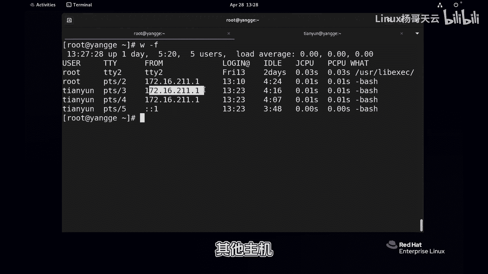
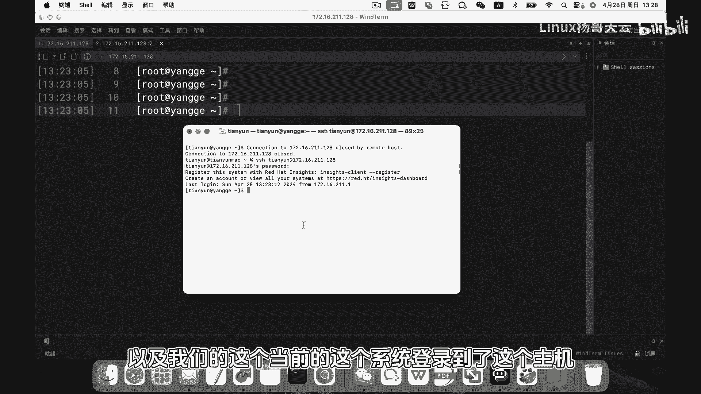
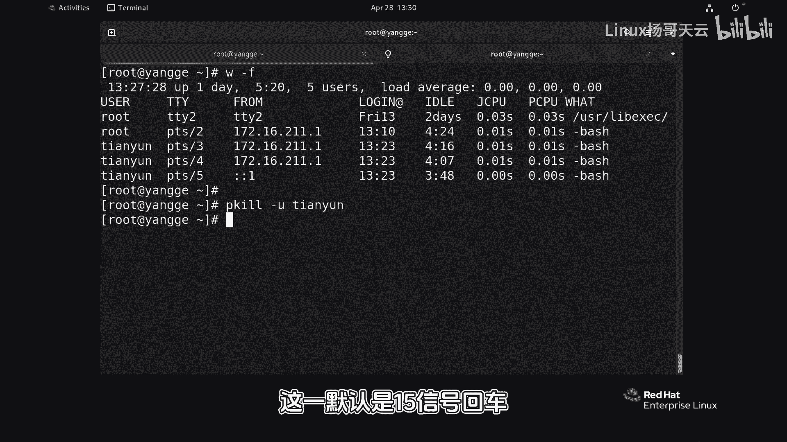
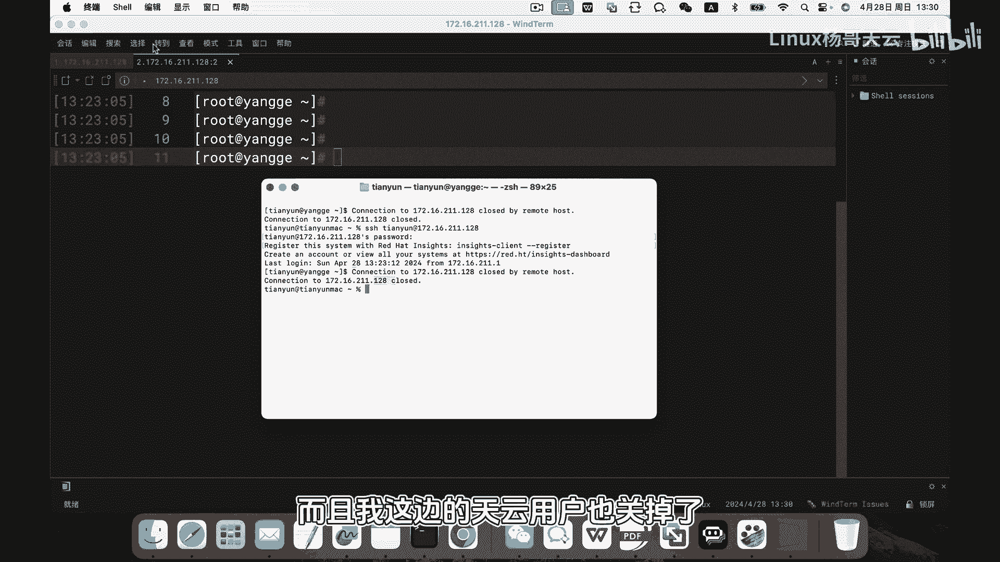
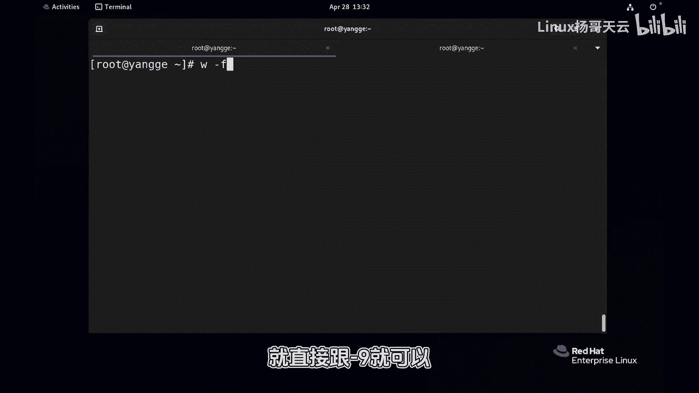

# 史上最强Linux入门教程，杨哥手把手教学，带你极速通关红帽认证RHCE（更新中） - P74：74.3秒断开危险用户的访问 - Linux杨哥天云 - BV1FH4y137sA

🎼当你怀疑有用户登录到系统，然后产生了一些不安全的行为。这个时候我们可能需要快速注销用户。🎼首先我们可以使用W杠F来查看当前登录到我们系统上的所有用户，以及他们开启的相关进程。🎼好。

我们可以看到当前系统有很多用户在登录啊，其中有root也有天翼用户，而且他们来自于不同的位置。这个TDY2呢是本地终端本地。然后这个是来自于呢其他电脑，其他主机好。

这边呢也是我们刻意的通过这个远程的SSH工具，以及呢我们的这个当前的这个系统登录到了这个主机，这个是指的是也是本地我们在本地呢做了一次登录啊，通过本地通过这个SSH天翼云。

然后logho的这种方式那做了一个登录。

好，这边就已经登录过来了啊。🎼那我们想注销谁呢？那比如说我们想要将天用户统通注销。好，那么我们可以使用PQ这种方式，它能够更加灵活的对比方说终端还有用户从这个角度呢进行相应的一些信号发送。那PQ呢。

如果说简单的，我们可以使用刚U天云啊，这里默认是事5信号回车好，大家看到这边已经终止了，已经关掉了。而且呢我这边的天云用户也关掉了。我这个也关掉了。但这个没有关掉，因为这个是root好，我们再来看一下。

当前是root用户还在连接。哦，刚才我们是对天用户进行了整体注销啊，来自于本地还有远程的那现在如果我们想要注销到root但是root用户大家看到有来自于本地的本地终端的。

也来自于远程的那这个时候呢我们可以通过PQ然后刚T终端的方式，这边终端呢是PDS杠2这是远程的那个终端。

🎼我们将它注销掉。好，当然后面也可以再继续跟上刚U刚Uroot也可以啊，回车我们再来看一下。🎼好，大家发现没有注销，因为失误的信号，发现没有注销的话呢，就直接跟杠9就可以。好，再看一下好。

这边已经注销掉了。

