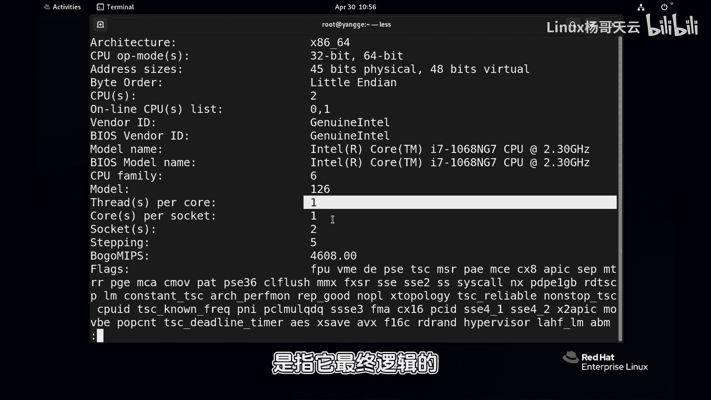

# 史上最强Linux入门教程，杨哥手把手教学，带你极速通关红帽认证RHCE（更新中） - P75：75.你真的会查看Linux系统负载吗？-上 - Linux杨哥天云 - BV1FH4y137sA

🎼如果你不知道系统负载该怎么看。好了，下面呢杨哥来教你。🎼这里有两种方式，一个是通过输入up time这个命令。🎼那我们看到呢在后面呢这个位置就是当前系统的负载情况。那它这边有一分钟。

最近一分钟系统负载5分钟，还有1个15分钟。当然前面有一些数字那大家也有必要解释一下，这个是当前系统时间啊，up状态。而且这个系统呢已经启动了4小时24分。那我们在生产中的服务器呢，这个时间会非常长。

另外还有一个就是当前登录到我们系统中的用户有几个用户，除此以外，我们还可以使用top命令来看，top命令也能看到相关的信息，大家可以看到这这一行呢是一样的。那么这个系统负载到底是什么意思呢？

从字面意思上可以理解系统负载就是我们整个系统的一个负载情况。🎼那到底是CPU的还是什么？之前很多同学狭义的理解为啊，说这个系统负载，就是就是这个CPU的负载情况，实际上不是的啊，不只是这样子。

它是一个这个系统的整体负载。那我们刚才看到的是一个什么是一个系统负载，在最近一分钟5分钟，还有15分钟的一个指数的一个平均值。那么它代表呢就是系统在这段时间的一个负载情况。那我们如果负载过重的话呢。

肯定呢这个用户的体验度，还有呢这个整个系统的负载也会高一些。那我们会可能会考虑增加服务器，或者增加相应的一些像CPU或者是来改善网络等等等等。那建议首先啊我们可以看一下，那根据官方的这样一个解解读啊。

他说通过报告CPU上准备运行的进程数。还有一个是注意看后面啊等待磁盘和网络IO完成的进程数来确定平均的负载值。所以不仅仅是大家传统意义上理解的说。

🎼啊，我有三个running的进程啊，或者我有4个running的进程，但是我只有两颗CPU，那我的负担是不是很重啊，是这样的，因为我们在后面会看到。🎼CPU确实是我们系统负载贡献度最大的一个方面。

但实际上呢还有就是我们的磁盘IO和网络IO大家知道磁盘IO和网络IO的话呢，这个本身会很慢的，它相较于我们的这个运算会非常慢。🎼因此呢它可能会也会呢给我们的这个系统负载呢贡献相应的一些值。

因为我们很多像这种D状态的进程。那实际上呢大家可以理解理解为什么？🎼它是不可中断的，这种不可中断的进程，通常指的是正在等待或者正在这个做IO的这样一个操作啊。

🎼所以这边我们看到这个负载主要贡线的进程呢是状态为R的。🎼running正在reable或者是正在running的正在CPU运算的。还有一个是呢等待IO完成的进程数状态是D的。那么这两类进程啊。

它们通们通常代表对CPU资源和内存资源类和那个IO磁盘IO资源或者网络资源的一个访问的情况。那他说一些传统的unux仅仅考虑CPU使用率或者排队的情况，只是负载。实际上我们linux呢和unux不一样。

它还包括我们磁盘磁盘网络的这个负载情况。那，所以这些都会有影响。但是呢这个CPU的话呢，它确实在整个整个这个贡献度是最大的。🎼啊，也说我们肯定更多的还是这个CPU的这样一个啊跟CPU相关。

我们能看到是我们的CPU的。🎼负载是不是过高哈，这个可能相关度高一点。那怎么来解读呢？各位看一下，刚才我们通过up命令来看到了这个1分钟、5分钟、15分钟的这样一个情况啊。

这边它代表了我们负载是增高还是在降低啊。确实呢这如杨哥刚才所讲到的CPU处理的进程是负载平均值的主要贡献因素啊，我们可以通过近似的每个CPU负载值来判断系统是否遭遇了显著的这样一个等待。

🎼所以呢第一步呢，我们光看这个值是看不出来负载重还是高的。因为你本身有些系统配置比较高，它有很多CPU有些比较低。所以这个值呢我们咦首先第一眼看上去肯定是看不出来的。

所以第一步我们先要看一下我们CPU的数量，就我们CPU的数量CPU是看CPU数量，它有两种方式，一种是回车以后会显示很多。那我这边呢就一下这边在这个位置看到了吗？这个位置就是我们CPU的相关的一些信息。

其中大家跟我一起看这三个值啊，一个是scketscket呢这个是插槽的一次物理插槽，那表示我这个电脑现在有两颗CPU我说的物理上的啊，当然我这是一个虚拟机。但是我们在装系统的时候给到它2个CPU。

🎼物理上你可以认为是两颗看得见摸得着的物理CPU。而我现在呢这个电脑上的每1个CPU，它它的这个核是啊每一个sockcket，每一个物理CPU上是一个核心，就一个大脑啊一个。然后每个核心呢是一个线程。

所以呢整体来讲的话呢，我这就还是两颗CPU。所以我们这里说的CPU不是指的是它的这个物理的，是指它最终逻辑的。你可以这么理解。

🎼啊，我们看这个书上的一个例子啊，这个例子大家看的很清楚，它一个CPU一颗CPU物理上是一颗，但是每一个CPU是什么呢？是两个核心，而每一个核呢又是两个线程。

所以呢一乘2再乘2相当于就是4个CPU当前是0号是3号CPU都在线的这是这个书上的情况啊我们现在这个情况就是2乘1再乘1所以你把这三个数字相乘的话呢，其实最后得到了就是你整个的CPU你看我这边是两个。

我这边是两个它的编号是从零和一开始。同样我们可以简洁的输出一下杠P杠P呢也看到了CPU的数量。第一个就是我们CPU的那个一个整体的编号，0号CPU1号CPU两个嘛多的话就会显示的很多。

下面会很多第二个是每个CPU的核心第三个是cket你看这个零和一呢明显表示这是两个不同的物理如果数字相同。

示它们是同一个位置啊接下来我们重点就是看一下怎么看这个负载情况啊我们整个来看一下首先大家先学会去认识一下。😊。

看CPU啊，然后怎么看CPU数量，按照刚才我杨哥讲到的sockcket，还有核心以及线程数。当然上面其实有显示，你也不用乘了，结果就是三个数字乘一下。好，大家可以先看一下。

