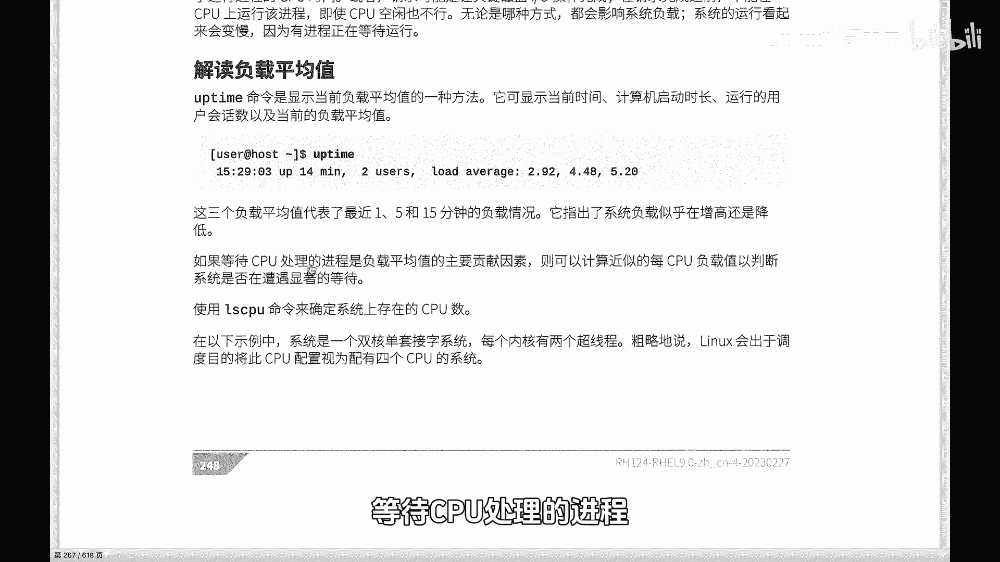
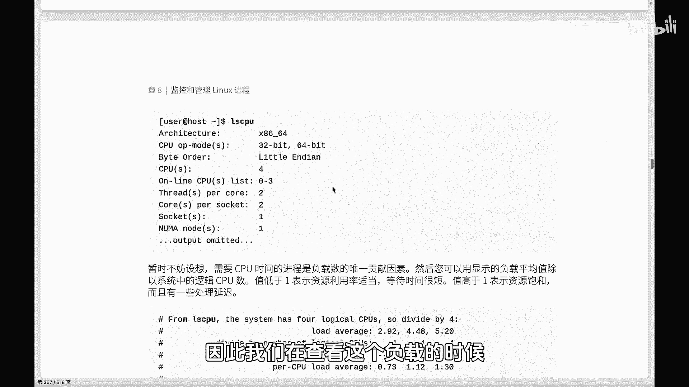

# 史上最强Linux入门教程，杨哥手把手教学，带你极速通关红帽认证RHCE（更新中） - P76：76.你真的会查看Linux系统负载吗？-下 - Linux杨哥天云 - BV1FH4y137sA

🎼好，同学们，我们继续来看系统负载。那在前面跟大家讲过，那我们的系统负载呢，它不仅仅是等待CPU处理进程的这样一个贡献值，还有呢就是来自于IO的情况，包括网络的这个IO以及磁盘IO。

但是确实呢等待CPU处理进程是我们平均负载值的一个主要贡献因素。因此呢我们在查看这个负载的时候。

🎼可能更重要的呢，这个关注点呢是放在这一块的。因此我们先要知道当前系统当中CPU的逻辑CPU的数量。这边刚才给大家已经讲到了，我们怎样去查逻辑CPU的数量，也就是用LSCPU啊，这三个数字乘一下。

当然呢系统中也会给到你这个逻辑CPU的数量。所以呢系统当中也给我们的一个这样的一个定义，就是我们暂时不妨假想一下啊，需要CPU时间的进程是负载数的一个唯一贡献因素。🎼注意这里给了一个前提哈。

并不是这样的。实际上，因为我们还有IO，但是主要因素我们现在考虑的是主要供献因素，那就是等待CPU要运行的进程啊，主要是R的两种进程。Rreable等待的，还有一个是就是排队的。

一个是正在running的。所以呢我们可以。🎼用这个这种显示的方式去计算一下，去通过CPU的数量，以及呢进程的这样一个啊以及我们的这个负载值去大致的判断一下系统的负载的情况。

那如果这个值低于一表示资源利用率适当等待时间比较短，也就是相当于我们去游乐园去玩一个项目啊，如果等待时间啊是5分钟，我们觉得这正常的如果时间过长的话呢？那表示呢？

这个整个的这样一个等待时间很长那资源饱和，那换言就是处理呢就会延迟好，怎么看呢？那这边大家看到给到了一个案例啊。

我们现在这个案例当中显示的是通过LSCPU这个命令看到是有4个ic4个逻辑CPU我一直强调是逻辑CPU啊，物理CPU它有什么它有核心，每个CPU可能有双线程啊，那所以呢最终是4个，那在这样一个情况下。

这个当然在我们的生产环境当中，4个CPU就其实已经是很少的啊，更多的是那个更多的CPU啊，然后有更多的核心，还有以及更多的这样一个。🎼物理的CPU好，那我们看到案例中给到的我们这个负载值呢是2。924。

48和5。220。注意这个是一分钟的，这个是5分钟的，这个是15分钟的。然后我们逻辑CPU的数量是444。换句话讲，就是每一个这个呃运算的时候，其实它都是4，所以运算下来以后呢，每1个CPU的负载0。

731。12和1。30。那么这个是。🎼最近一分钟的CPU的负载情况啊，我们系统负载情况不能叫CPU啊，那这个是5分钟，这个是5分钟的。那么到底是高还是低呢？我刚才讲过，这里有一些变量。

其中最关键的变量就是我们CPU的数量。如果说你的CPU逻辑CPU达到16个或者32个，那你这个上面就可以更大，对不对？好，那我们下次下面来解读一下啊，看一下这个第一个是我们的所有CPU在最近。😊。

🎼一分钟的一个负载情况，那它是73%左右啊，其也就是说对CPU的利用率呢其实并不会没有达到饱和。等待时间比较短。啊我们说这个时候系统是还是比较轻松的啊，非常轻松，并没有饱和。然后这个是呢5分钟的。

那么这个5分钟，很显然，你看超过一。🎼已经overload负载的可能就比较重，达到了超过了12%。这个超过了30%。那说明系统在最近的一分钟O没问题。但是在过去的5分钟和15分钟。

系统负载是比较重的这个时候我们可能要去查一下到底在过去的5分钟和15分钟到底是哪些进程，导致我们系统负载比较重啊，这这样一个看法，所以大家不要盲目的或者说直观的看到一个数字就觉得高。

主要和你的CPU的数量去做一个简单的运算。好，但然这个运算方法呢实际上并不是特别精确的，为什么呢？因为我们这个负载呢它不只是等待CPU要运行这样一个进程的空线因素。但是这是主要的啊，其实呢还有了别的。

我们可以先把别的忽略不计，先看这个O那每个CPU我们知道空闲的CPU对列数为0。也就是现在没有任何一个进程在运行。那这个地方就是零。

那每个等待CPU只要是等待CPU处理的进程就会使负载加一那就相当于这呢你可以认为就是一个进程。如果说一个进程在CP运行负载呢就是一。🎼我们这里的runney呢在前面跟大家讲过，有runable等待。

还有呢是runney啊，如果资源没有处在使用状态，没有等待请求，如果该进程运行了整个一分钟，那么它对这一分钟的负载平均值应约就是一。啊，同时呢我们还有还有就是因为磁盘和网络IO的情况。

也会呢去增大系统的负载啊。啊，这是整个的一个情况。所以我们。🎼可以看啊，基本上这个一的话在一以下，那说明什么说明我们的负载是比较轻的，或者接近一左右，说明我们整个系统的这个负载比较轻。

同时呢它的利用率还是比较高的。如果说明显的超过一的话，那说明我们的这个利用率倒是很高。但实际上呢整个的这个负载呢就会很重，就会导致我们很多的这样一个资源啊，变得很慢。

所以大家要结合CPU结合一些实际的情况去看啊。那大家这个看一下自己的这个服务器，到底负载是怎么样子啊，如果负载过重的话呢，肯定你的这个应用，不管是数据库还是你的网站都会有这个影响啊。

