# 史上最强Linux入门教程，杨哥手把手教学，带你极速通关红帽认证RHCE（更新中） - P77：77.实时监控工具top你会用吗_ - Linux杨哥天云 - BV1FH4y137sA

🎼进城监控工具炮果大家会用吗？如果你也是其中一员，那一定要认真看完杨哥以下的讲解。

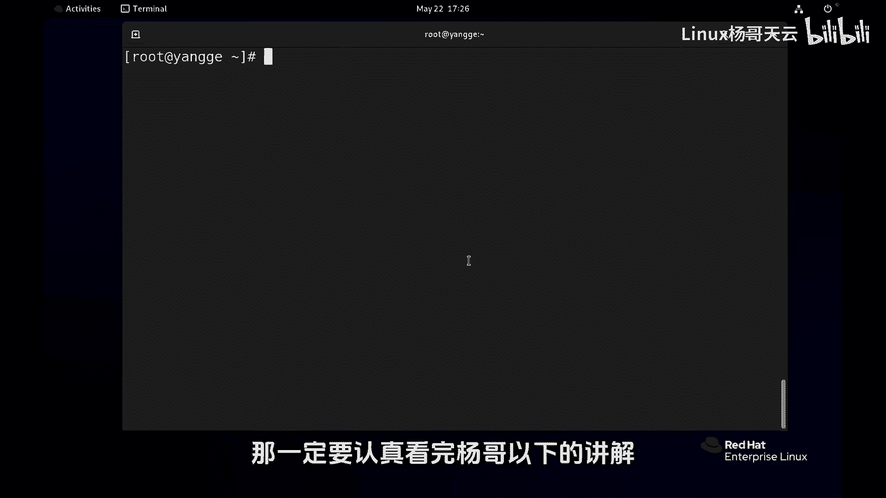

🎼好，接下来我们给大家讲解进程的一个实施监工工具。top。在之前呢给大家其实已经展示过top的使用。那下面我们再详细的给大家解释一下top的一些使用技巧。

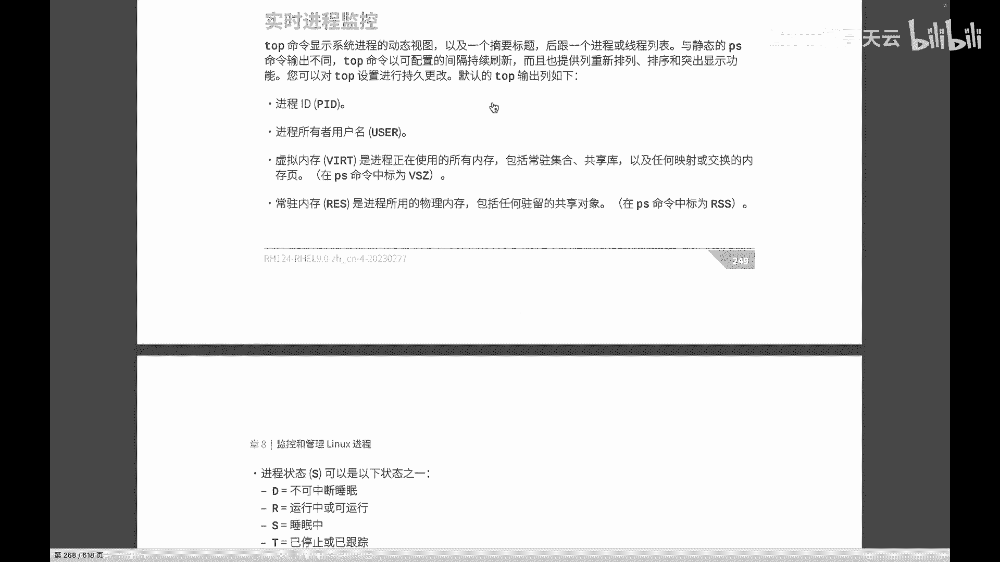

🎼好，首先top。🎼在最上面的几行呢，包括我们的系统负载，这个在前两个视频当中已经有详细的讲解。大家可以回过去看一下啊。接下来呢我们这是进程的数量。

进程的总数running的啊各个状态的进程running的还有呢sleep的top还有的进程。那接下来呢就是关于我们CPU内存的一些使用情况。那这几个值是他们的一个使用的一个百分比占比。

其中包括什么用户态系统态的，还有呢像这个空闲的啊空闲的这样一个CPU占比等等等等啊接下来呢是内存的一些使用情况，包括我们的啊物理内存，还有交换分区，它们的总内存，以及呢空域的情况啊。

这边首先top呢它的使用方式呢呃是应该说是比较的有意思的啊，其中包括我们看到的一些基本的一些这个显示。同时呢还可以通过一些这个命令的方式呢来这个去显示不同内容啊。

或者说我们去定制top的显示的内容那比如说其中我们现在看到CPU的一个显示啊，它显示的是总的。

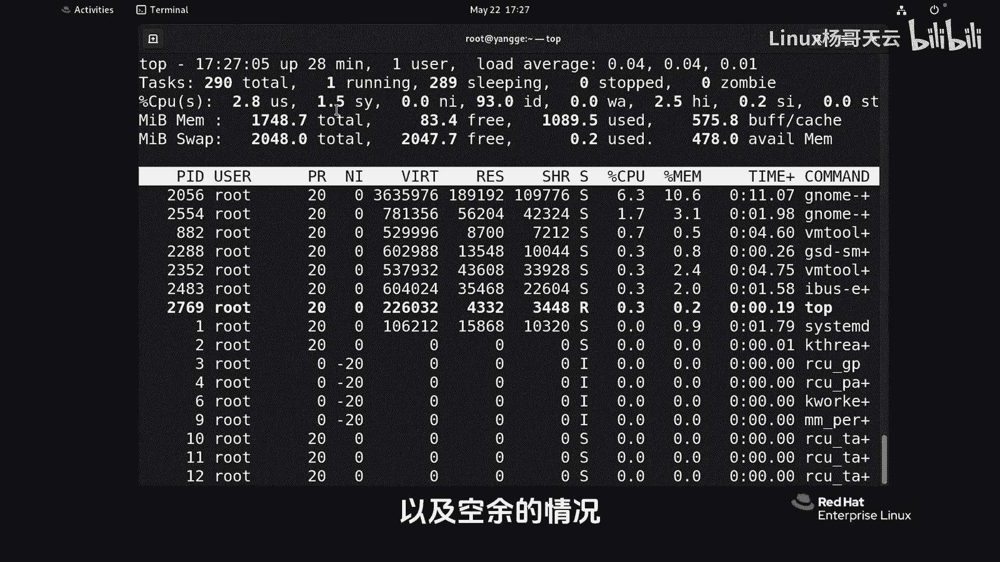

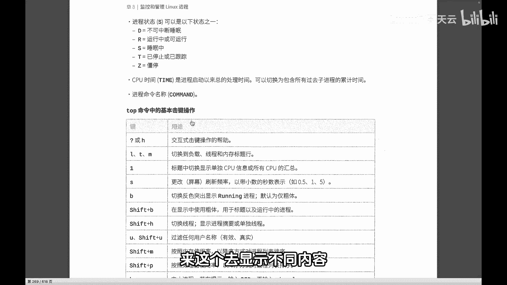

🎼啊所有CPU的情况，如果按下一这个命令，那它会显示所有CPU这个所有CPU也就使用LSCPU看到了所有CPU所有逻辑CPU的情况，每一个CPU的一个相关的一些百分比的一些使用情况。

按一的话收起这个如果CP比较多，那这个屏幕占的比较就会刷一下占很多屏幕。接下来呢是我们进程的一些相关信息。方说进程D啊，还有呢进程的启动用户以及呢这两个是他们的一个可以调整它的优先级啊。

还有呢我们的内存的情况，这里包括虚拟内存啊，还有我们的这个呃驻流内存以及呢共享内存，这个是进程的状态。

其中R是我们知道是running呢就以及呢CPU该进程的一个CPU的百分的一个占比百分比的一个占比以及内存的一个使用占比。还有呢就是他们的使用CPU时间以及进程的一个名称。

🎼那这里大家看到显示其实比较乱的，比方说我们想要看前面的哪些进程占CPU比较多，占内存比较多，但实际上现在不是排序的。因此呢我们可以通过像啊像这个M和P的方式注意是大写的M大写的P。

也就是shift文件加M它将会按照内存的使用情况，或者按照处理器CPU的使用情况进行排序。O我们按shift文件加M好，这边那按照内存的使用情况，可以看到现在是降序的方式，我们能看到哪些进程呢？

它对内存的消耗比较重。同样呢shift加P呢，它是按照CPU的一个使用情况进行排序。

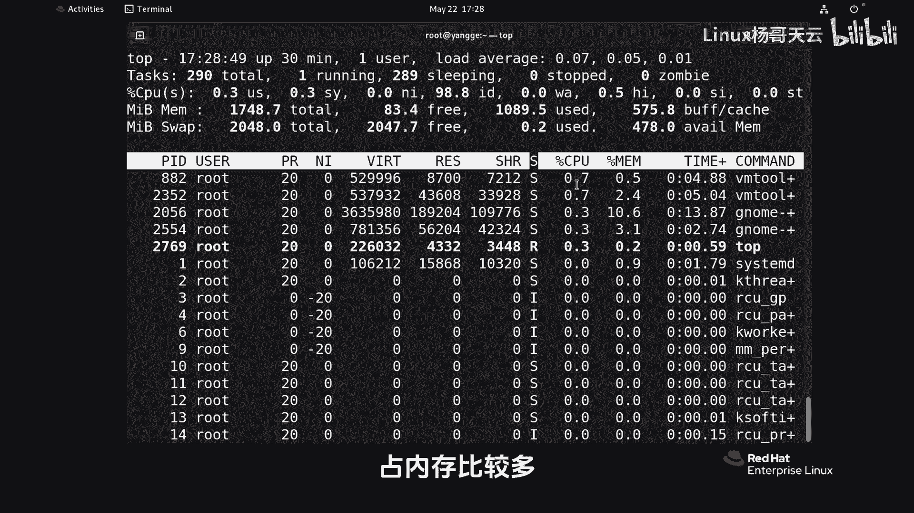

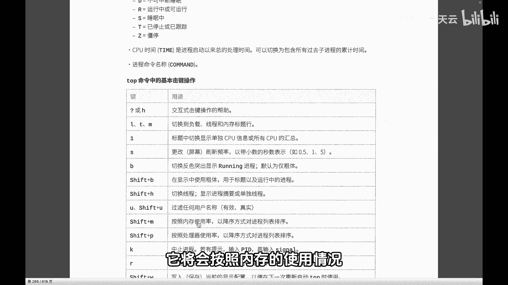

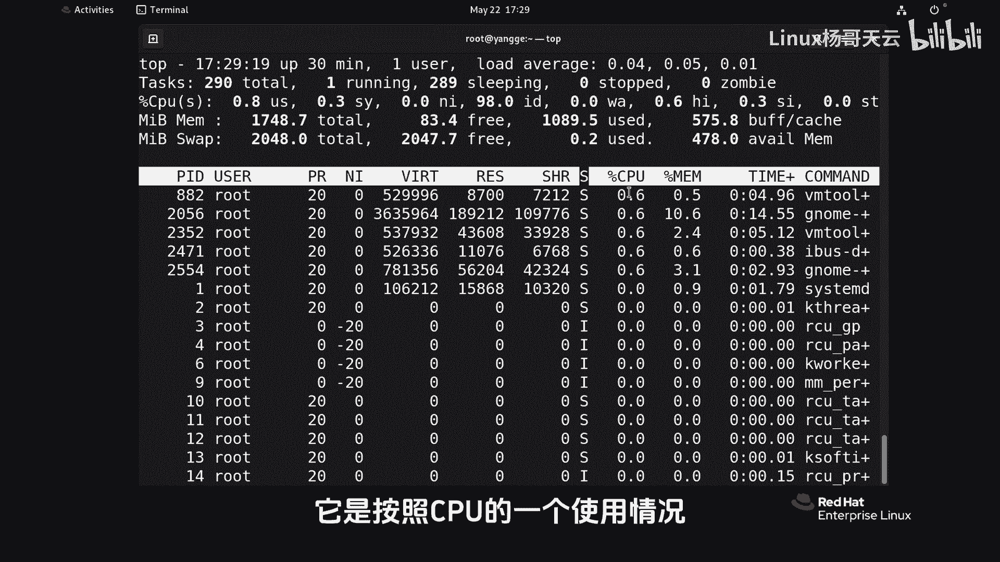

🎼这是这两个啊，除此以外呢，有一些命令呢，我个人觉得可能用处不是很大啊。然后那这边还有几个给大家要要说一下啊，那这边我们看到好像当前没有看到它的PPID啊。

也就是这是它自己的I还有它的一个附这个没有显示，因为当前的这些字段，我们其实是可以定制的。这个时候我们可以输入F啊这个字一个单词，也就是这个F字段这个命令好，这边大家看到它其实有很多字段啊。

当前带星号的表示呢选中的字段当然鼠标这边不能操作啊，这边我们比说要显示PPID啊，可以呢选到这一行上来键啊选上来过来过来以后呢按空格或者说空格空格取消或者加上啊。

这边可以呢把有一些啊比如我不想要的可以把它减掉啊，这样的话就可以好，然后呢按Q或E键呢回到我们的这个界面上来，这边我们看到就有个PID但如果我们觉得这个顺序好像不是这样的。

我们想把PPID呢放在最前面啊那这个时候同样呢再次按F键啊然后。😊。

🎼到先移动到PPID这边来上下键啊，注意看现在啊现在它的这个我们杀下键是只是光标移动。我们如果想选中它的话呢，想要移动的话呢，是按左右键啊，大家看到左右键，如果选中的话呢。

大家看到这个光标整个就会变得不太一样啊。好，选中以后按上键，我们往上走。这样的话我们可以调整咱们这些字段的显示的一个顺序，我用按Q键退出。好，这边我们看到PPID显示在最前面。

所以我们可以自己来定制我们top呢它的显示的一个内容啊，但是如果现在退出的话，按Q退出的话呢，再进来的话呢，它又没有了。那为什么呢？因为刚才我们所自定义的内容实际上是没有保存的。因此呢这边可以输入W。

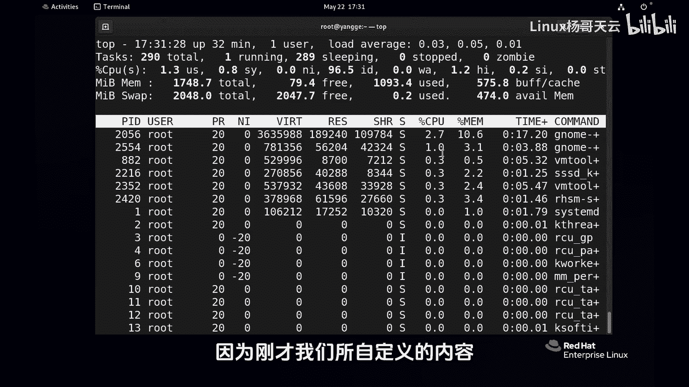

🎼shiftW，然后来保存top的这样一个配置啊，这样的话在下一次呢比说我们大家演示一下啊按F键啊，我现在把这个这两个去掉，然后我把这个PPID呢加上去。

并且呢右键啊把它选到最前面去这个按键按shift加W可以看到屏幕上其实刚才有个显示他把我们的这个配置保存在一个隐藏文面里面去了啊。好，如果再退出重新再进来，这个时候还是有PI好除此以外呢。

这边用的比较多这些命令呢，包括刚才用到的一啊，还有呢就是呃咱们的这个M还有P这个用的比多一点。至于是不是高亮显示，或者说反射突出啊，大家可以去试一下S或者是B啊，这个去看一下啊，还有改变什么刷新率之的。

然后这边还要给大家要说的是进程的一个管理K一个是K个R呢就是我们给进程发新号，这个之前我们引过。说我们通过命令，后呢它默认I9然后我们我们可以呢在这边输入一个相关的一个编号，然后按灰车就可以。😊。

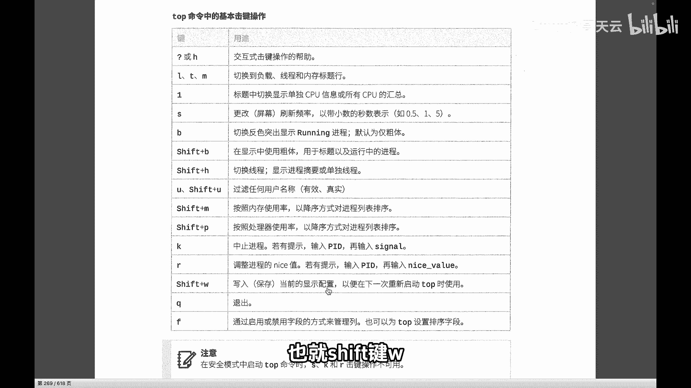

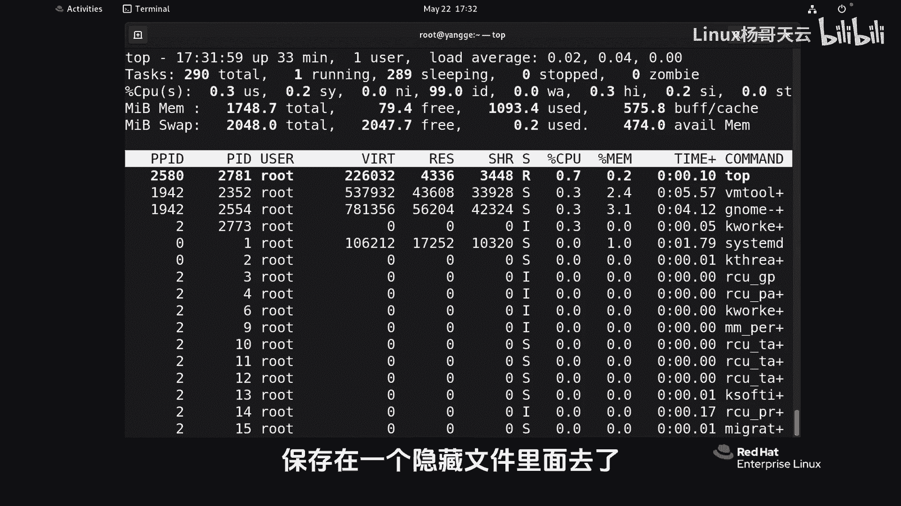

🎼好，这边就不演示了啊，我这边都是系统进程，大家可以去发送这个信号给进程。除此以外呢，还有一个我按EAC就可以了啊。然后还有一个就是R这个命令。这个命令呢我们现在还没有讲过调整进程的一优先级less值。

好，这边呢我们可以先试一下，大家看到默认呢它也是有一个进程，我们可以去改变它的一个值，重新调整它值好，关于这个优先级呢，我们将在后面的内容当中给大家讲到啊E好，这就是我们这个top命令看到的这个进程啊。

去查看进程的一些技巧。以大家只要记住这些比较常用的就可以啊。那另外最后还问一个问题啊啊，大家可以在评论区给杨回复啊，除了我们的top以外，还有哪个工具可以实时的查看进程的信息啊。

这个大家可以呢在评论区回复一下。😊。

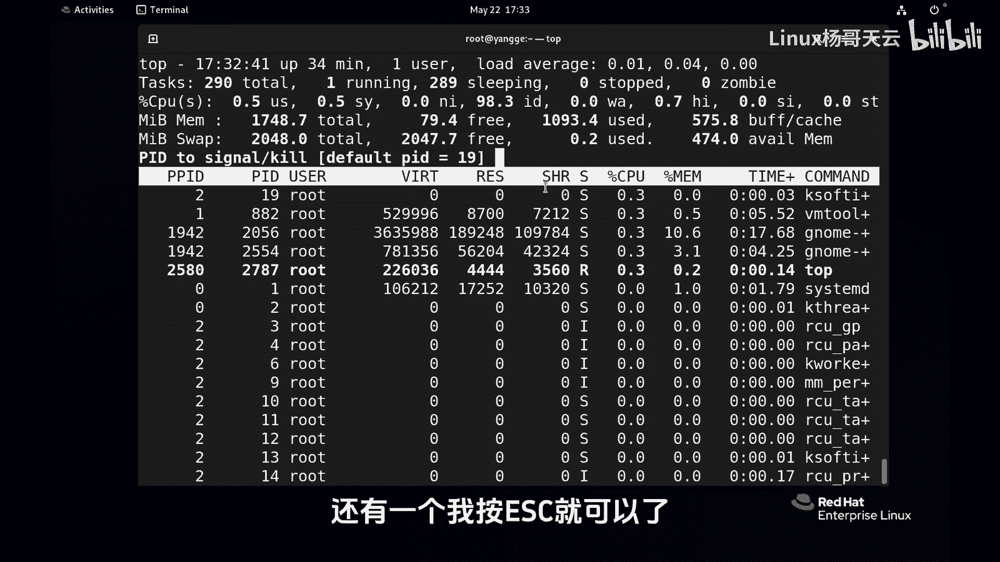

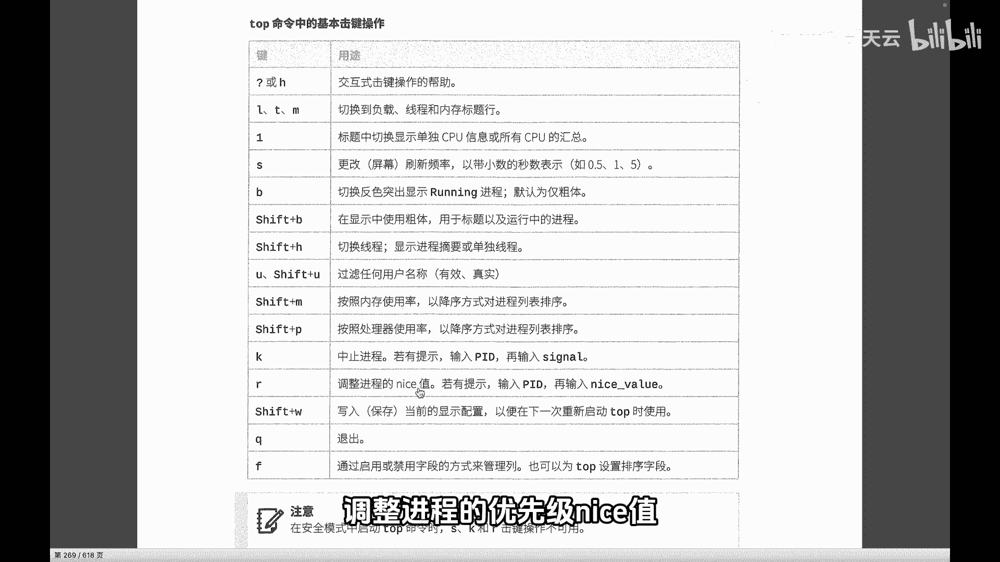

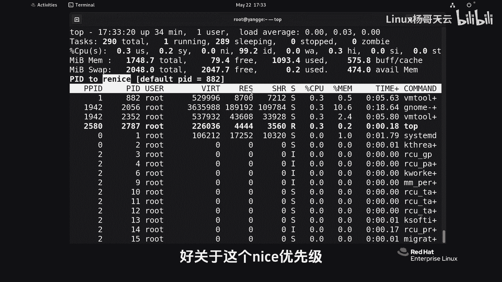

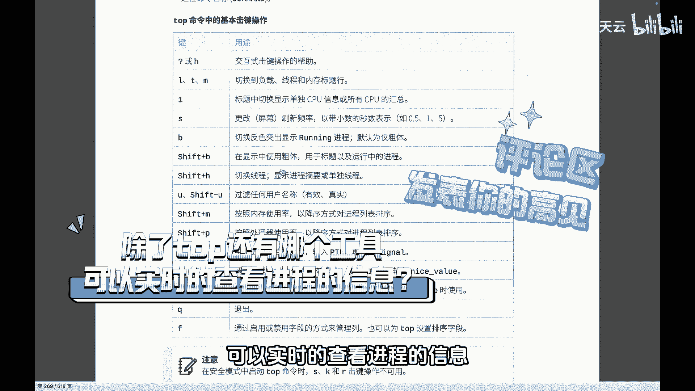