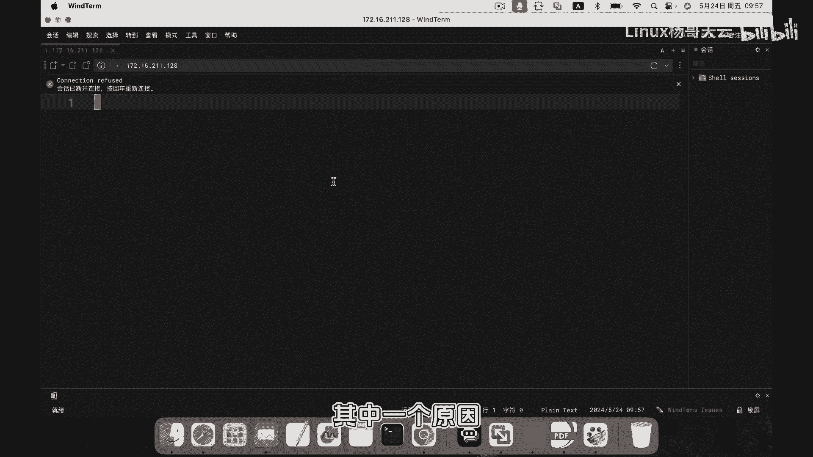
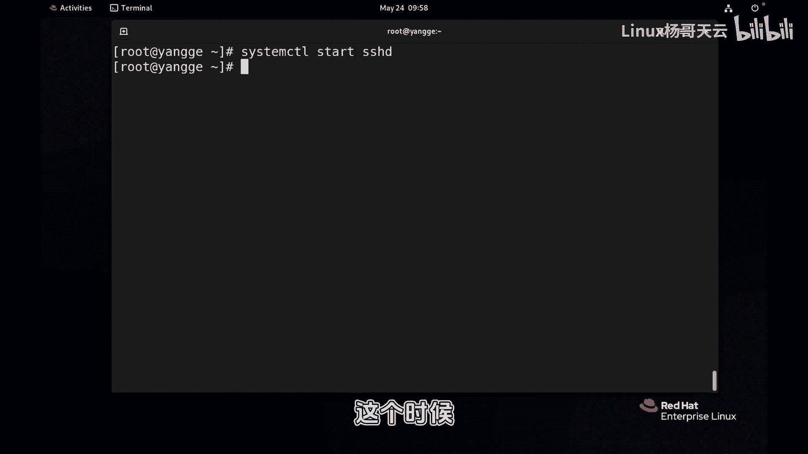
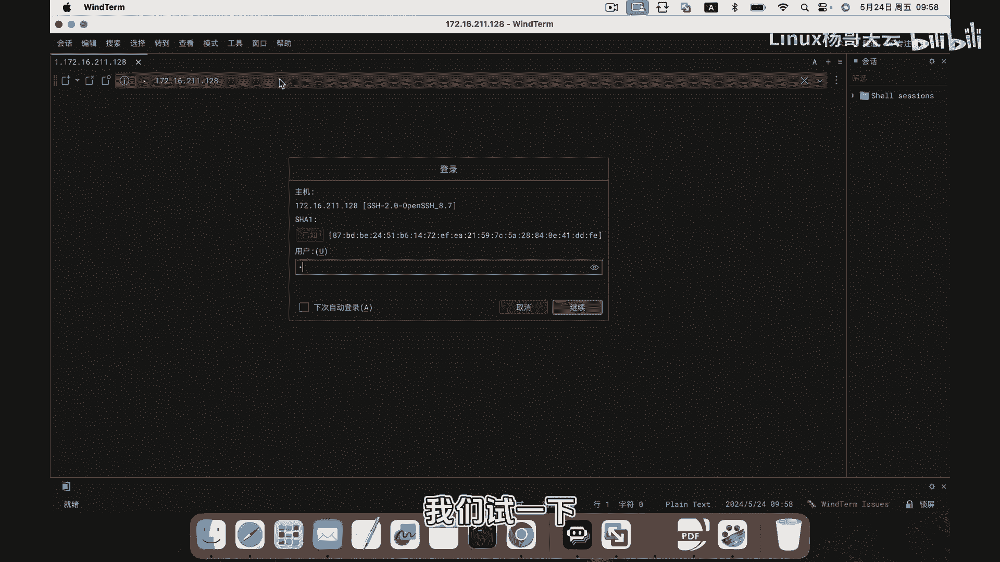
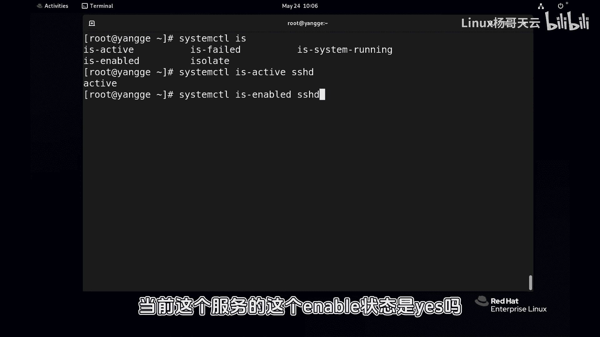
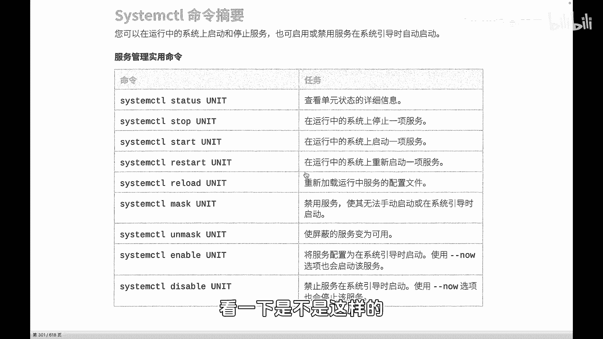

# 史上最强Linux入门教程，杨哥手把手教学，带你极速通关红帽认证RHCE（更新中） - P78：78.ssh远程服务为什么连接不上_ - Linux杨哥天云 - BV1FH4y137sA

🎼为什么SSH服务连接不上？大家想一下可能有哪些原因？比如说端口，比如说防火墙，还可能会有哪些因素呢？其实下面我们讲一个最老六的问题，就是这个服务根本就没有启动，这是我们没法连接的一个其中一个原因。啊。

接下来我们就来看一下服务的一些管理。

🎼那当前呢我们首先来通过systemCDL这样一个命令来查看一下STATUS来查看一下我们的SSHD这个服务。那这个服务呢后面可以跟上点service啊。然后这个服务当前的一个状态。

因为我们知道只有SSHD这个进程。这个守护进程啊，它启动的话呢，我们才可以去连接。好，同学们可以看到呢？当前这个守护进程是inactive是没有启动的，所以根本就没办法去连接。🎼啊，怎么启动呢？

接下来就是我们要给大家讲到的，如何来管理我们linux上的守护进程。那我们刚才用到的工具啊，用到的min令叫做system controll啊这样一个命令。🎼我们可以呢使用start。

然后来对SSHD这个服务呢进行启动。后面如果没有默认跟这个点service的话呢，默认其实就是服务啊，所以可以不用跟像这样简写为SSHD好，这个时候呢首先我们先来看一下连接的情况啊。

这边再次按回车大家可以连接啊，然后至密码对不对啊，这个这是后话啊，我们试一下啊，用户名。

🎼密码好，大家看到可以连接是的。重新我们来看看状态，stem CTL status。🎼然后SSHD点service啊，你可以不加，我也经强调过了啊。好，同学们可以看到，当前它的一个状态是active啊。

说明当前是启动的啊运行状态。大家知道我们这个在鸿帽考试的时候，有些同学可能最后呢很多服务是得零分。他自己在测试的时候没有问题。但最后考试的时候，考官检查的时候呢会得零分。

原因是呢他这个服务或者他这个守护进程没有设置为开机启动。🎼这个大家听明白了吗？那么上场当中也是一样，我们的服务器可能会因为一些原因重启，有可能是人为的需要重启，也可能的是呢比方说断电的一些因素。

然后导致这个服务器被动重启。那么重新启动以后，你的这个服务是不是会自动启动呢？我相信这个是一个必须的基本上的一个常规性的动作，也就是说你把这个服务启动起来以后。

那你还要同时考虑到它在下一次开机的时候是否能够重新启动。以接下来呢我们就要用sst啊L这个工具呢来对我们的服务做相关的一些管理和验证啊，那刚才我们用的到的这个命令啊stL这个工具啊。

我们可以呢比方说刚刚刚才跟到的最简单的star来启动一个服务啊，但这边可以按table table看到啊大家看到有很多很多或者是呢跟上stop呢来停止停掉一个服务啊，停到一个服务的状态。

我们其实刚才大家验证过了啊，这个没问题啊启动和停止。那除此以外，除了s和top以外呢，还有一些比较常用的一些使用方法。比方说。🎼啊，SSHD啊同样后面可以跟点service呢毫无疑问，就是请先把它停掉。

再重启。那这边呢我就还有一个点要特别注意一下啊，这个star这个min令啊或者这种用法，在生产当中很多时候是不常用的。你要知道，因为当前啊不是你的网站服务器。

或者是后面我们讲到的NGX还是网站服务器还是其他服务器。那么用户是在访问着的你的重启会断掉它的相关规划。所以呢这个min令没问题。你看啊如果没有连接的情况下啊，或者没有这个相关的一些这个规划的情况下。

这个没问题。那最后我们查看呢状态肯定也是启动状态是啊，这边有一个地方我还没有讲到，这就是刚才杨哥谈到的enable也就是开机是否自动加载的意思啊啊，我们先Q推出。

那刚才我们说到这个restar其实还有一个叫做reload。🎼重新加载，这个是比较推荐使用的那当我们的这个服务，比如说有一些配置发生变更的时候，我们轻易不要去rere。因re的话呢。

它会相当于把这个进程关掉了，再启动一个大家可以其实可以去查看我们的这个进程的这个PID啊，就发现这个是变化了的。那我们在下一节当中给大家做个对比啊，大家看一下。

那这次呢我先给大家强调一下reloadreload的话呢，它会加载重新加载配置文件。然后不会影响当前的对话。但是呢在一些特定的场景呢。

我们有时候可能没办法reload这个在下一小节当中给大家详细讲一下啊，这是一个reload啊，然后除此以外呢，我们可能需要了将服务将这个进程啊，准确的说将这个进程设置为开机自动启动。

那方法就是呢我们可以使用enable后啊SSH这个并不是启动服务，这是将这个服务或者将这个首部进程设置为开机自动启动。好，大家看到可能没有什么效果。因为目前本身就是开机自动启动。

我们可以通过状态来看一下。🎼目前本身就是enable没有什么变化Q退出啊，我们将它改成这个叫做diable。可以看一下好disable其实呢它就是把这个一个啊这个服务的一个配置文件啊。

一个单元文件给它移移掉了啊。那我们再来看一下它的状态，它这边就是diable但是呢当前是运行的，也就说当前你此时此刻你这次你是运行的，没问题。如果关机重启。

那么系统是不会把你加载的内存当中的那也就是说你不会启动的啊，这个大家可以自行验证一下，重新验证一下就可以好，那相应的呢相反呢就是刚才我们说的star啊叫做那个 enable好，那这里呢大家说一下啊。

我如果现在把这个服务停掉。那相当于呢再次看一下当前状态也是停掉的，并且开机也不会启动，听明白了吗？那这里呢我要说如何将它开启，并且呢我们要进行这个叫做开机启动，其实有两种方法，一种方法呢是先启动了。

先把这个启动，注意我现在没按回车，然后呢啊我只是示范一下啊，然后再将它设为开机启动这种。😊，🎼啊，我现在没让回车，我取消一下，我并没有做给大家验证一下，是不是好，我现在没有做。所以我要说的是什么呢？

这两条命令其实可以等价于另外一条命令是等价的。大家以后可能在别的地方可能会见到这样的方式。好，这个enable然后叫做什么？本来是这样写的啊，本来是这个SSHD没问题，那这个没问题，那我们家刚刚。

所以这条min和上面这两条命令是等价的。好，就相当于呢同时将它设为了enable，并且将它启动起来了。这大明白了吗？我们可以看一下。😊，🎼H好，并且一做了这个事情，同时做了另外一件事情啊。好。

这是关于这个叫什么那还有一些验证方法呢，也给大家说一下啊，比如说stemL这个别用脚本的时候，们可能需当前服务是启动的嘛当前这个服务的这个状态是也好，这个是可以返回或验证服务的一个状态。

那另外呢这边相应的一些啊一些具体的命令，也就stemL一些对服务的启动停止命令大家已经展示的这边啊，还有一些呢我们在后面给大家去讲到ok好，那大家可以自行的练习一下啊。

就来我们SH后远程来访问看一下是不是样。😊。

