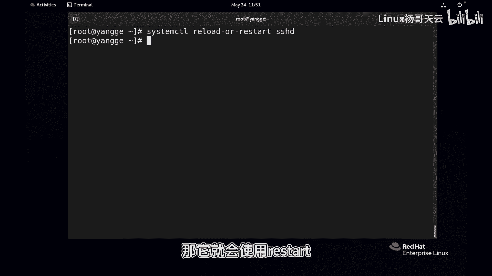

# 史上最强Linux入门教程，杨哥手把手教学，带你极速通关红帽认证RHCE（更新中） - P79：79.restart 和 reload有区别吗_ - Linux杨哥天云 - BV1FH4y137sA

🎼当我们修改了一个服务的配置文件之后，我们是应该restar还是应re。那么这两种方式实际上是有区别的那接下来杨给大家展示一下这两者的区别。好，首先我们先来查一下啊咱们的SSHD这个进程的D啊。

我们以这个进程为例杠F过滤一下SHD好同学们可以看到有3个甚至会有更多的这个D啊这边有470447084760之类的啊。

那那哪一个倒是呢啊很显然这里呢是这个啊这是它的一个主的一个D我们也可以通过sstemHD来查看好，这边同样我们看到它有一个主的PD啊，因为它还会有这个相应的用户过来连接，所以呢就会产生很多紫禁程啊。😊。

🎼大家一定要知道它的这个主的PID好，那如果我们现在假设我们改了配置文件，那现在还没有讲到这个服务，我们先不着急真改啊。我们来重新启动一下。首先啊c systemtCTL先来重启一下ART。

然后重新启动一下，大家观察一下它的PID有没有变化啊。比如说那很显然这个服务赢经钱了。好，我们同样通过两种方式啊，一个是。😊，🎼PSEF啊过滤一下。🎼好，大家看到它的主的PID呢是4879。

也就是这个已经变了，对吧？好，或者我们通过刚才啊这个tus也也可以来看到。🎼好，它的主进程的PID已经变了。那这样的话呢，对于这个进程的PID变化，实际上大家可以认为是重新启动这个进程，关闭重启了。

那么这个对于有一些服务来讲的话啊，特别对用户的连接甚至监控呢是有影响的。所以我们有第二种方式就是reload。🎼好，同样大家先记住它的原来的啊1个ID啊PID。

然后我们现在呢同样假设对这个服务呢做了相关的一些配置文件修改，然后采用reload的方式SSHD返回车。好，大家看看现在它的PID呢是没有发生变化的。它的组的PID没有发生变化啊。

你通过tatus也可以看到也是没有发生变化的。🎼好，所以我们尽量的对服务的配置文件修改以后，尽量应该首选的是reload，这样的话不会影响进程的1个ID啊，同样也不会影响与之关联的一些其他进程。

那有些时候我们可能也不太清楚啊，就是到底用这两两种哪一种。因为有一些服务你reload是没有用的，它可能不会有真正的这个意义，并不会重新加载你的配置文件。所以呢官方给我们提供了第三种选择。好。

大家看看sstemL后面呢你看我打一下re这边除了reload，还有呢这个restar以外，还有一个叫reload or restart这样一个命令。🎼好，用的时候大家可能看不到有什么变化啊，是这样的。

如果说它能够reload并且加载它的新的配置，那它就会reload。如果呢系统发现这个服务不可以啊，就不能加载配置，那它就会使用restar，也就是先优先reload先拟后兵。

