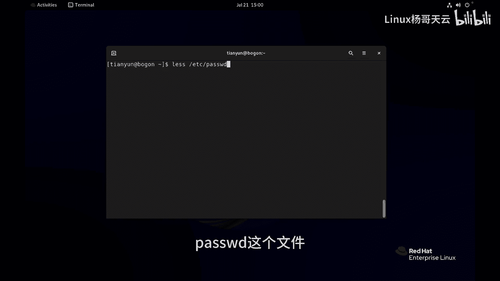
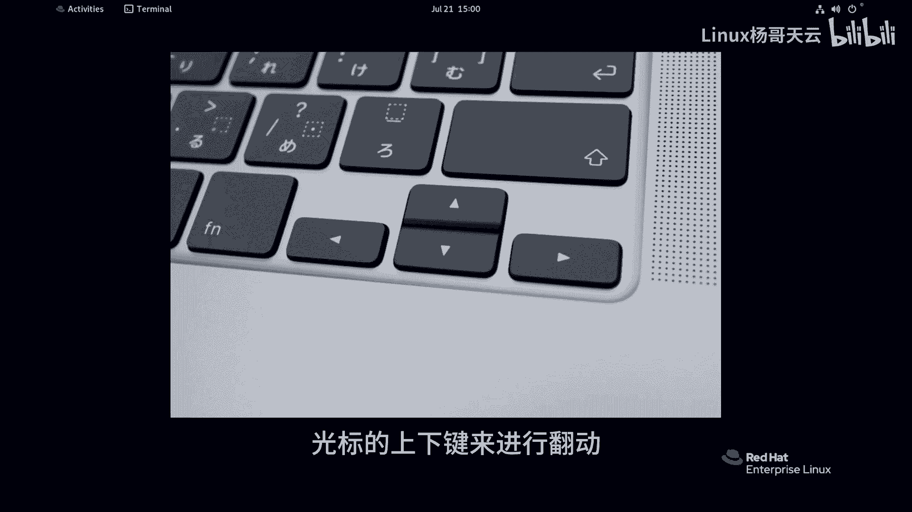
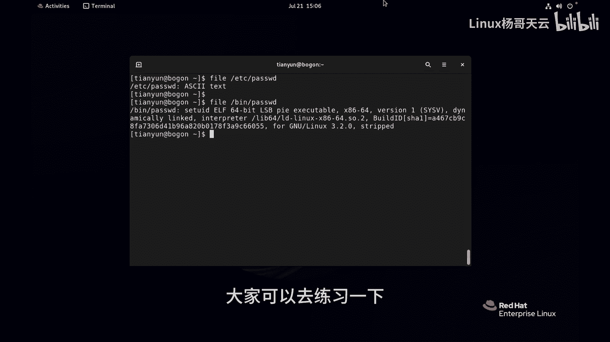

# 史上最强Linux入门教程，杨哥手把手教学，带你极速通关红帽认证RHCE（更新中） - P7：7.如何在Linux中查看文件内容？ - Linux杨哥天云 - BV1FH4y137sA

那我们下面呢来看一下，使用by事shell来怎样对文件做一些基本的管理，那比如说我们想要看文件的内容，我们可以使用一些mini，比如说像cat lets，或者像那个had at。

以及呢tile这样一些命令来进行查看，下面我们一个一个来简单看一下啊，首先cat mini呢一般适合看内容比较少的，比如说不会特别长，怎么讲呢，比如说我们看一下etc下的host死啊。

这样一个文件注意空格啊，这个是没有空格的，这是一个路径，我们后面会详细讲到这个内容呢，一共就两行没问题，但如果我们要看内容比较多的呢，比方说etc下的pass w b d文件，它内容也比较多。

可能有很多很多行，这个时候我们可能看不到前面内容，那怎么来看呢，清下屏CTRL啊，我们就可以使用，比方说lets命令，let's命令呢，它也是查看文件内容的，我们可以使用let's空格。

EDC下的DPASSWD这个文件。

它前面其实是从第一行显示的，只不过没有显示完，我们可以通过光标的上下键来进行翻动。

翻我们想要找的内容，然后怎么退出去啊，注意你看下面这个这个整个到下面呢，也不是我们的shell那个提示符，所以呢你想要退出去的话，得按这Q这个命令啊，啊退出来了，没问题，这是使用lets。

我们有时候只想看文件的这个一部分，开头一部分想知道它是什么内容，我们可以使用head头EDCID还是password，这个命令，那默认情况下它看到的是前面的十行，比方说had的命令能不能看前面的两行呢。

我们可以试一下，比方说杠N这是个选项啊，两行EDC下的哈斯WD好，可以啊，那你可以看指定的就是前面的多少行，你不指定这个选项的话呢，是默认十行，我们指定的话呢就是你想看到的行，注意这是有空格的。

然后选项杠N这是个短选项，后面这是一个参数啊，后面是指定的文件，如果只想看文件的末尾，可以使用tell，也是EDC下的pass w t，同样的道理呢，他看到的是末尾的十行。

如果想要看想要看末尾的五行的话呢，可以使用tile，同样杠N它和had的是同一个选项，LAMBOEDC下的WD，各位这个时候看到的就是末尾的五行，A1的命令呢，我们也有必要来认识一下。

这个命令有有很大的用处，它可以帮我们统计，像大家知道在word里面有字数统计啊，相关的统计，那我们也可以使用WC啊来进行统计，这个此WC不是那个WC啊，Etc had password。

这个文件呢我们看到一共是37行，然后以及呢2098个字符，88个单词，那你也可以呢使用选项，比方说呃杠L行，那它只显示行前37，如果说呢我们使用杠W啊，word来统计它的字数。

它当然英文的字数不是中文的啊，也可以使用WC啊，杠C来统计多少个字符，2098，所以WC这个命令呢，也同样可以帮助，我们在后面呢来获得文件的行数啊，这些东西都有它使用的场景啊。

我们后面再做日志分析的时候将是非常有用，当然我们来做一个冒犯性的东西啊，我们比方说使用cat来看一下并下的password，这个看来可能就要出事了，为什么它不是个文本文件，我现在做一个错误演示啊。

看乱码，我们一般对文件的编辑，那基本上是文本文件，你不能对二进制文件进行编辑，是不是好，这就是我们怎样在LINUX里面，看文件的这一些内容啊，主要针对的是文本文件啊。

我们可以再再次确认一下是不是文本文件，EDCL的pass w d还记得这个命令吗，文本文件啊，如果使用B下的password，这就是二进制的可执行文件，你不可能打开。

就是你不可能用记事本打开一个视频文件，你不可能用记事本打开一个EXE的文件，道理是一样的，这就是关于文件的一些基本查看。

