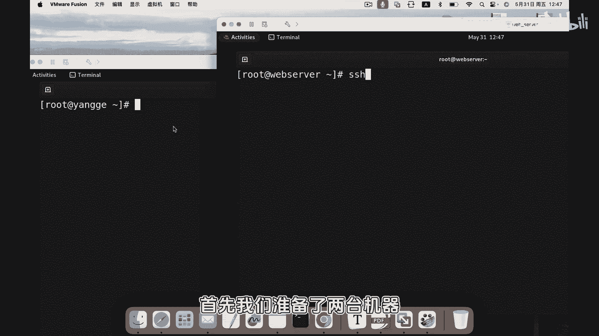
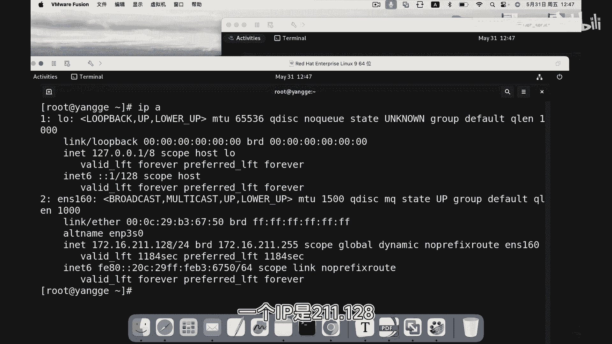
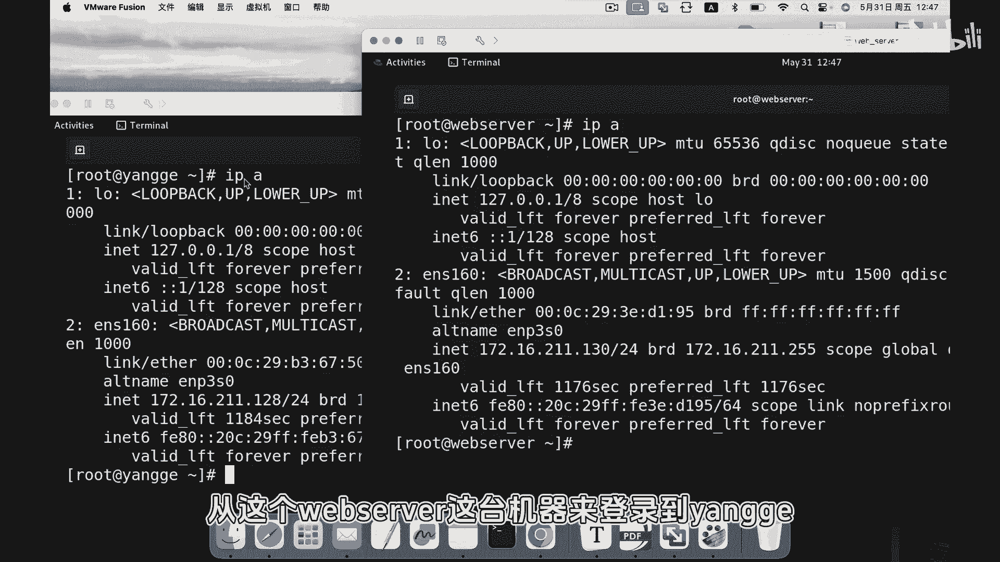
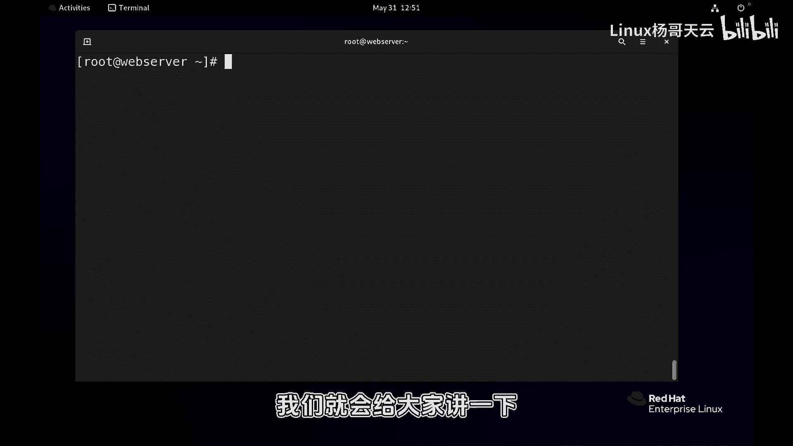

# 史上最强Linux入门教程，杨哥手把手教学，带你极速通关红帽认证RHCE（更新中） - P80：80.ssh登录远程服务器 - Linux杨哥天云 - BV1FH4y137sA

🎼好，那我们在正式介绍SSH之前呢，先问大家一个问题。第一个S是哪个单词？有同学知道吗？可以在聊天区打出来啊。那么这个SSH呢可以说是我们在远程管理的一个非常重要的协议。

无论是从linux端登录linux服务器，还是从windows登录，我们都会使用到一些SSH工具，从客户端去登录服务器，然后对服务器进行远程管理。😊。

🎼那下面呢我们就以客户端的身份来远程对lininux服务器进行登录。首先我们准备了两台机器啊，这边先看一下IP地址。

1个IP呢是211。128，这个服务器叫杨哥啊，这边呢。

🎼这台主机呢是130，是webs server。好，我们下面呢从这个webs server这台机器来登录到杨哥，大家看一下，我们可以复制一下这个IP啊，是128这个IP地址。好，首先我们来拼一下。

探测一下这个主机是不是通的啊，128OK没问题，crl加C。因为在inux里面默认情况下是持续拼的。😊。

🎼好，接下来呢我们通过SSH这个客户端去连接服务器。首先我们什么都不加情况下，然后直接加上IP啊，大家看一下啊，没有加任何用户回车好，由于第一次登录啊登录这台机器，所以呢要接受密钥啊如果你不接受的话呢。

那就直接就结束了啊我们yes好，大家看到那他的这种书写格式呢是啊前面是用户名，后面是at后面主机名好，我们要输入目标主机的这个密码啊，这边密码也是re好，这边我们登录到了杨哥这台机器。

大家从提示符上可以看出来。😊，🎼好，这里问大家一下，我刚才实际上是没有输入用户名的，我没有以哪个用户的身份登录的啊，但是他默认好像给的是ro的用户，对吧？我们下面再做另外一个测试啊，先退出。

然后比如说我这边新建一个猪猪侠的账号啊，然后我切换到本地的。😊，🎼猪猪侠啊这个账号，各位看到前面视频经变了，我再次以SSH这个客户端的这种方式啊连接的方式登录目标主机128。

同学们看一下会出现什么现象啊，这边好像又出来一个新的这不是刚才你登录过吗？为什么是新的呢？我们且接受一下这边看到啊他前面其实并不是用户是猪猪侠也就是说你在登录目标主机的时候，我现在这边终止一下。

你在登录目标主机的时候，它其实默认是以当前用户的身份再登录如果说你希望你这个用户的身份登录O没问题。大家别忘了，我们现在登录的是远程服务器那个服务器那边必须要有这个账号好，如果说没有的话呢。

我们换用户这样写我觉得更标准一点啊，后面可以上IP地址I地址呢后密了在大家看到前面提示服这个时才登过以其实来到另外一个器上也可以看一下当然在这边以过W命我可以清楚的呢？看到有机器登录可以加一个F。

可很清楚的知道。😊，🎼130登陆来的啊，其实现在已经登录到远程机上去了。所以我们在连接的时候，可以指定像这样可以像指定用户名，也可以指定一个普通用户。比方说那边的天云用户at后面可以上IP址。

🎼那自然就输入天用户的密码。好，登过去以后就是天用户看到了吗？我们从linux上登录呢就是比较简单的，就是从所有带有这种所有的这个的客户端的这样的ux登录都是这么登录的啊。

然后如果在window上登录的话呢，我们要装一些SSH的客户端工具，这就是一个简单的SSH登录的一个方式。大家可以练习一下，你可以登录到你的另一台服务器，也可以登录到云主机。

当然前提是你得以某个身份去登录到那边去。实际上在生产环境当中，我们可能账号是被禁用的，所以我们未必能够用户登录。那么在后面课程当中，我们就给大家讲一下怎么去进用ro用户远程登录这样一些行为。

