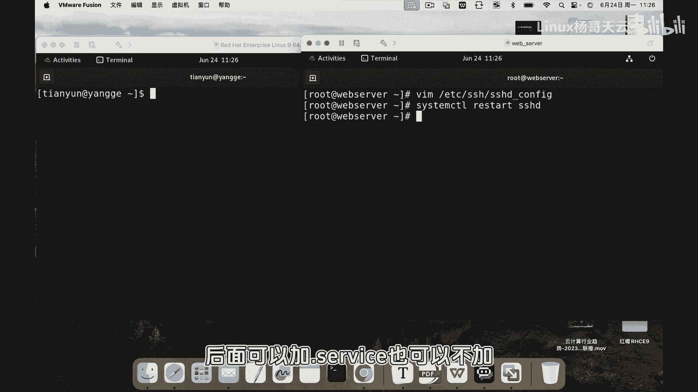
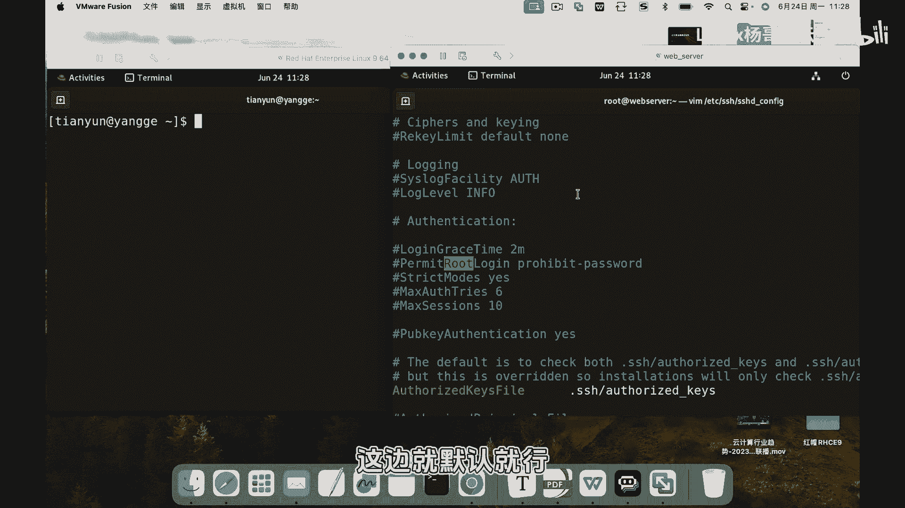

# 史上最强Linux入门教程，杨哥手把手教学，带你极速通关红帽认证RHCE（更新中） - P81：81.为什么禁止root用户远程登录会失败 - Linux杨哥天云 - BV1FH4y137sA

🎼同学们，我是杨哥。那么大家在做SSH禁止入用户登录的时候，有可能会失败。那很多同学不知道是什么原因啊，下面我带大家来做一下这个SSH如何禁止入用户远程登录。为什么呢？因为用户权太大了。

一旦密码泄露的话呢，可能会对我们系统造成非常大的危害。下面我们就来设置一下如何禁止入用户远程登录以及可能会出现的问题啊大家看到左侧呢是我们的一个普通用户啊啊。

就当客户端右侧呢是我们的服务器 server好，我们就从左侧登到右侧啊。现在首先我们打开我们的这个SSH的主配置文件，也就是SSHD杠文件然后找到这个位置那当然搜索的时候呢，默认是区分大写的。

你可以设置下I个忽略大写。😊。

🎼啊，也可以呢就搜大的ROT那默认情况下，大家看到这边有一个井号。这个井号呢，那表示它是注释的意思啊，但实际上呢这是一个默认值。那我们看到嗯它现在啊这个prome这个位置呢，它的参数是也就是禁止登录。

那如果我们想要把它改成这个允许登录的话呢这边可以用这么几个参数我们来看一下啊呃首先如果说这个上面是这个pro的话呢，那就是整个指的是绝对禁止用户远程以任何方式登录。好了，我们也可以改成什么呢？

改成啊face就是不允许密码登录，但是可以使用我们接下来用到的公钥登录，这个没问题。所以大家看这个你的一个需求是那个完全的禁止呢。

还是只是禁止密码的这种形式呢或者说呢就干脆改为y允许用登录这样的方式或者改为啊好，这也是可以的。但是呢默认情况下，我们看到系统这个安装的候，如果说你在装系统的时候没有做这个相关的设置的话呢。😊。

🎼默认情况下就是禁止入动用源登录的。下面呢我们来看看怎么把它改为yes。那现在那这边改为yes的话呢，就是允许入的用户登录okK改完以后呢，我们要重新启动一下system controll啊。

然后liststar。

🎼SSHD后面呢可以加点可以不加OK现在呢我们来尝试登一下啊，这边的IP地址呢IPAD点2开IP地址是19216810点20啊。这边我们从这个客户端这边引入的用户身份登录到192168点10点啊20。

好，刚才大家看到我们改的是yes还是no啊，大还记得吗？我们可以来过滤一下啊，EP杠I忽略大小写啊，然后过滤一下这个SSHD。

🎼刚好，我们刚才改改的是yes，允许入动用语登录啊。我们来看看啊，先输入yes，然后输入的密码。好，没问题，可以登登过来，对吧？来，我们再改为no啊，刚才说啊，我们要禁止入动用语登录啊，再改一次。

把这边改成no。同友们看看啊。好，这边我们确定改为no，或者是你把上面这一条注释打开就可以了。也就是使用一个probited，然后password禁止入户登录。😊。

🎼保存以后重新启动一下服务器。好，这边我们再次尝试登一次啊。

🎼好，密码呢？好，大家看到为什么还是可以登录呢？这就是我刚刚说的，可能大家会遇到这个问题，还是可以登录。其实我们已经是禁教了，但是为什么还可以登录呢？😊。

🎼这里呢就要说一下啊，大家看。

🎼我们的这个很多服务它的配置是这样的，除了它的主配置文件以外，还可能在这下面呢会有你看这是它主配置文件前面那个点这里面还有它的一个包含的配置文件。

所以呢默认情况下我些服务呢会通过方式主配置文件里面去包含一些配置文件。其原因就是呢我们没必要去老改主配置文件，可能呢通过增加一个子配置文件或者删除一个配置文件来达到对某一个服务配置这样一个目的。

所以呢同们看一下啊，其实现在在我们的这个子配置文件当中，它也有这个这个叫配置点1这里面它是等es。所以刚才其实我们大客B去修改那个位置的内容。但然你要在那修改的话呢两个地方都要修改。

以我们大客呢去改主配置文件，这边就默认就行。本身在主配置文件里面，这条语句就是禁用之所以能够登那是因为配置文件里面呢，我们有这样一项我们将它改为no就可以再次重启一下。😊。

🎼30T好，这边我们再看一下各力盘啊，台灯呃，它没有显示我们密码的照常输。

🎼啊，这密码肯定说的是对的，大家可以相信我啊，再来一遍。好，大家看到是如何用户登不了。那别的用户呢是肯定可以的。因为刚才只是对这个groupot用户进行了一个啊SSIG里程登录的一个限制。

所以大家在做的时候呢，同样呢要注意一下，有这个子配的文件。还有呢就是刚才我们说的几个参数，包括yes no，还有呢就是with password以及啊probit password，它们是有些区别的啊。

😊。

