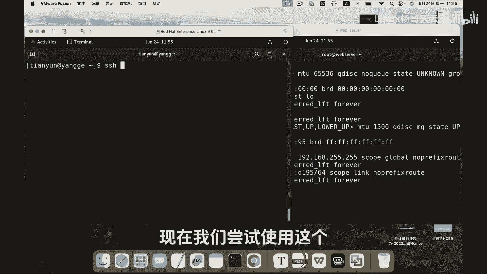

# 史上最强Linux入门教程，杨哥手把手教学，带你极速通关红帽认证RHCE（更新中） - P82：82.修改SSH端口居然遇到重重困难 - Linux杨哥天云 - BV1FH4y137sA

🎼接下来呢杨哥带大家来修改SSH端口。除于一些安全的因素，我们可能会修改默认端口22，比如说改成4个2，改成这个1到65535之间的一个端口。那下面我们来看一下怎么修改啊。

首先打开SSH的这个主配置文件，找到端口port，注意区分大小写。我们将前面的井号给去掉，否则的话它默认还是22，比如说改成4个2。好，然后呢这个比较简单，改配整比较简单。

接下来呢我们就要尝试重新启动SSH服务器。首先那遇到第一个障碍就是SC。

🎼这边他其实提醒我们啊，你可以通过这个joer controllert，然后复制这条命令来查看一下遇到的问题以及怎么解决。其实呢。

🎼如果说你去看的话呢，无非就是Slinux的这个限制。🎼可以看一下，这边就是Slinux限制，很长啊，我们就不看了。在实际生产当中，我们有同学是不会使用Slinux的。这个可能考试的时候是必用的啊。

那我们就以这个生态环境为例，把Slinux关掉啊。

🎼关掉呢有临时性关掉，比方说setforcing零，这个是临时性关掉的啊那现在如果重新启动，再重新启动SSHD服务没问题了。但是想永久关闭呢。

我们可以打开这个fi这个文件找到这里面大家看到默认情况下规则是inforcing它上面有三个选项informissive和diable分别是强制，这个是警告第三个是diable呢就是不加载规则。

这个我们现在将其改为able这样的话你保证在下一次开启的时候呢，不会加载。好了，那现在按理讲，我们s已经关掉了哈，这边的主机的IP地址呢是192168120好。

现在我们尝试使用这个说杨哥的身份来登录1921681020，当然默认回车肯定是不行的。因为这个22号端口是肯定被拒绝了。大家看到默认是22号端口。

🎼我们可以使用杠P4-2。🎼但实际上呢，我们看到这个端口同样跟上面的不太一样，上面是连接拒绝，这个是没有录入到这个主机，很显然是不对的哈。那什么原因呢？各位。

🎼那是因为我们现在除了SN尼以外，还有就是防火墙。🎼防火墙也是开着的，我们没有关这个防火墙呢，当然你也可以选择关闭。那今天我们已经妥协了一次呢，那防火墙我们暂时不妥协了啊，我们就把它规则给它加一下啊。

大家看到通过fawork啊，comcom然后杠杠perment永久规则杠杠，然后是ADD这边可以通过table见谱鞋，这说port。

🎼4个2，然后TCP。🎼好，我们加了这个规则，但是现在并没有起作用啊。我们。🎼需要去加载一下，翻刚reload一下，加载它规以则。

🎼好，当然你要防火墙关掉的话呢，这个过程就不用了。在此向上回车立马呢okK大家看到我已经登过来了啊，这就是我们修改端口，以及可能会遇到的问题。

