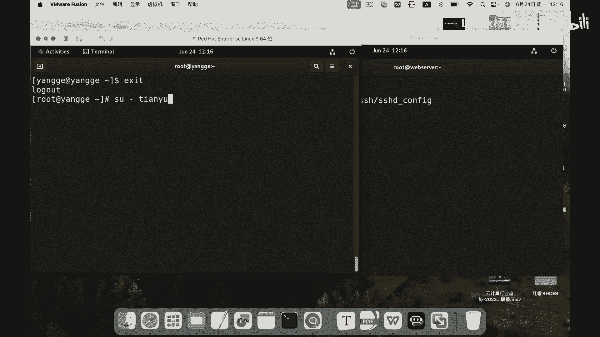

# 史上最强Linux入门教程，杨哥手把手教学，带你极速通关红帽认证RHCE（更新中） - P83：83.ssh公钥认证最安全 - Linux杨哥天云 - BV1FH4y137sA

接下来呢杨哥带大家配置SSH的公钥认证。这个比密码认证呢更加安全。好，首先我们为了实验效果呢，右侧这台服务器，我们将端口还是反馈到20号端口啊，然后左侧是我们的客户端，从左侧登录。

我们将使用杨哥杨哥这个身份呢来进行密钥的这样一个认证公钥认证。首先我们切换到服务器的这个杨哥这个用户，大家看一下当前它的加目录里面呢，就是这些文件。好，然后在左侧第一步呢。

我们要生成这个密钥SSH这个密钥，我们通过SSH杠kgen啊回车基本上是一路回车就可以不用再输任何东西。这边他生成了在当前加目录里面有一个点SSH的文件，在这个点SSH文件里面呢？

目录里面呢就会有这个公钥和私钥，这是公钥，这是私钥。好，那现在呢我们在这个客户端，大家记住，你是从哪边登，你就要把你的公钥传给那边啊，传给另外一边。

我们使用啊我们使用这个SSH杠co ID然后面跟上用户名杨哥。😊。

主机10点20，我们要将我们的公钥传给我们的20这台服务器回车这边输入这个对方杨哥的这个密码。一开始这个时候还是使用密码验证的啊。好了，这边就应该是传过去了。大家看到传过去了。

我们看看在这一侧它也多了一个SSH一个文件夹再点S文件夹里面呢就会有一个好了就这么一个动作，我现在再来使用SH然后是注意是杨杨杨哥的身份啊，当然默认情况下，本身这就是杨哥，所以你可以不加。

然后1921681020回车大家看到直接就通通过公钥的方式进行验证，不需要输入任何密码啊，因为他会优先使用公钥验证，这个是最安全的。因此呢我也可以在配置好这一切以后呢。

将服务器端的密码验证这个功能给它关掉。方说打开我们的配置文件然找到password这边有一个大家看到passwordationy你把注释开关掉以后呢，把注释这边啊去掉以后。😊。

把后面改为漏，这样的话呢，我们就不支持密码验证，也就是说只能够采用密码以外的。比如说公钥验证，这个更加安全。当然你刚才传的时候是要开密码的，所以这些得需要等到你配好以后才可以。那这个开启也没关系。

密码设的安全一点。但是我们默认情况下呢，有公钥的话，他肯定使用公钥验证。那这里要提醒各位一点呢是我刚才是通过这边的客户端的这个杨哥这个用户，然后把公钥传给了我们的sever用户的杨哥。

那也就是说从这边杨哥杨哥的身份登录服务器没问题。但如果说我们换一下啊，比如cl c退出一下，我们进入到天宇用户，这用户是我们自己的，我再退一下。😊。

切换到天云用户，我客户端天用户。这个时候大家看到他的加目录，它是没有与之匹配的那个公钥的啊。所以如果你使用它就算也使杨哥去登录192168点多少10点20这边就有问题，他只能使用密码。

所以你使哪个用户传呢？他有这个公钥和私钥段的话呢，他才可以验证啊，所以就这样一个过程啊，所以大家一定要注意啊，尽量使用两边匹配的用户。

