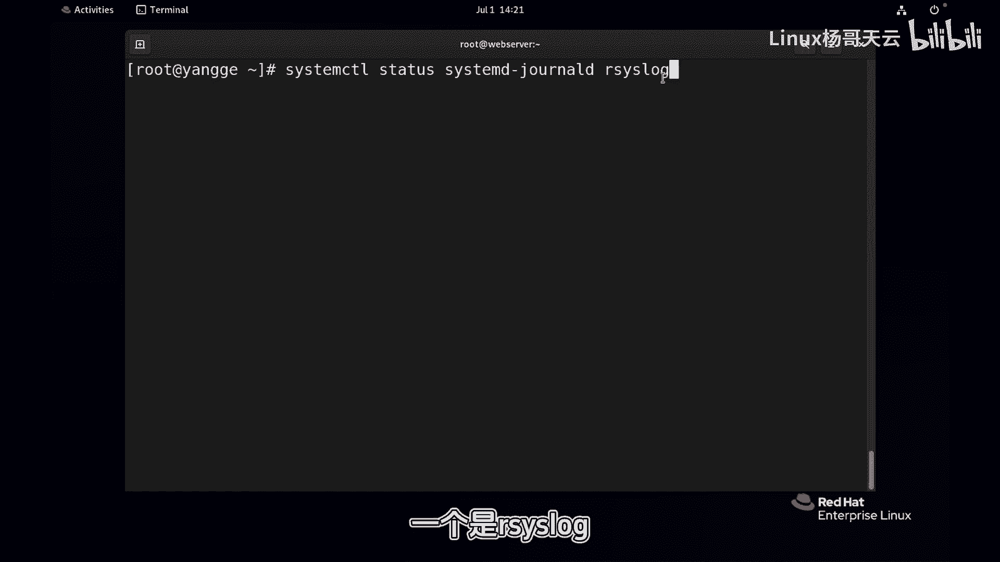
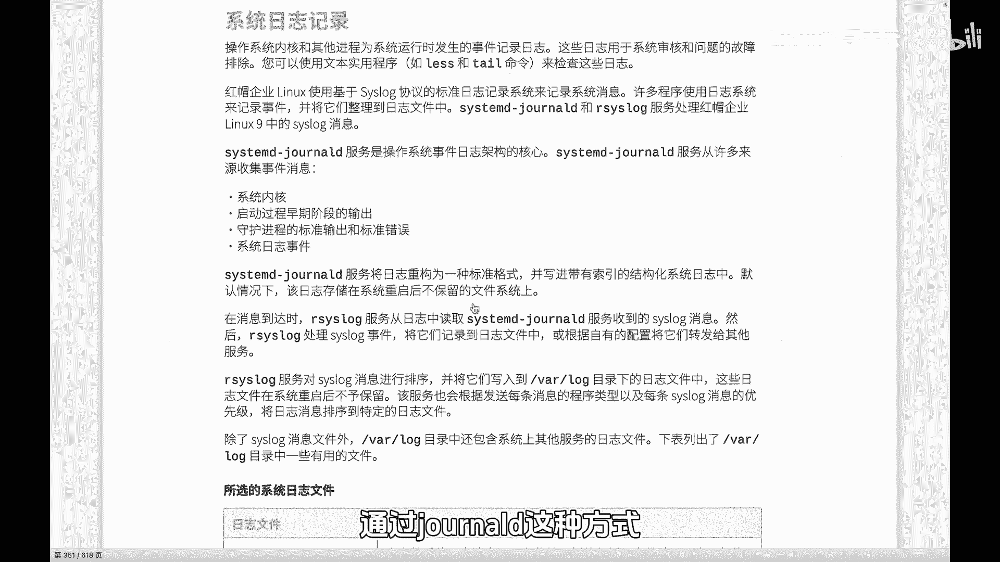
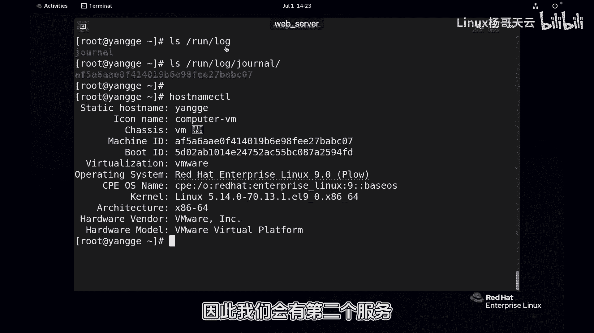
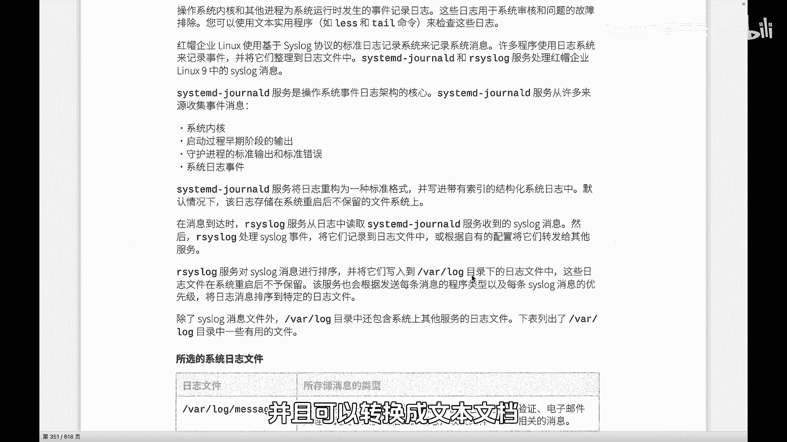
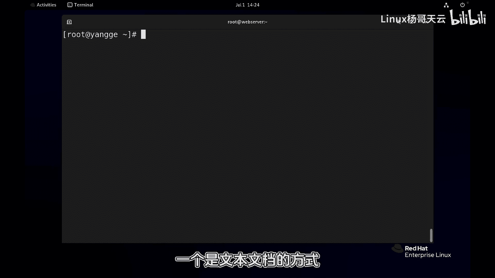
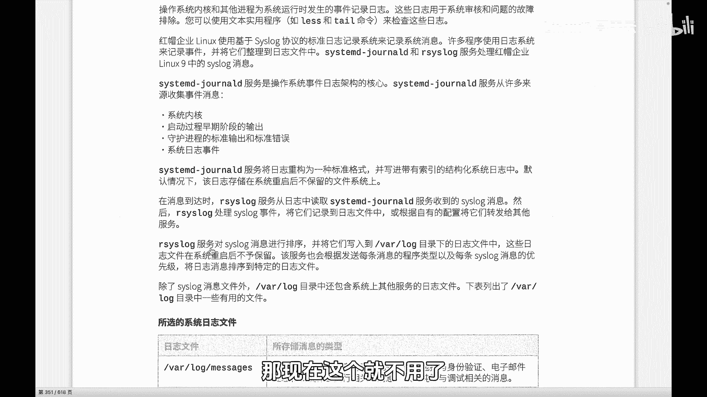

# 史上最强Linux入门教程，杨哥手把手教学，带你极速通关红帽认证RHCE（更新中） - P84：84.systemd-journald和rsyslog - Linux杨哥天云 - BV1FH4y137sA

🎼为什么我们的系统中有两个日志服务？一个是呢sstem杠一个是这两个服务呢目前都是running状态。那我们有必要来给大家讲一下这两个服务的一个区别。

首先sstem呢它可以说是我们的最核心的一个日志架构，它会从包括我们的内核啊系统内核还有呢就是系统启动的过程，以及呢我们的一些守护进程，它的一些输出的一些正确的或者说错误的输出。

还有了一些系统事件来收集我们的日志，大家知道日志呢我们是可以通过日志呢来进行一些问题故障的一个排除啊，所以我们对日志这块的一个查看是非常重要的那这个和这个有什么区别。

很多同学可能不太了解前面这个stem那有必要大家讲一下啊sstem杠呢首先它是收集日志的它的这个日志呢是经过压缩，还有一个是格式化。

🎼重要的是呢是二进制数据。因此呢它的这种查看和定位的这样一个速度非常快。我们在后面呢给大家会讲到通过招招地这种方式呢来进行快速的一些日志的定位。

🎼大家看在我们的run下的logo这个位置，这边就有joer。好，下面的这个AF5A呢是我们这台主机的，我们可以通过posts name cTL，然后看到是我们的主ID。

所以呢它收集的是关于这个ID的相关的日志。那同学们知道在ro下面的这个日志呢，首先它是不会持久化的。也就是是保存在类存当中的。当这个系统重新启动以后呢，它会全部消失，而且呢也会保留有限的时间。

所以呢它没有办法去长久记录。🎼因此呢我们会有第二个服务，那就是呢assses呢，它首先会从sstem d杠jo呢来拿到这个日志信息，并且呢可以转换成文本文档，一般会保存在什么呢？保存在这个walogo。

这个位置呢是持久化的，也就是存在硬盘上的啊，这是两个不同的地方，就一个是二进制，一个是呢文本文档的方式便于查看。但是两者还有一个区别是什么？就是我们的。

🎼在开机过程当中，实际上呢这个 log是在开机过程当中呢还没有启动的那这个过程当中，也就是在我们的没有启动成功之前，那么产生了一些像开机日志呢，其实是默认没有办法去记录的。

所以在之前呢那有一个叫做KK log的一个服务来记录。最后再转给我们的。那现在这个就不用了。现在我们的sD杠呢可以来完成包括开机日志的一个收集。

