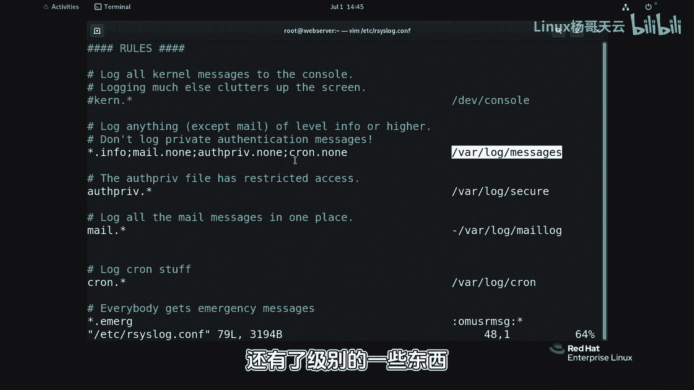

# 史上最强Linux入门教程，杨哥手把手教学，带你极速通关红帽认证RHCE（更新中） - P85：85.Linux常见的日志 - Linux杨哥天云 - BV1FH4y137sA

🎼好，接下来我们来看一下日志的一个分类。首先在我们的onelog下面呢，大家会看到很多种日志啊，包括什么bo点log，还有con，而且后面也跟着有时间，还有这个DDNF点log什么的，有很多日志。

那所以日志呢它是分类的。但是有一点呢在前面给大家提过，在brown下的logo，也就是。🎼Joer。🎼这个是不分类的啊，注意它是一个整体，也就是由jo它的这个日志收集的日志呢是不会分类的。

这个不是他干的事情。而我们的 log呢会拿到读到这个数据以后，然后根据我们的规则来进行相应的分类。那比如说打开ECR的的一个它的配置文件，也就是点com这个配置文件。

大家会发现呢有相应的规则来定义呢不同级别，不同类型的日志呢，应该怎么去存储存储哪个地方啊，所以呢这个是我们的 log干的事情。那它是根据规则来干的事情啊。

🎼那同学们可能看到这边除了后面呢有这个文件名以外呢，前面还有了相关的一些啊，我们称之为这个类型啊，还有了级别的一些东西啊，日志的这个类型或者叫日志设备的这样一些类型。

🎼所以呢我们有必要的来跟大家去带大家认识一下常见的日日志文件。还是记住刚才杨哥杨哥所说的thisD稿招到D呢，它是不分类日志的啊，它是一个整体，你可以理解为它是二进制，是特殊的格式，便于查看。呃。

我们有时候我们是需要呢将日志进行相关的表述分类，然后将不同的日志呢保存在不同的文件里面啊，并且可能还要做这种持久化。

🎼啊，当然默认情况下，slog呢它本身就是持久化的啊。好了，首先我们看到的是messageger这个日志，这个是很多同学可能所熟知的，大多数系统它的这个日志呢都是记录在这个位置的。但也有一些。

另外这个刚才我们打开主配置文件规则文件这个是一个规则，大家看到了吗？规则决定了log该如何将日志进行分类，该储存在哪个地方去，所以它是根据规则来定的。那比如说。😊。

🎼我们看到星也就是所有设备的日志，这个级别的日志，稍后来讲这个级别啊，都会保存在哇lo下的message。所以这是我们系统的主日志文件，大家必须关注。但是也有一些例外，像这几个例外呢。

稍后来给大家重点来说哈这几个例外它是不会存储的，存在这个位置的单独放啊，因为内容可能多一些。还有呢像我们的哇lo下的这个安全日志，这个是记录的主要是和安全相关的。

比如说我们稍后呢给大家去啊来一个小的案例，我们去登录的时候，我们比如说失败登录或成功登录呢，它都会有这个相关的记录啊，我们可以看一下，还有呢lo下的mlog。

这个很明显呢是我跟我们的这个电子邮件相关的这个日志。还有和我们计划任务相关的日志。那下面这个骤点lo呢是我们的这个和开机启动啊相关的这个日志，我们也可以通过一些，比方说啊基本的命令来看。😊。

🎼好，如果想看我们的哇log下的me，这个可以像这样看，一般我们可能关注的是日志的后面的内容啊，这样可以看到了。嗯，或者是呢我们加一个杠FF的话呢，它会持续看这个日志文件只要有变化。

相当于一直在一直在监控啊我我这边rll终。然后我们也可以通过像这样的指令然后来查看我们的系统启动过程当中的一些相关的日志，主要是查看我们系统启动啊啊。

从这个系统引导到正常启动整个过程的硬件相关的一些这个级别的日志来看。然后当然内容比较多，你可以通过管道给s啊来看啊，这可以看整个启动过程，包括我们的这个驱动的加载等等等等啊都有啊。

还可以通过像来看什么呢？看我们的这个系统上所有账号最近一次登录的信息。当然它也是读取的我们的相关的刚才哇lo下的一些日志文件啊，就快捷的去看的这样一个一些工具。😊。

🎼这边我们同样可以传给我们的这个比说我们会看到哪个账号从哪个地方，然后或者从哪个IP最后一次登录是发生在什么时候的。

有一些账号呢像这些账号它是从来没有登录啊没登录没有登录没有登录像这个账大家到杨这呢从这个机登录的是终个终是在什么登录应记录当这些呢它也是读取呢我们刚才所说的下的以相关的一些这个日志包这个我们安全它读取里面日志那么在此呢有一点大家说一下有一些服务他们是不依系统录日志我后面的奇我自安装一些服务他们有自己的日处理的一些方式啊。

所以呢这些服务呢他们不依赖我们杠或者是不依赖我们这些服务是自己己的处理方式呢主要是。😊，和系统相关的比较紧密的这个一些日志啊，所以这点大家注意。

