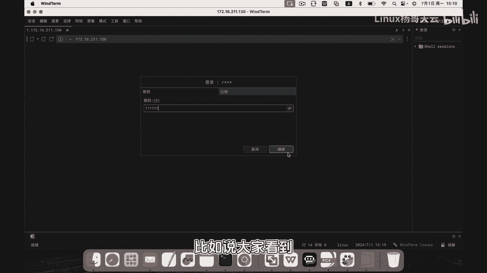

# 史上最强Linux入门教程，杨哥手把手教学，带你极速通关红帽认证RHCE（更新中） - P86：86.通过日志监控登录失败的用户 - Linux杨哥天云 - BV1FH4y137sA

🎼好，接下来我们通过监控日志来了解是谁在尝试登录我们的系统。那比如大家知道。🎼我们的安全日志呢是这样一个志文件，我们可以通过减F的方式呢来持续对这个格件进行查看好回车这边为了方便，我们回车一下。

加一些所谓的空行。然后紧接着呢我们来到我们的另一台机器上使用入的用户进行登录。这边呢我们可以尝试输错密码。比说大家看到我说的是一堆11111的这个密码点击继续最后显示失败。啊，同学们可以看到这个日志呢。

它是有一定的格式，这边产生的两条日志，首先这是7月1号啊几点几分时间戳，这是一个时间最前面是我们的时间。后紧接着呢是主机的名字，也就是这是哪台主机产生的日志。当然这是这台主机啊。

后面呢是我们的那个进程产生的，这是SSHD还有它的PID好，以及呢相应的呢是由这个这样一个模块来认证的时候，认证产生了这个失败，他告诉我们远程主机是哪个主机。然后用户名是哪个最后是失败了这样一个结果。

好，那我们也可以呢通过再次重新再登录一次啊密码是。😊。

🎼好，这边是成功了，可以看到又产生了相应的这样一个结果，这是接受了这样一个密码啊。

