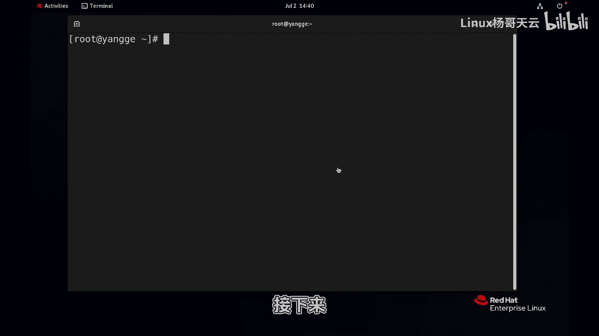
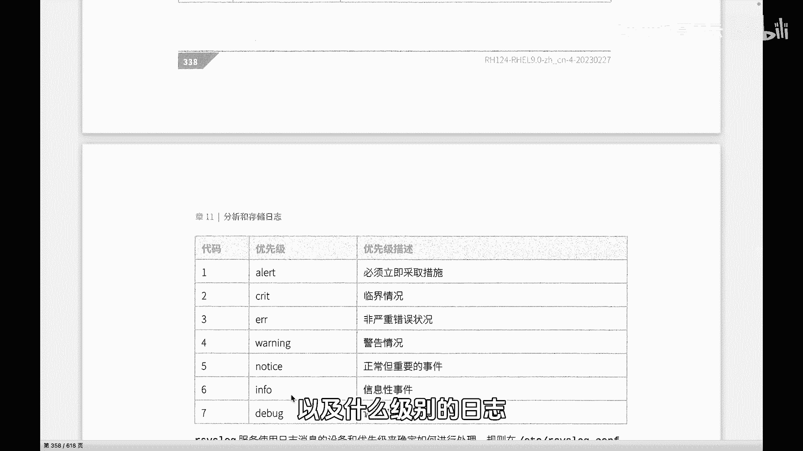

# 史上最强Linux入门教程，杨哥手把手教学，带你极速通关红帽认证RHCE（更新中） - P87：87.日志记录设备和优先级 - Linux杨哥天云 - BV1FH4y137sA

🎼接下来呢杨哥带大家了解一下日志的设备，还有呢就是优先级。这个日志设备呢简单的讲就是消息的一个类型，也就是谁会产生这个消息。

🎼是哪个设备啊，哪个进程或哪个服务它会产生这个消息。第二是优先级优先级呢相当于消息的一个严重性。那每一种消息呢它可能有这种紧急的，也有这种普通的消息。

那这个将会我们在后面的日志的规则当中呢将会用到这个设备。好首先我们看看这个支持的通常的这样一些日志设备啊日设备呢，刚才杨哥一直强调也叫消息类型，也就是谁产生的日志。那这边啊它有这个相关的代码。

那我们一般看的是设备的名称，包括这个col内核消息，也就是说这个是有内核产生的消息。还有呢我们用户级别的用户级消息，邮件系统产生的这样消息，还有我们的守护进程产生的消息。

以及呢我们的认证身份验证相关的这样一个相关的消息，还有我们一个消息。那像这个LPR或者新闻呢还有可能用的不多。那下面像这个这个是我们的计划任务啊这种任务时钟守护进程产生的消息。以及还有这。😊。

🎼非系统授权的消息，包括FP啊我们的VSFP呢，它也会产生相应的这个日志信息。还有一个就是我们的logo到logo7，这个是自定义的，也就是说我们可以通过logo到logo呢来进行这种自定义日志啊。

这是我们的设备。当然呢在前面给大家也说过，并不是所有服务或他们是有自己的日志的一个管理系统的啊，这里的主要是和系统相关的一些进程的一些日志。那中间呢是他们的设备名字。

然后另外一个呢就是它的优先级优先级呢描述了我们这个日志的一个重要性啊，到底是应该什么样一个级别啊，包括这个是说最紧急的一个这样一个。😊，🎼状态啊这个优先级比如说像内核崩溃啊等严重的这种消息。

当然我们后面会讲到Eerage这种消息呢是会在终端上显示，就相当于地震的大快跑这种消息呢就不会说单独会发到哪个地方去。我们待会在日志规则的时候，这一类的优先级肯定是最严重的啊。

像我刚刚说内核崩溃这样的事件。还有呢像接下来这个优先级呢是这种需要立刻响应的消息，也就是次它的是一个级别啊类似接近于上一个级别以及呢还有我们的啊临界的这种情况也是严重的。比如说这个某个软件不能正常工作。

还有是也是这个错误级别。但是这呢它的这种错误等级呢相较于上面来讲的话第一点可能只是某一些功能，不是说某个软件只是某个软件的某一些功能不能正常工作这样一个级别。

那这个警告级是可能说比较常见的啊那就比如说某一些软软件呢给到了这样一个警告的这样一个级别啊，警告，但是可能并不会影响整个的一个运行。还有呢我们的这种这个是普通的。😊。

🎼这样一个条件啊通知的这样一个级别啊，以及呢in就是消息性事件。这个呢通常不是说报错，可能就是一些常规消息。还有第个调试级别的这种我们通常在开启一些调试的候才会产生。通常我们一些服务或程。

它不会产生这样一个级别的日志。那我们如果说是需要调试的话呢就会产生。那还有两个级别其实这边没有列出来啊NN就什么都不记录，这也是一种级别还有一种级别呢是星代表所有级别。

所以我们这个教材上面给到的这个级别呢其实一共是7个那我们可以认为呢还有两个就是没有什么都不记录。还有一个是星表示所有级别啊，这就是我们的一个日志的设备。

也就是消息类型是谁产生的日志啊日志当然不是说一定是错的，还有通知级别的in这种级别的然后还有优先级优先级呢就是我们是不是这个软件它报的所有信息，包括它正常的一个in啊。

还有呢就是它的一些有普通甚至严重的信息呢，我们都该去理会呢都该去记录呢？这个我们是通过这种级。😊，🎼来定义的啊。

接下来我们会在规则当中来详细给大家讲到我们怎样去定义通过规则来描述我们该将什么类型的这种日志以及呢什么级别的日志呢去做如何处理。

