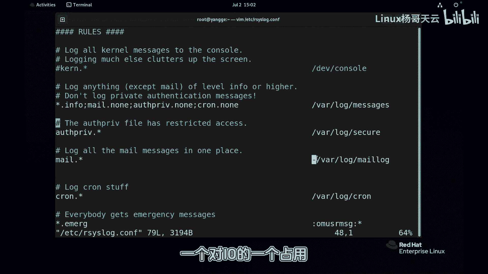

# 史上最强Linux入门教程，杨哥手把手教学，带你极速通关红帽认证RHCE（更新中） - P88：88.rsyslog规则 - Linux杨哥天云 - BV1FH4y137sA

🎼那么日志该如何记录？也就是说什么样的设备，什么样的这个消息类型，它什么级别的日志该存储在那个文件里面去。那这个时候我们可以呢来通过编辑。

🎼个规则文件。那这里面呢就是相应的规则。这规则里面呢就定义了某种设备的日志啊，该记录到哪个地方去啊。前面呢我们看一下啊。

比如说像内核级别的这种日志啊col这是设备各位还记得所有级别啊都会发我控制台上去然后下面这个呢是我们比较常见的，也就是主日志文件lo下的me大家看到是新点in新呢就是所有设备。

那这里的所有设备当然是我们的真持的所有设备啊，不包含像mycyclq啊或者是X这些是独立的有自己的日志管理机制。

那也就是说所有的这种设备的in以及in级别以上的日志或者在严重的这种信息都会记录在哇logo下的，这是我们系统的主日制文件，很多信息都在这里面。😊，🎼然后呢这个分号呢表示是这个是其他的设备啊。

那m这个设备 mail这个设备它点呢没有它全要排除了除外了。然后没有计划任务呢没有那之所以排除是什么原因呢？是因为他们的日志也比较多，但是呢我们需要单独拿出来。

不想跟lo主日混混在一起所以接下来呢大家看到下面有专门定义他们的这个相关的一个日志的一个存储啊，这边也就除了这三个以外，其他都会记录到主日志里面去。然后那下面就接着呢定义了我们的这三种设备啊。

它的一个呃相应级别那这里的级别就是所有级别哈，它的这个跟认证相关的啊它的所有级别的信息呢，所有级别的这个日志都是保存在安全里面这个在之前大家演示过还有我们的邮件啊邮件消息。

然后是记录在我们的哇lo下的m信息同学可能看到前面有个小杠有些没有在小杠啊，因为呢邮件的这个信息量特别是巨大的啊，不单是由我。

🎼邮件系统，还有我们的这个系统层面发送的一些邮件啊，通知的一些邮件。然后这些邮件呢都会记录在这里面。所以呢存储量比较大，因此呢我们采用了异步的方式。换句话讲，就是先存在我们的这个内存当中。

然后达到一定量，再往磁盘上写，这样的话防止我们的IO的话一个啊对IO的一个占用啊，所以是这样一个情况，因为量比较大。

🎼然后还有呢我们的这个的日志跟计划任务相关的，计划任务主要是这个像这个进程啊，它所产生的计划任务的一些这个日志新所有的这个级别是放在里的所以大家如果说想要了解我们的这个计划任务的执行的成功与否的话。

可以去关注我们这个文件。还有呢每个意看新点新所有设备的这种紧急的这是最严重的啊，这个这样一个级别的哈，这个日志都会干嘛呢？新号这边我们用到了这样一个方式，那也是会发给所有的登录账号。

在后面我会大家做一个实验啊，给大家看一下，是不是会发给所有登录账就所有登录的用户都会收到都会马上不管你做什么事情，你的终端会收到这样一个消息。那其他的呢像 news什么什么的这些我们就不管了。

那接下来还有一个就是我们自定义的像默认这个还不是自定义的它主要是和我们的相关的这是我们领导相关的这个是放在我们的这个。😊。

🎼lo下的部队lo里面的那这就是我们的规则。当然我们可以改变规则。一般情况下我们不改，我们可能需要的就是自定义。当然我们也可以呢这个除了记录在本地以外呢，我们也可以去配置日志服务器。

然后集中式的呢把日志呢放到一个地方去。呃，这种方式这是接助于系统的这种方式来实现日志的一个统一管理。当然实际上呢我们在后面可以通过一些运维工具，更高效的运维工具呢来进行日志的一个管理。

因为这种管理方式还是比较简单或者比较的呃应用性不是那么强。这是规则。咱们日志的规则文件。😊。

