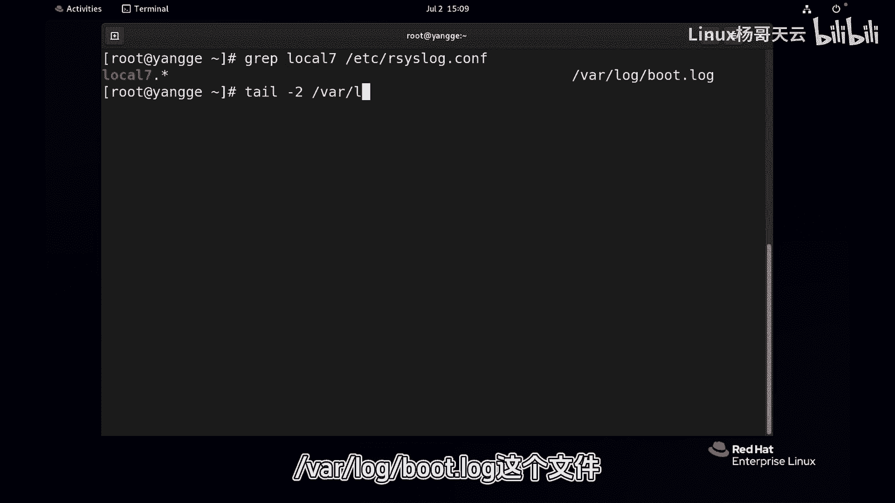
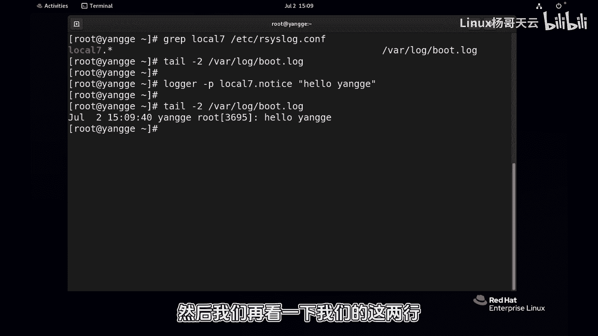

# 史上最强Linux入门教程，杨哥手把手教学，带你极速通关红帽认证RHCE（更新中） - P89：89.logger手动发送syslog消息 - Linux杨哥天云 - BV1FH4y137sA

🎼好，接下来我们通过手动的方式呢向slog发送一个消息，看看它是不是会如期的进入到我们相应的日志设备里面去。好，首先呢我们看到在这个EDC点里面logo7所有的级别的日志呢都会记录在点logo里面去。

那同时呢我们也看一下最后的两行下的logo下的put点lo这个文件，现在默认是没有啊。好，那现在我们就发送一个消息，通过logo。

🎼刚P啊这个P呢是proority指定优先级。比方说logo7的一个lo notice啊这样一个级别的。

🎼优先级的，我们发一个hello杨哥。

🎼回车。🎼啊，屏幕上没有显示，因为这个级别的消息呢，它不会在屏幕上显示的，对吧？好，然后我们再看一下我们的这两行啊，其实只有一行，因为它是来自于logo7这个设备的nottice啊这样一个级别的日志。

所以呢thislog收到以后呢，就会记录到按照规则，它会读取规则记录到这里面去。😊。

