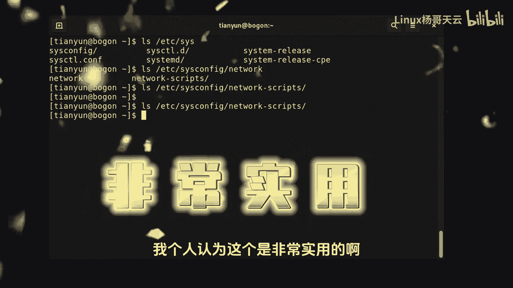
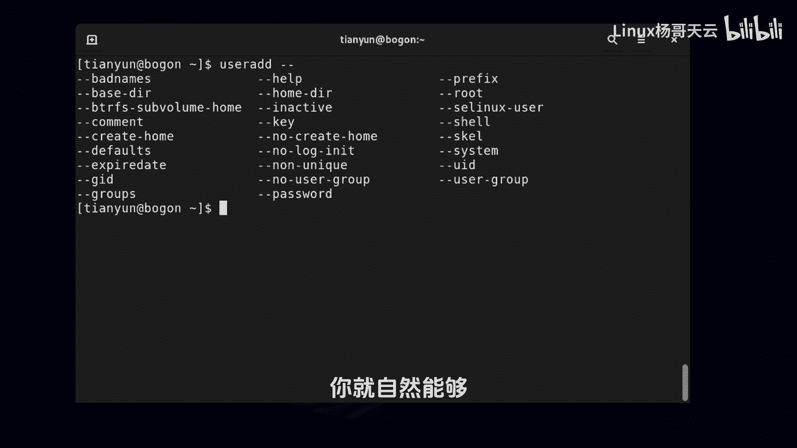

# 史上最强Linux入门教程，杨哥手把手教学，带你极速通关红帽认证RHCE（更新中） - P8：8.Linux自动补全：命令补全、文件补全、选项补全 - Linux杨哥天云 - BV1FH4y137sA

下面呢我们来讲一个非常重要的技巧，就是batch里面的补全，下面我们首先来看一下这个补全的第一种，也就是针对命令的补全，比如说我们要敲的mini啊，整个应该是PSWD。

但实际上呢我们有可能啊在敲到TIS的时候，就已经记不住了啊，怎么办呢，那我们可以按键盘上的tab键，也就是TAAB这个键按一次可能没有什么效果，为什么呢，因为这个命令补全它是这样的，如果说你输入的。

已经能够说明这个命令的唯一性，也就是你提供的信息已经足够，能够表明它的唯一性的时候呢，它就自动帮你补全了，那如果说不能的话呢，那你再按一下，也就是两次tab键，大家看到啊。

由于我们这个在当前命令当中有这个PAS，W d，也有PS as什么什么TE，还有pa i s u什么什么，那很显然呢我们刚才输PS的时候，他没有帮我补全，因为他也不知道你到底要的是哪一个。

也就是你提供的还不唯一没关系，这个时候按两次table，它会把你这个PS出现的所有命令，都帮你全部展示出来，那你接着可以敲就行了，那比如说你敲PS还敲第二个S的时候，实际上我们心里很清楚。

如果敲到这个位置呢已经是唯一的，那所以你完全不用去打那个WD，那你可以直接table键，那如果是这个命令呢，大家想象一下，你敲PSU的时候，然后table键它就不全了，所以可以帮我们实现这种命令的补全。

接下来我们看文件补全，这个非常重要，首先表示我要看一下啊，tile t i l啊，这个时候就可以补全了，你看我一般打到三个的时候，我我有自信，我就按了tab键，哪个手指按tab键呢。

很显然是你的那个左手的小小手指啊，那箭是你高频度使用的，所以你的那个手呢就应该去往那边勾一下，如果大家对指法不熟悉的话呢，建议大家下一个金山打字通去练一下啊，有个警察追小偷，然后去打一下英文字母。

好不多说，我们来看文件补全好，这个文件呢完整路径给大家打一下先啊，就是etc下的，然后password按tab键出来了，看到了吗，它能补全，有两件事可以证明，一说明你这个路径不是通的。

第二是呢能够提高效率好，那接着呢我们看cs啊，SOS好，同样如果说你真的忘了，因为很多文件呢那个路径真的是特别长，那就按table table，按两次table好，一看哦，原来是这个，那我们就输一个。

差不多CEO的时候就应该能补全了，因此就算再长的路径，我们也能消的很快，这是文件的补全，我个人认为这个是非常实用的。

接下来我们再看一下选项的补全啊，那比如说我们用这样一个命令USERADD，那这个命令也就是创建管理用户的命令，当然这个命令呢普通用户应该是用不了，那我们可以尝试一下啊，可能在创建用户的时候会加一些选项。

大家知道这个选项呢会有长选项，短选项我们可以输入杠杠，然后table table其实可以，比如说我们要指定JID，那就G啊还是不行，为什么，因为有好几个带G的I看到了吗，这可以补全。

同样这个选项当然可以很多啊，比如杠杠这个叫什么，我们找一个很特别的，你看这个好长，BTR很长的哎就可以，那所以呢这个对于mini，还有呢文件选项的补全非常重要，所以大家一定要在后面的练习当中多加的强化。

那你敲多的话呢。

