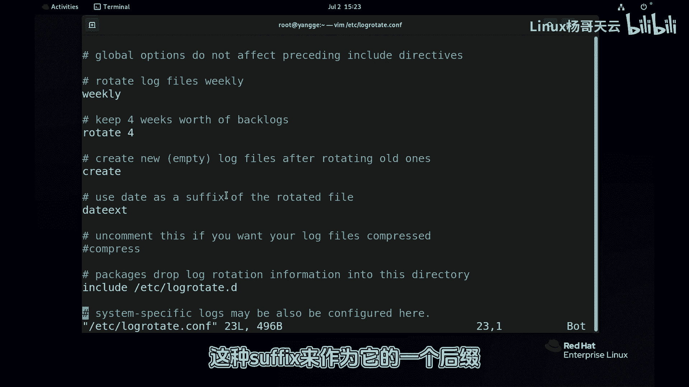

# 史上最强Linux入门教程，杨哥手把手教学，带你极速通关红帽认证RHCE（更新中） - P90：90.日志轮转logrotate - Linux杨哥天云 - BV1FH4y137sA

🎼下面这个服务loggoroot，它对日志呢有着非常重要的关系。那如果没有它的话呢，那大家可以想象一下你的日志。🎼日积月累会越来越大。那对于一个大文件来讲的话呢，我们无论使用什么工具去检索。

都会变得非常的慢，非常困难。所以呢ro呢它会按照规则来对日进行轮转一个轮回，相当于多少年一个轮回重生一下啊。好，那这个服务大家看到默认是开启的。而且呢我们也看到了它工作的这样一个成果啊。

比如说大家看到的我们的message日志。其实这边系统我们的按照规则它会读的呢是这个mesage也会写到当前的mesage里面去。那实际上大家看到还有很多以年月日啊命名的这样一些文件。

这就是轮转的这样一个结果，对日志文件进行切割，防止它过大啊，但是呢它会影响当前我们的。😊。

🎼啊，这个日志服务的一个使用啊，那怎么轮转的呢？下面呢我们就来看一下啊，看一下这个logoro它的一个配置文件啊，这里就是它轮转的规则。这是主配置文件。

同时呢还包括呢点地下的一配置文件也就是说默认情况下，这是大众的一个设置。如果说你没有单独的设置的话呢，我这个来第一个这个是轮转的一个周期，这个周期呢可以设置为月啊日啊，或者是那个星期啊。

这边是我们的每周轮转一次默认情况下，还有呢保存的一个日志的的一个份数保存的是4份，所以刚才各位看到的是在这下面呢默认就是4份对吧？有同说怎么这个保存的比较多一点呢？那那是因为呢它使用了自己的一个规则啊。

还有呢这个轮转以后将会创建创建一个新的空的文件日志文件还有一个是会使用我们的日期这来作为它的一个后缀啊，当天的日期什么时候轮转的当天日期那这下面呢是其他的。😊。

🎼定义啊，一般情况下，如果如果你没有定义的话，就按照这个规则啊。接下来我们看一下这个子配置文件，也就是在ETCR的logo rotate点D下面呢，大家看到又有相应的一些文件。好，那。

我们具体来看一下呃一些常见的。

🎼轮转的一个规则。首先是这里面呢大家可能常见的几个日志，可能大家都看到了啊，这是我们比较常见的几个日志，包mas主日志，还有我们计划日日志安全日志都在这里面那他们将按照这里的规则。

那这边呢我们看到没有写这个轮转周期，没有写的话，就按照前面包每周还有使用时间作后缀这都有啊，只不过呢它加了一些内容说啊缺失失不提醒以及呢轮转的时候包括轮转前后流转后要执行的脚本。

那这个post呢指的就是我们轮转之后就之后要执行什么脚本啊，要执行相关脚本那这里的为什么有这样一个动作，大家看到啊这里其实这个不杠S就发送了一个重启信号给我们的点那个什么给这个服务。

那为什么做这个事情呢？可能大家不太了解，因为你一旦轮转以后其实产生的是一个新文件这个新文件呢它会有自己的就自己的一个文件编号那这个时其实原来的服务都找不到了都不知道是这个。😊。

🎼没办法和他对接，所以呢要重新启动。因为这个时候是个新文件来了一个新人，所以呢这个时候呢就重新启动slog，让他知道，哎，我要往新文件里面去写。

