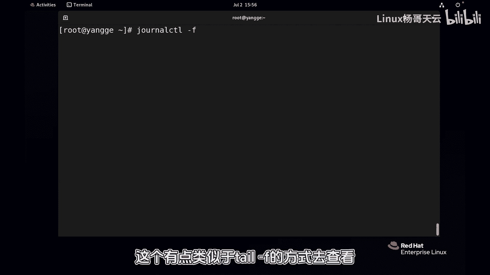
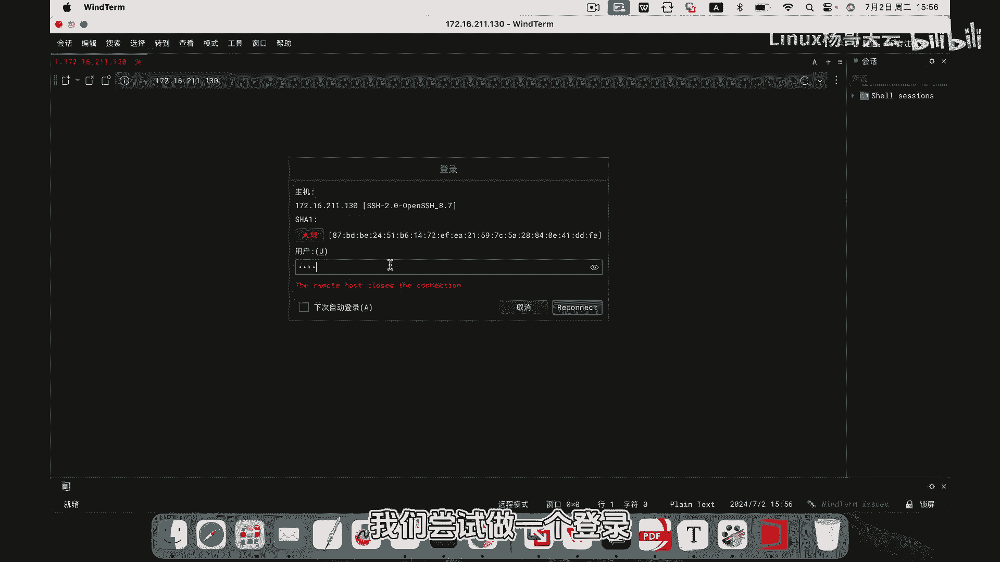
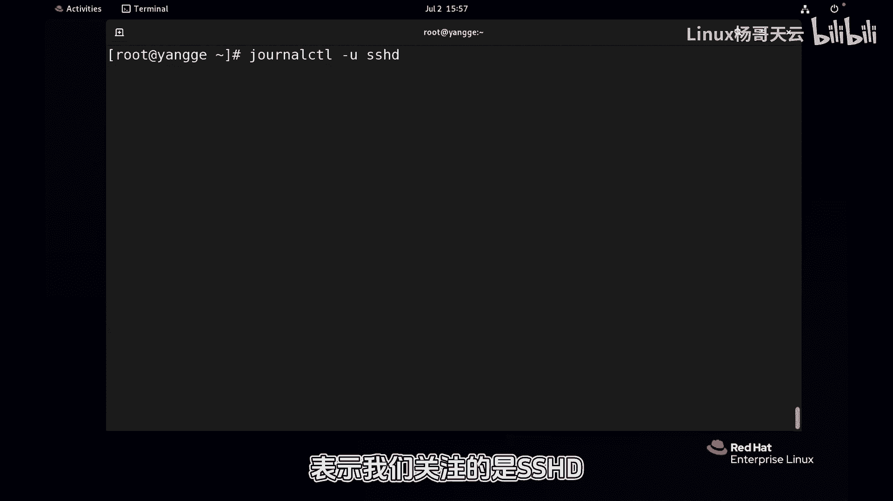
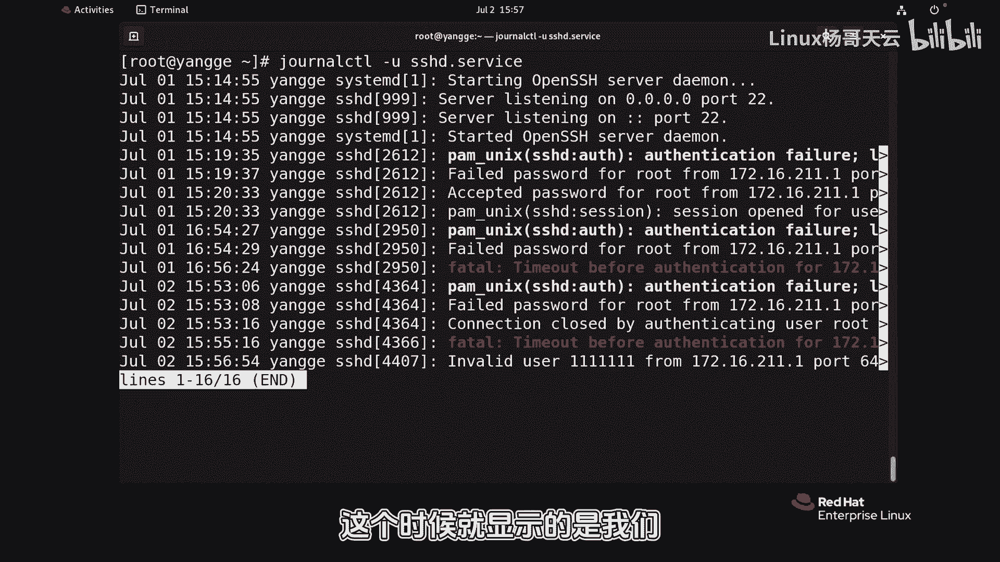
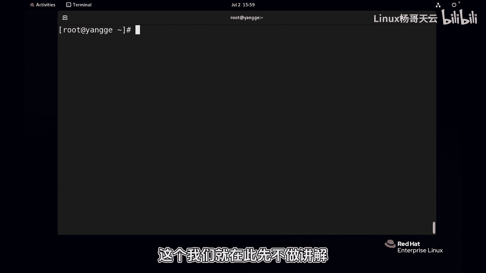

# 史上最强Linux入门教程，杨哥手把手教学，带你极速通关红帽认证RHCE（更新中） - P91：91.journalctl查看内存日志 - Linux杨哥天云 - BV1FH4y137sA

🎼接下来带大家查看内存日志。在前面给大家介绍过我们的日志呢是由sstem dD服务，将其存储在内存当中，它默认是这种结构化的二进制文件，所以非常方便检索。

但是它只保存自开机以后的这一段时间的这样一个日志。那查看的方法呢使用的就是l这样一个命令这个命令如果直接回车，那它会显示所有的日志，我们可以呢在这里面进行搜索。

比方说搜索关键词像那我们能找到所有的这个的相关日志啊。那也可以呢我们加一个杠5那显示最近5条日志当然也可以呢按退出啊，也可以呢通过 f这个有点类似于杠F的方式去查看好。

那这边我们回车从另外一个终端我们尝试做一个登录root密码呢随便输输错啊。好，这边大家看到就会显示呢由相应的这样一个用户登录啊这样一个错误日志刚说的ot是是这个11这个用户啊，好，也没关系。

总之这个日志得到了这样一个显示。好conrl c终止这个按Q可以。😊。

🎼那也可以呢我们去看某一个服务，某一个单元的这样一个日志。比方说我们关注的是SSHD啊，可以后面加点service也可以不加啊，都可以。这个时候就显示的是我们这个服务它的相关的日志啊，除此以外呢。

我们也可以指定像时间我们可以指定通过杠来指定开始也可以使用杠来指定结束好，现在看始开始比如说查看今天的to退出也可以呢通过杠加一个时间，这个时间是年月日1分的方式，比2024年啊，然后杠06杠30啊。

6月30然后是10点10分，那我们后面可以加一个结束杠杠L同样呢是一个时间戳2024年啊杠07杠01啊，比说是0点0分好那这样话指定的这个时间的日志没有任何的记录我们加一个2号啊。

这边就有了啊除此以外呢我们也可以。

🎼通过一些其他的一些选项的方式，比方说啊开始呢我们使用前一个小时-1-1小时啊，查看前一个小时的日志。那这样的话我们就能够很方便的去查看。特别是我们有一些服务在启动报错的时候呢。

它可能会提示我们去使用er controlttrol这样一命令去快速的查看当前的日志，然后它会给到一些帮助它不单单是日志呢，甚至还会给到一些解决这个问题的方法啊，所以这是关于我们的这个内存日志的查看。

当然内存日志呢也可以持久化。这个我们就在此先不做讲解。

