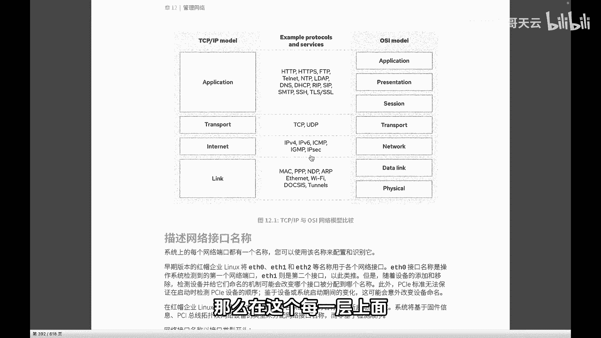

# 史上最强Linux入门教程，杨哥手把手教学，带你极速通关红帽认证RHCE（更新中） - P92：92.TCP-IP与OSI网络模型 - Linux杨哥天云 - BV1FH4y137sA

🎼各位小伙伴们，大家好，我是杨哥。接下来我们带大家学习第十二章网络管理。那么在正式介绍网络的一些配置之前呢，我们有必要来了解一下，像TCPIP协议站OSI网络模型，还有呢就是网络接口等一些信息。

首先我们来看一下这个TCIP协议站与OSI这个网络七层模型。因为它会和我们后面的很多的一些服务和应用相关。那比如说大家知道嗯在右侧呢是我们的OSI层模型，我们一般是由下向上述啊啊。

我们的第一层是物理层数据链路层网络层传输层规划层表示层和应用层啊，对应的话呢，它跟我们TCPIP协议的这个模型是对应的。上三层的话呢，在这边统一统一是应用层。还有呢这个是传输层，这个是一样的啊。

这个呢是名字叫法不太一样啊，你也可以理解为网络接口层没问题啊，下面是整个的物理层和数据链路层统一呢对应在这个内路层这一块。那为什么要了解这个协议模型呢。首先啊我们说一下。

🎼OSI汽字模型呢，它主要是指的网络的这样一个通讯的。就是我们很多时候搞这个网络设备啊的这样一些小伙伴，可能更加关注的是呢，我们OSI气字模型。

比方说这个数据包数据报文是怎么在网络上传输的这个它当中有什么变化，怎么寻址的这个更多的关注的是呢？OSI气字模型。

🎼然后在另外一点呢，比如说拿我们运维的同学来讲，我们可能更多的关注的是这个协议，像ITTP协议这些协议啊，我们要抓包要分析。所以我们关注的呢这个更多的是TCPIP的这个模型。那么在这个每一层上面呢。

它有相应的一些协议啊，还有一些服务。比如说在我们的链路层啊，整个这个链路层。那关注的呢像我们的mac地址啊，还有呢像里太网的一些标准。还有呢我们wifi的一些标准啊等等等等。

这样的话更多的涉及到的是整个的一个呃物理的一些呃协议呀标准的一些定义。

🎼然后在我们的这个上一层，也就这个位置。那如果从这个右侧OSI层模型来看的话呢，就是三层。所以我们一般通常说的三层、四层、7层其实呢都指的是都是拿这个OSI模型来泛指的。所以呢在三层这个网络层这块呢。

它主要关注的呢？就是这个怎么来进行数据的传输啊一个寻址。所以呢这边像我们所知道的IV4的协议IV6啊，还有呢像INP这种P啊或者IGMP这样一些协议，它是在这一层上定义的啊。

比说我们IP报文的一个格式啊一个长度封装的形式都是在这一层上定义的。那么在上面的传输层呢这个更加重要的两个协议是CP两个协议。所以我们也会在后面会见到有一些服务啊。

有很多服务它会使用CP协议传输可靠的这种传输协议。有些协议呢有些可能使用这种方式来进行传输。那这两者的区别呢，就在于他们的这个报文的长度不一样。所以对于整个的传输的速度啊。

🎼各方面是不一样的。大家可以想象一下TCP呢由于它要去控制它的一个可靠性啊，所以呢它会在原数据上面加很多的一些内容爆头啊。所以呢它的这个数据传输或者说所带来的这样一个数据量就会大一些。

然后作为我们运维来讲，刚才杨梅也提到我们关注的这个应用层这块的话呢，这个协议非常多。就比如说我们的P协议啊，这个是网络是我们的这个客户端浏览器和服务器之间的一个传输的一种超门传输协议。还有呢这种加密的。

加了这个SSL的一个加密的啊，那这每一种协议呢，其实它都会对应一个相应的端口。还有呢就是我们的FDP协议，这些都是用来做文件的传输的。好，比说我们的tlet还有SSI协议。

是我们用来对网络设备进行远程连接进行管理的这样一个协议。当然在早期的路由器，还有一些交换机上面呢，更多的使用的是这种明文的协议在现在呢很多都支持这种加密的传输协议。还有呢像我们DP协议。

这个用来时间同步的啊，还有呢像DNSCP。

🎼还有我们的一些其他的一些协议，像SNMP啊啊或者SMTP这种邮件传输协议，这都是主要是在7层。因此呢作为运维人员来讲的话，关注的点比较多的呢可能是在这个上三层，也就是应用层这一块啊。

然后当然呢作为网络的这个我们作为运维人员来讲的话，我们要去做做一些网络的一些故障排除抓包。我们同样呢是要去关注下面的这个几层的啊，下面的四层因为下面的四层呢整体来讲的话是影响到数据的传输。

而上面的三层呢更多的是影响到什么呢？就是我们不同的应用，他使用不同的这种协议的这种交流啊，就像对英国人要说英语。对加拿大人要说相应的语言啊，同样呢还有的一些表示的一些方法在上三层来实现。

所以这就是一个最基本的概念，大家在正式接触网络之前呢，这个是必须要了解的。

