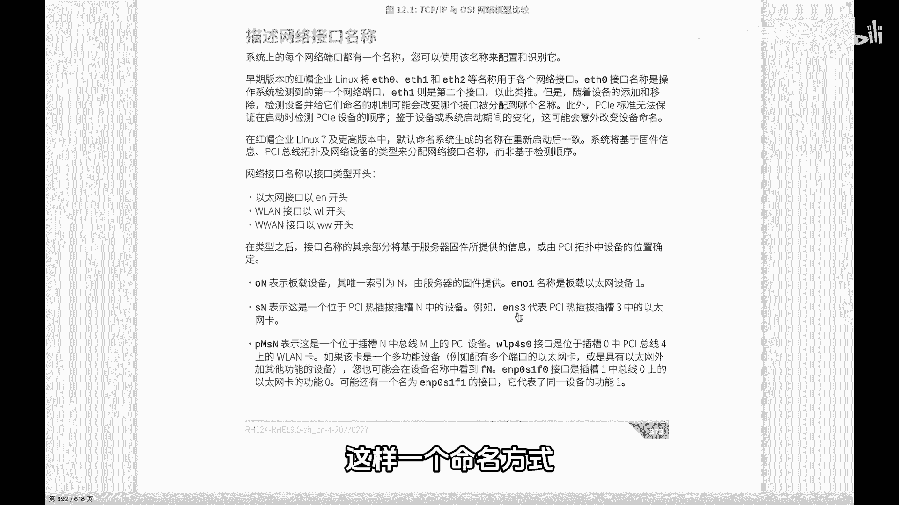

# 史上最强Linux入门教程，杨哥手把手教学，带你极速通关红帽认证RHCE（更新中） - P93：93.新的网络接口名称 - Linux杨哥天云 - BV1FH4y137sA

🎼说到网络接口，大家会看到在我们的九版本上面啊，它是以这样的一个方式。那杨哥首先告诉你，这个并不是网络接口，这个首先很奇怪，ENS160啊这样一个叫法。🎼那就原刚才所说的，这个不是网络接口。

所以稍后呢我们再来看这是什么东西。那说到这个网络接口的话呢，我们首先有必要来给大家介绍一下，在早期的红帽版本当中，当时呢网络接口的名字呢是这样来的啊。

每一个网卡啊它是像这样E0ETH1ETH2这样的名称。那么这样的话带来了一个很大的问题。因为本身呢它这种命名方式是根据检测到的第一个网卡或者检测到第二个网卡依此类推。那么因此随着设备的添加或移除。

特别是移除。大家想象一下，本来你们1233个网卡，三个人排好对的，你是第一个你第二个第三个，但如果说前面的第一个或第二个坏了，那我们有可能把这个网卡换掉。但是最后呢它所识别到的新的。

它会分配到一个新的顺序，新的一个编号。那么这样的话，它的配置就会发生重大的变化。所以这样的一个方式呢，就会让我们的网络配置变得特别的麻烦。所以在之前特别是在7啊之前的版本当中啊，那么这样一个。

🎼命名方式给我们的运维人员来讲带来了很大的灾难啊，有很多时候就是因为换一个网卡，最后发现呢不通了。因为配置文件它没有变网卡换了。所以呢在这个7啊以及新版本当中，那么现在的这个网卡的名字呢。

再是这样命名好各位看到刚才我说了这个不是网卡的名字。但是你先给我认为它是网卡的名字啊，这一点我是让你先记住啊，然后什么ENS160，那这到是什么表示方式呢？

那这个接口的命名方式呢是这样的网络接口通常我们可能对于我们来讲的话呢，关注的呢就是这样一些打头的。比方说刚才我们看到的EN这个EN呢就是我们以太网以太网开头的，说明它是一个以太网接口。

当然我们所接触到的网络设备呢？也主要就是这种以太网这种接口啊多一点然后还有呢这个W或者W这样的方式，分别是我们的局域网的这个无线局域网和无线域网的这种方式这种接口开始这个EN各位看到了接下来呢我们就看一下后面的一些区别。

比如说各位看到我们这边是ENS。😊。

🎼那也有可能你看到的是ENO什么的那如果说是ENO表示它是一个板载设备，什么叫板载设备呢？你可以认为这是主板上自带的一个设备，一个网卡啊。

主板上自带的不是我们额外的插进去的一个设备板载的这个后面的N呢是一个编号，这个一般是由我们的这个设备提供的啊，它是不一样的，所以它不是按照我们前面的01234这样的命名啊，因为最后我刚才讲过。

由于某一个坏了坏了以后原来的顺序会发生大变啊，所以现在呢它不是这样的一个名称，可能是一个很长的一个缩引编号很长的那如果说是这个热插拔的也是我们的PCI这热插拔单独插进去的这样一个设备。

那它不再是O是SS这种这种接口啊，这这样一个命名方式。说我们看到ENSES表示它是一个PCI热插拔三中的个网是这样一种方式啊，所以这种接口方式呢跟以往的方式这个不一样，刚才杨哥说了。

这个不是接口名字这是名字呢其实我这里要说的是这是配置的名字这。

🎼区别呢？我们先用一条min大家先看一下啊，我回车大家看一下。好，这边我们看到的是设备，也就是具体的网卡设备。各位大家看到啊它的设备名字，也就是我们现在刚才所说的啊，这个是我们根据这个新的版本。

同样根据它的一个类型，是以太网呢还是不是以太网，它是载的呢，还是插上了一个网卡，后面是它的一个索引编号，这是设备名字，也就是说你可以理解为这是网卡的接口的名字硬件尔的，对不对？那后面这个东西啊。

这个ENS160其实是可以不叫这个名字的。我现在勾的这个位置和上面这个呢是匹配的。也就是说我这边改成别的名可以吗？可以啊，上面也叫别的名字，那这两个分别叫做设备的名字或者叫接口名字。

后面是它的一个配置的名字，我们一个网卡是可以有多个配置的啊，当然这个配置的名字可以保持和网卡一样，也可以不一样。这个在后面我们会详细来做。也就是说我们后面在配置IP地址的时候。

其实严格讲是针对某一个接口的某个配置去配置的。😊。

还要要注意一下啊。