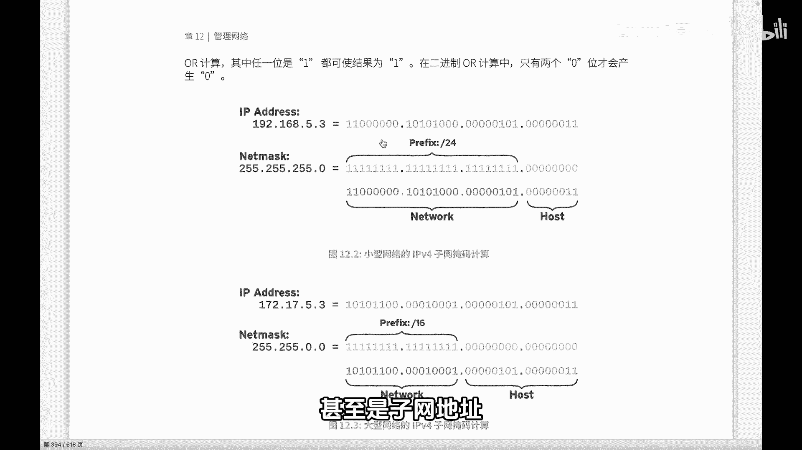
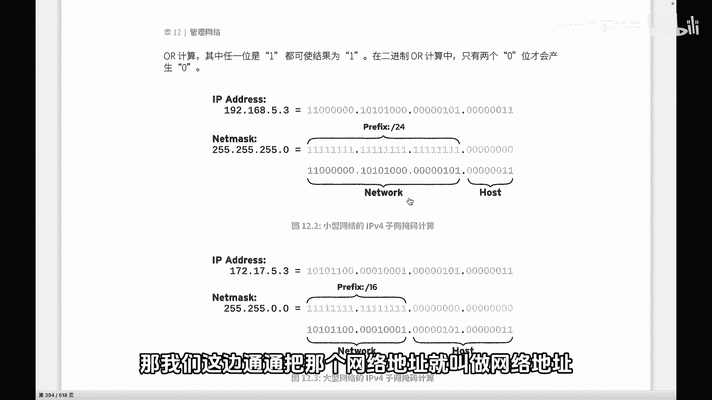
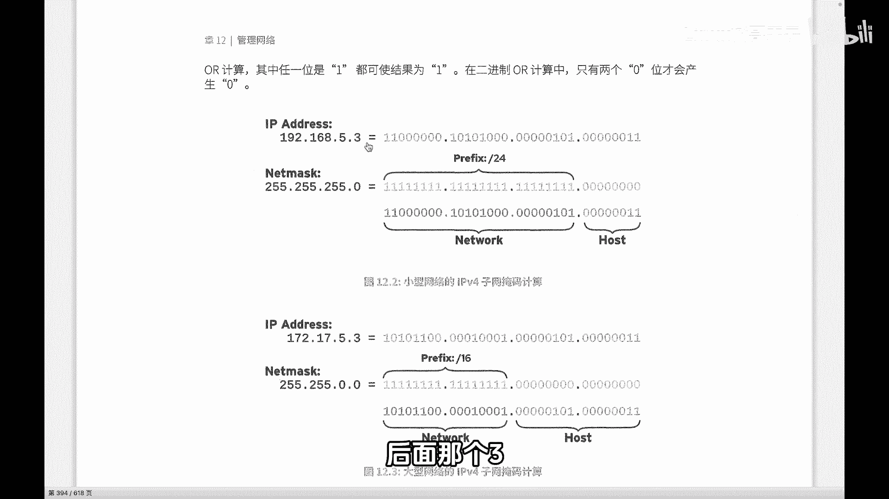
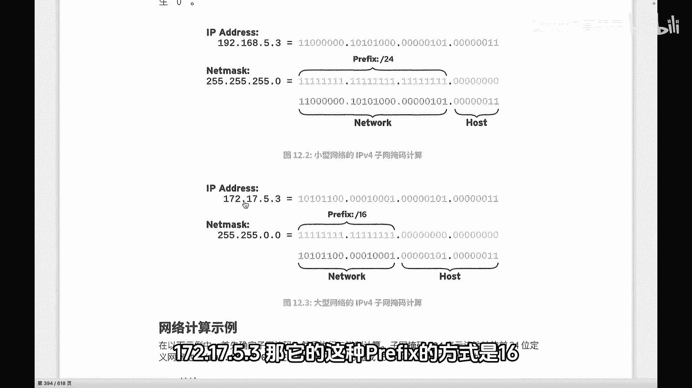
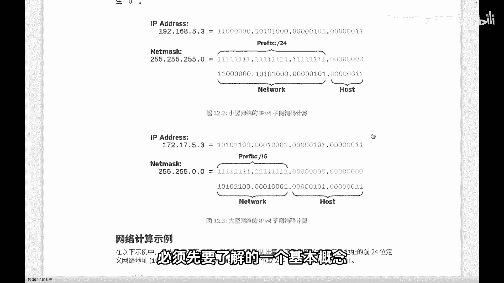

# 史上最强Linux入门教程，杨哥手把手教学，带你极速通关红帽认证RHCE（更新中） - P94：94.IPv4子网和子网掩码 - Linux杨哥天云 - BV1FH4y137sA

如果你是初业者，那么我们有必要了解一下IP地史的一些基础知识。🎼首先呢我们比较常用的是IPV4。那么IPV4来讲的话呢，大家看到这就是1个IPV4的一个地址。那准确的说，这是1个CD地址。

🎼那后面呢实际上我们知道IP地址呢，特别是我们IPV4，它是1个32位的二进制的一个地址。因为我们在传输的时候最终都使用是二进制01的这种二进制。那为了这个配置方便，或者说我们边语去配置于使用。

所以呢把32位这个地址呢每8个也就是一个字节啊，8位呢分成一个部分用点分开，然后再将每一个部分呢转成十进制，这个过程叫点分十进制也就是说IP地址呢32位实际上是四个字节那另外我们在配置IP的时候。

那通常呢是需要配置子网掩码的大家看到啊这个子网掩码呢它只有两种啊形式啊，当然II也是一样，也是这个0110但是子网码呢它是连续的一是连续的，后面是这个是不一样的。它用一来表示对应的表示什么？

这个部分是属于网络地址。因为IP地址实际上是分为2块的啊。那有同学说分3块也可以比说它是有网络地址啊甚至是子网地址，还有主题地址。那我们这边。

🎼通把那个网络地址就叫做网络地址了。那按照当前我们看到的是这个IP和这个掩码，那这边是前面的3啊333824啊，是我们的这个子网掩码。凡是是一的地方呢，表示对应的是网络地址。

也就是说这个IP配这个子网掩码以后，这一部分是网络地址，这一部分也是网络地址，这一部分也是。

🎼那如果用这个前缀的方式表示，就是斜信24表示就是24位，其实呢用实际率表示就是252525。0。因为子网掩码是用来确定哪一部分就是这个IP地址当中，哪一部分是属于网络位，哪一部分是属于主机位的啊。

所以这边1921685。3，那网络地址是什么？1921685，这是网络地址，后面那个三呢是主机地址。

🎼那同样的呢，我们拿这个B例地址来进行看一下啊。🎼这个是一个啊源码是我们看到是16位的这样一个地址，172175。3。那它的这种profi的方式呢是16啊，这里表示呢17217是网络地址，然后5。

3呢是属于主地址。那么这个网络地址和主题地址呢？特别是我们在通讯的过程当中，在寻址的过程当中，其实最关注最关注的呢？首先是网络地址。也就是说这个将影响到我们这个地址。

我们这个数据包能不能送得到是区的哪个地方，也就像我们现在比如说我们要去快递员送快递啊，我们要送到上海的某个某个街道啊，某个门牌，首先肯定重点是关注上海啊，上海，也就是说是关注的是它的一个网络地址。

🎼然后再关注到相应的一个底下的一个主机地址。所以这个这个会影响到我们后面的主机的一个寻址啊，所以这是初约者必须先要了解的一个基本概念。

