# 史上最强Linux入门教程，杨哥手把手教学，带你极速通关红帽认证RHCE（更新中） - P95：95.我来自哪个家族上 - Linux杨哥天云 - BV1FH4y137sA

🎼我是谁？我的家族有些成员，这个是每一个人都必须知道的。那比如说我们看到这样1个IP地址。🎼1921681。107，我们是要去确定我这个IP地址，我是在哪个网络里面。然后呢，我的主机地址是多少？

我的网络地址是多少？还有呢就是我这个网络，我所在的网络到底是主机是从哪个地方到哪个地方。还有一个是什么呢？就是我所在的网络。

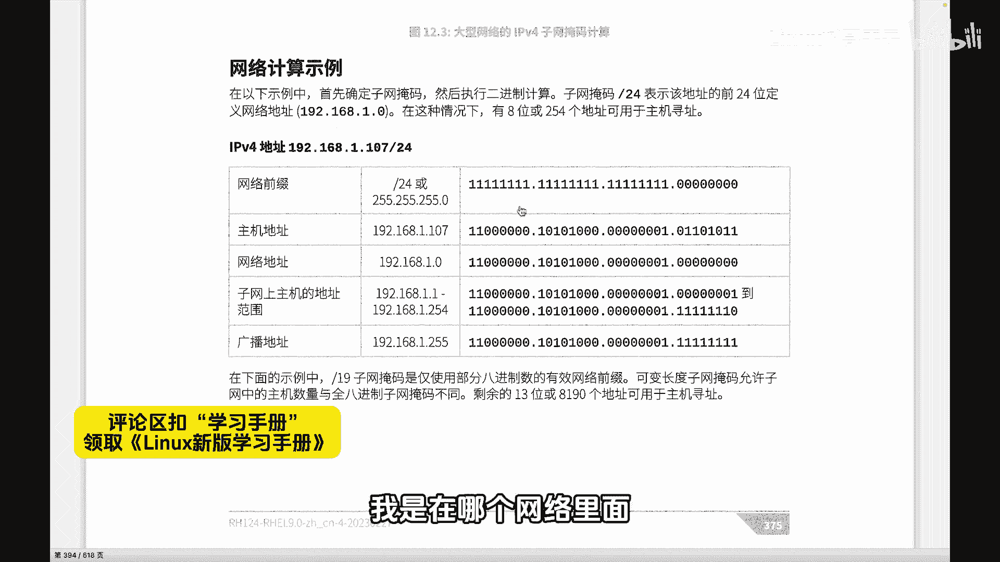

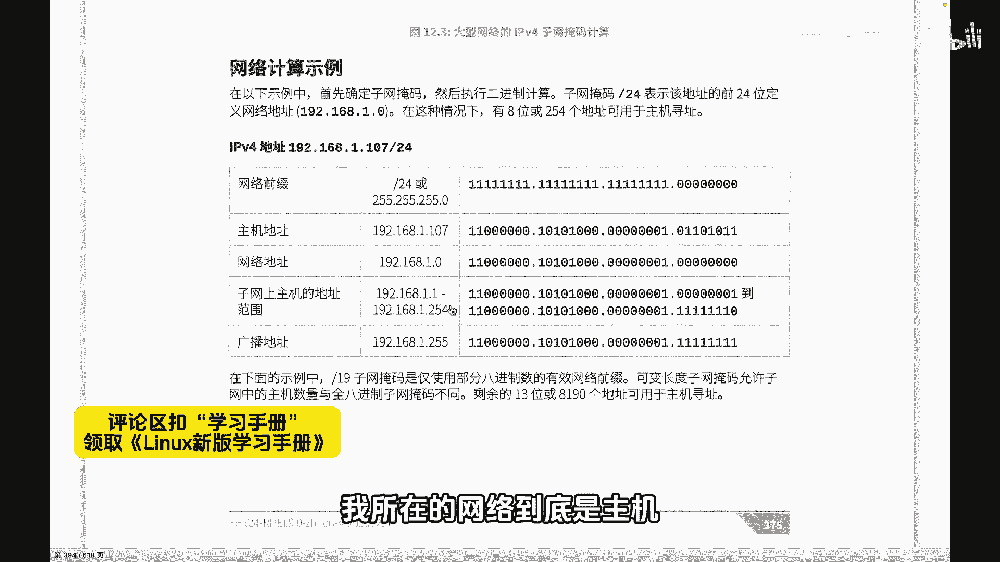

广播地址多少？🎼这些都跟我有关系啊，所以比方说拿到这个1921681。107-24的这样一个地址。

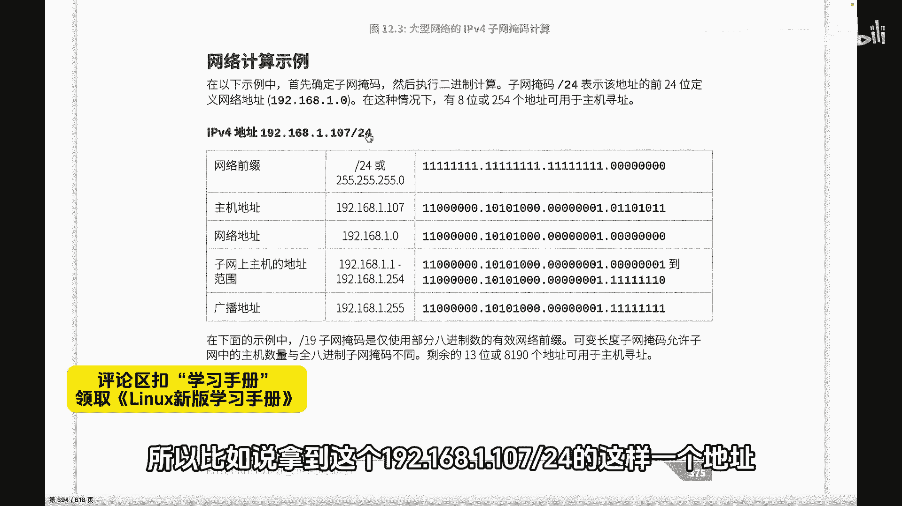

🎼杠24呢是指野码啊，我们看到这个叫网络前缀，我们可以写成旗线24或者是2525。0，或者是呢二进制呢，就是3824个18个0。然后紧接着呢我们确定呢其实我们的网络地址呢，192168。1。0。

为什么1。0呢？因为野码决定呢？这三个部分，第三个部分呢是网络地址，后面那个地方是主地址。所以呢前面的也就是1921681，后面呢是0啊，就是野码决定的，这是网络地址，也就是我所在的网络。然后呢。

当然我的主机我的这个地址呢肯定是不变的，是1921681。107不变的。然后以及首先这个1。0是网是网络号，也就是我我这个IP我所在的家族。然后呢这个地址当然是不能使用的啊，跟大家说一下。

这是我们的网络地址就相当于家族号一样。后面那个广播地址呢也是不能直接作为这个原地址使用的，也就是不能给某一个人设置。但是我们后面会通过一些方式，比方说去这个广播的时候，这个时候是需要用到这个地址的。

那用到这个地址的时候，你就知道你应该向哪个网络发广播。向哪个地址发广播。所以。

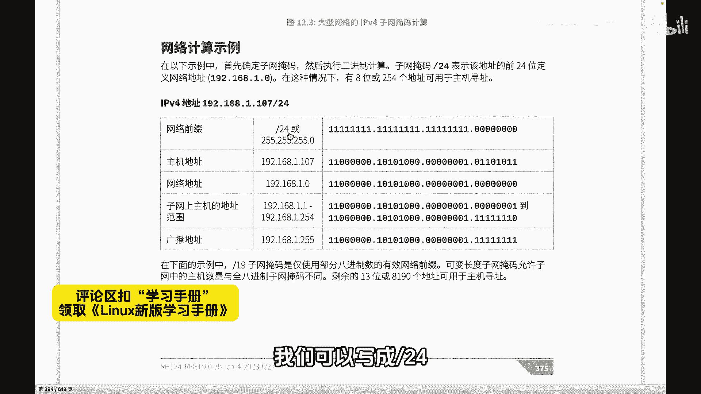

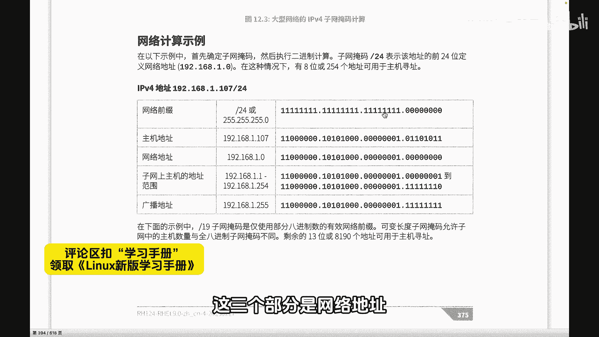

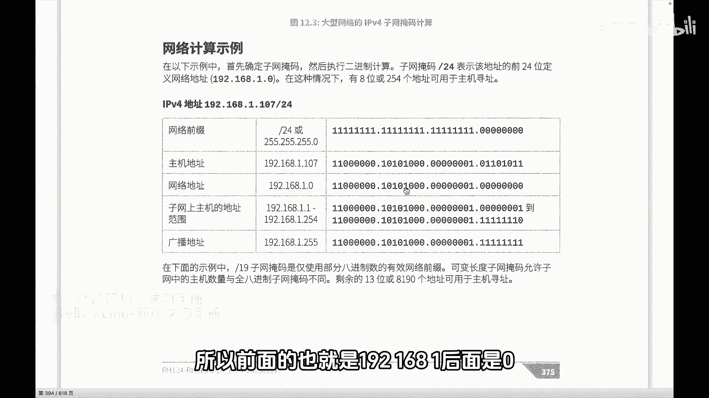

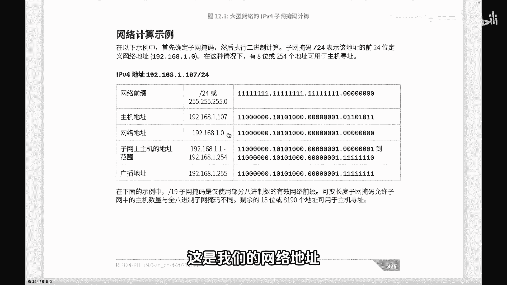

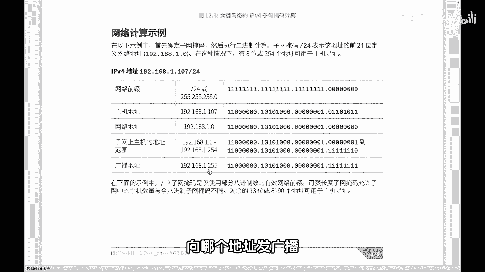

🎼广播地址它指的是什么呢？指的是主机位权为一，就是广播地址，也就是最后一个地址。主机位权为零呢，就是我们说的网络地址，你可以认为是这个网络里面第一个地址是网络地址，代表是整个家族的一个一个相当一个名牌。

广播地址呢，就是我们这个最后一个这两个地址呢，都是不能说不能用啊，是不能作为原地址使用，是可以在特定的时候要用到的。

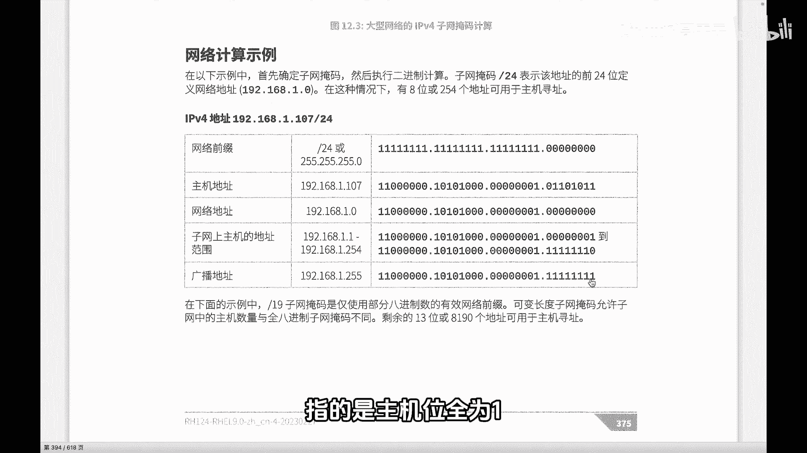

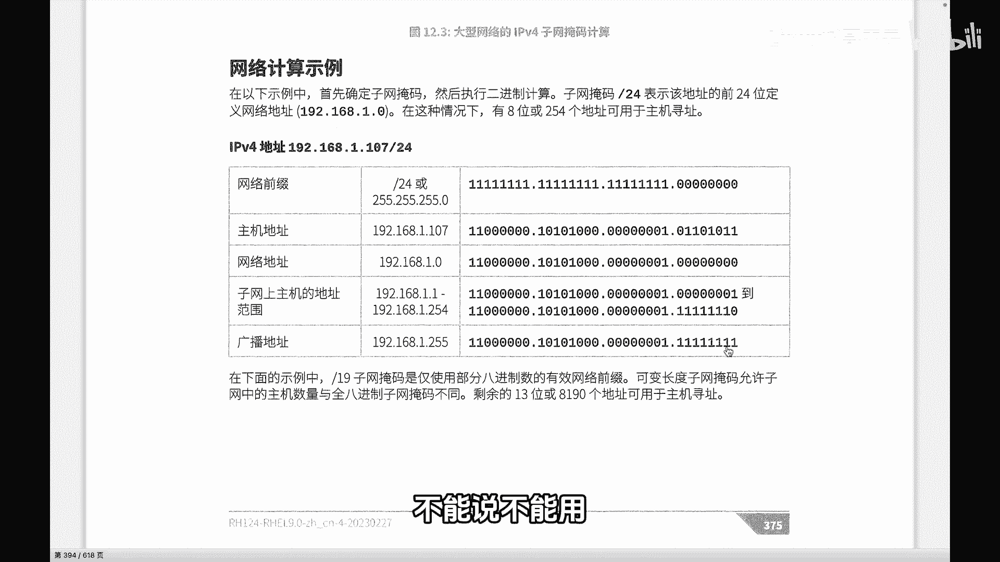

🎼然后整个我们这个家族当中呢，可以就是和我一个线儿的，和我一个级别的啊，就是我们都是一个一个辈份的是哪些人呢？那就是从1。1到1。254。换句话讲，就是从1。0后面那一个到1。25最后一个。

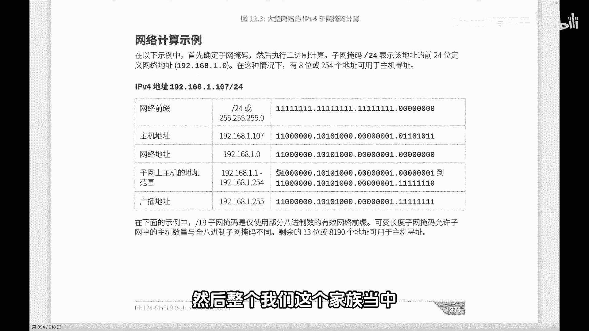

🎼也就是把那个主机位呢啊从一开始，最后一呢不能全为一，因为权为一的话就是广播地址。如果全为零的话呢，就是我们说的网络地址。好，所以每一个地址它都有自己的一个属性，也就是说他有自己的根据野码啊。

能够确定他是谁，他在哪个网络领域啊，他的家族是哪个网是是谁？他家族的这个成员有哪些？1到254，这是他的兄弟姐妹和他一个级别。还有呢他的一个最高的那个那个统帅1。25，这是他们的广播地址啊。

这是我们通过野码来确定。

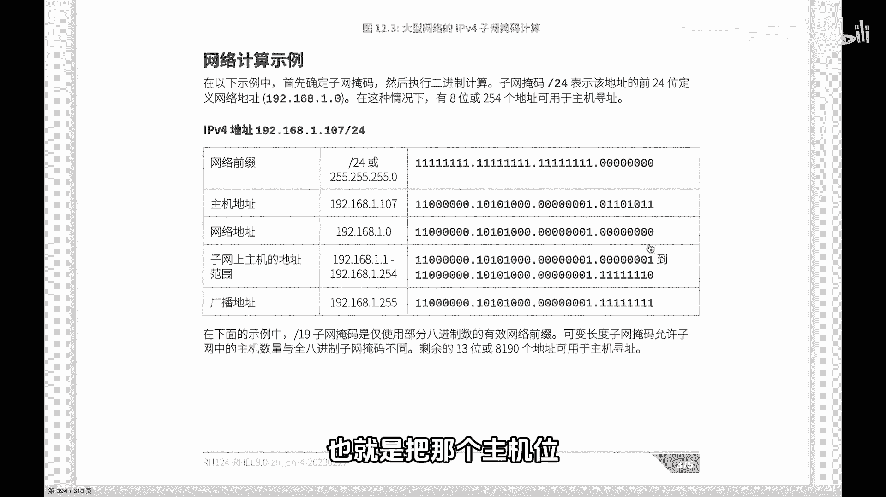

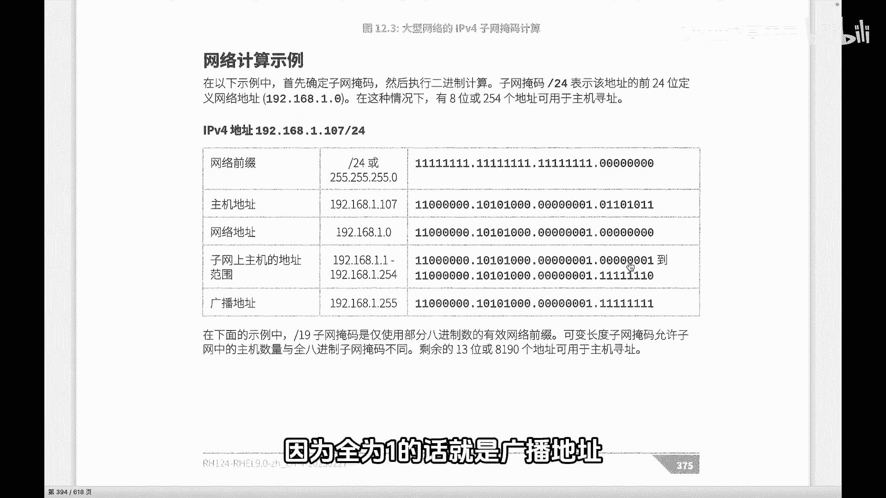

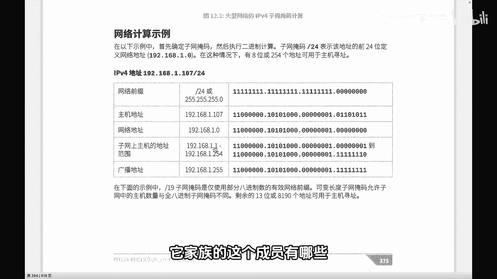

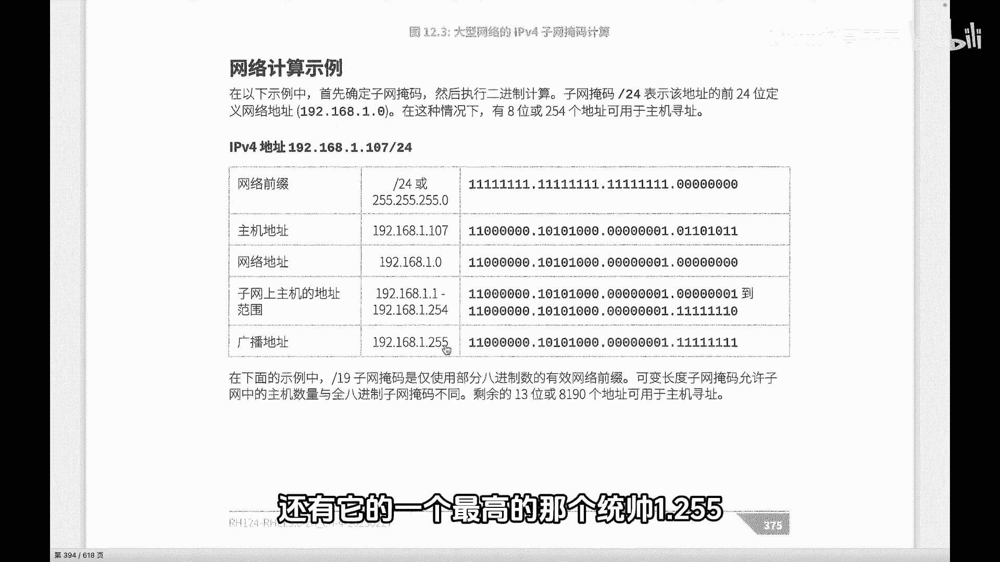