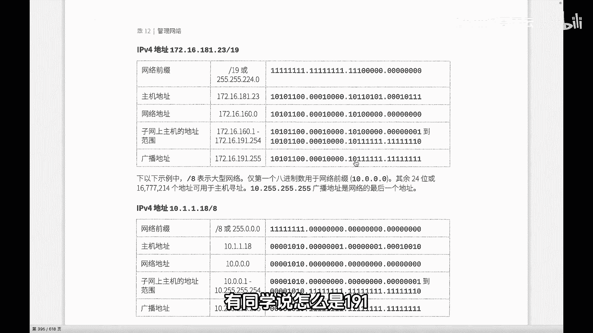

# 史上最强Linux入门教程，杨哥手把手教学，带你极速通关红帽认证RHCE（更新中） - P96：96.我来自哪个家族下 - Linux杨哥天云 - BV1FH4y137sA

🎼小伙伴们，我是杨哥。接下来我们再带大家看一个相对来说特殊一点的IP地址。我们看一下他怎么找到他的家族以及他家族的成员。首先给定的是这样1个17216181。23的一个斜线是9的地址。

后面那个斜线是9呢指的是掩马，野码的位数啊，8位8位三位，一共是19位，这个没问题。所以呢得到的十进制呢，这个也没问题，25525，后面三个亿呢就是我们的224。第一个一呢是128，第二个亿是64。

第三个1是32，所以加起来是224。然后紧接着呢，IP地址呢，我们将去转换成二进制。然后再紧接着我们先找到他的网络地址，这个比较简单，就是按刚才所说的，然后掩码所对应的位置，就是网络地址。

那前面这个不没问题，全是也就是172全是这个也全是也就是16全是。第三1个呢是111，这个位置，也就只有前三位是，换句话讲，这个是这个10110101，也就是181，对不起，这个就不不全是网络地址。

只有前。

🎼三个部分，也就是前三位，那么也就是101，这是重点。各位看清楚了吗？101，其他的呢我们是网络地址呢就是主机位权为0。你看101，这就是前面19位嘛，所以呢大家看到的结果这个是怎么好像很奇怪。

这样1个IP它所在的子网怎么是160呢？这个并不奇怪，因为它决定的野码决定的只有这三部分是网络地址。所以101，那就是我们的128加32，也就是160。这个可能你觉得生了儿子跟父亲长得不一样。

这个也不要觉得很奇怪，这有时候是正常的啊。😊。

🎼那可能就很好看一些，所以这是160网段。那么由此得知呢，他所在的家族就是160网段。

🎼那么这个是网络地址，有网络地址以后呢，我们就能够得到得到什么呢？其他的信息。比如说什么呢？第一个地址就是我们的17216160。1点1嘛，第一个嘛，网络地址加1个点1，然后紧接着呢把主机地址全换成一。

就是我说网络地址啊，就是191。255啊，这边全换成一，有同学说怎么是191呢？看101，这个是不变的。听清楚了吗？101是不变的，后面全换成一，那这个加起来呢就是191啊，这个是我们255。

中间的160。1到191。254是。😊。

🎼整个可用的主机的一个范围。所以我们拿到一个地址，要根据其掩码来决定它在哪个网段，以及呢这个网段里面的哪一些主机，以及它的广播地址是想什么？这个全是通过这种掩码的这种运算来得到的。好，大家一定要看清楚。

不要觉得好像这两个之间没有关系。从肉眼上看确实感觉一下看不出来啊。但实际上呢二进制的这个结果是肯定的。

