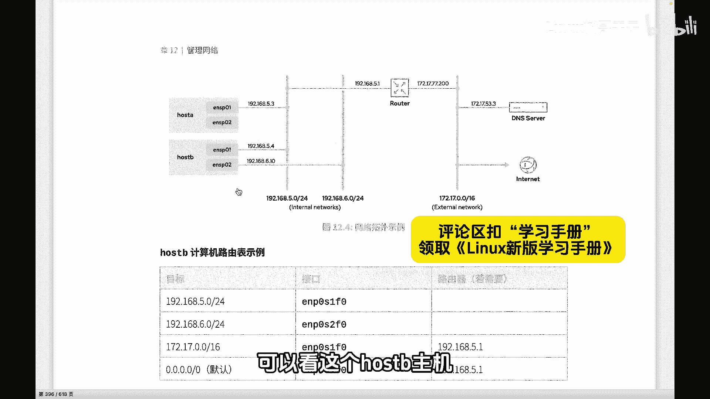

# 史上最强Linux入门教程，杨哥手把手教学，带你极速通关红帽认证RHCE（更新中） - P97：97.IPv4路由基础知识 - Linux杨哥天云 - BV1FH4y137sA

🎼接下来我们通过这样一个top扑结构来了解路由的一些基本概念。好，各位看到这边有几个网段，分别是5。0网段、6。0网段，还有呢我们的外部网络172170。0网段。

我们以这个hos B主机为例，可以看这个hos B主机呢有两个接口，01和02，分别是属于5。0网段和6。0网段。然后呢这个这是。

host B主机的路由表。

🎼所谓路由表呢就是描述了我们到达某个网段或某个IP从哪个接口出去，然后呢，要不要路由，要不要找路由器啊，这是我们自己可以解决呢，还是要叫个路由器去解决呢。当然大家可以想到，我们自己如果能够。

🎼触达的地方，比如说同一个网段，那肯定我们自己就可以去解决了。我们可以路由了。

🎼然后如果到不了的话呢，那我们就要交个路由器。这个道理很简单。如果你要把你的这个信件送给你同一个班的这个女朋友，女朋友A，那跟你跟你在一个班或者在一个楼，你走过去就可以。

但如果说你要把信拔花送给你上海的女朋友B。这个时候呢，恐怕你要交给快递交给你最近的快递，要经过一定的路由，最后到达你女朋友手上。那么无论是我们在网络中的路由器，还是我们在主机通讯的时候。

我们都会有路由表。路由器有路由器路由表，主机有主机路由表，总之呢，他们所描述的东西呢都是很相似的，也就是到达某个目标，这个目标可能是个网段，可能是个IP然后呢，从那个接口出去。

🎼然后以及呢要交给谁，是我们自己可以搞定，还是交给谁，是这录入表。好，各位可以看一下host的B当前录入表。

🎼这一条一条我们叫路由条目啊，到达5。0高24这个网段，我们是从。

🎼一号接口连从这个叫叫什么一号接口出去啊，有有同学说怎么这个接口的名字和上面那个名字不一样啊。这个在之前给大家简单解释过，接口的名字和网卡配置的名字是可以不一样的啊。然后这个6。0网段从这个接口出去。

因为这个接口呢是我们六网段对吧？它不不需要进路由器，换句话讲，如果说我们一个数据包要送达到6网段的主机网的主机，直接从这个接口抛出去就可以然后去找他的m地址就可以啊，一个网段。

那如果说我们现在要把数据包要发送给这个DNS服务器，我们要让他去帮我解析，我们都是以B主机为例啊，然后1721753。3这个IP那首先我们要判断能不能到达这个网段呢？

那我们通过查路由表看到哦这个IP它是属于172170。0-16这个网段，也就属于这个网段的啊。所以呢我们通过第三条路由条目就可以来确定这个数据包该怎么走OK从这个接口从零一接口出去呢？然后呢。

我们的要交给我们路由器。😊。

🎼一这个路由器通过路由器就可以到达，然后再紧接着呢下一套下一套怎么路由这路由器的事情啊，到达我们目标目标主机。那如果我们要访问的是其他主机呢，表示互联网上通过DN解析以后。

我们要访问的是别的IP别的主机啊，比如随便1个202点什么什么的一一个主机。这个时候呢，我们通过查询路由表发现目标不是去往这个网段。所以这条条目对它无效，也不是去要去往这个网段无效，也不是去往这个网段。

这个条目无效，那我们就有一个叫默认路由。所谓的默认路由呢，它也叫做默认网关，也就是除了这个什么前面可以到达以外的这个任何地方，那我们就走默认网关啊，同样呢是由这个。😊。

🎼这个零1接口出去，然后呢交给我们的路由器5。1，这下的事情就不管了。好，这是我们的一个路由条目。所以呢所有主机在通讯的时候啊，不管是局域网还是通过去访问互联网啊，都要去查询路由表。

如果说路由表当中没有对应的条目，那么这个接口叫做什么网络不可达。这个大家一定要听清楚了啊。那后面我们会教大家怎么去配置，或者怎么查看路由表啊，首先大家要了解这个概念。

