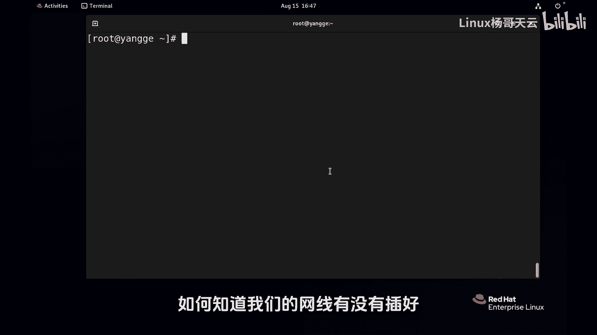
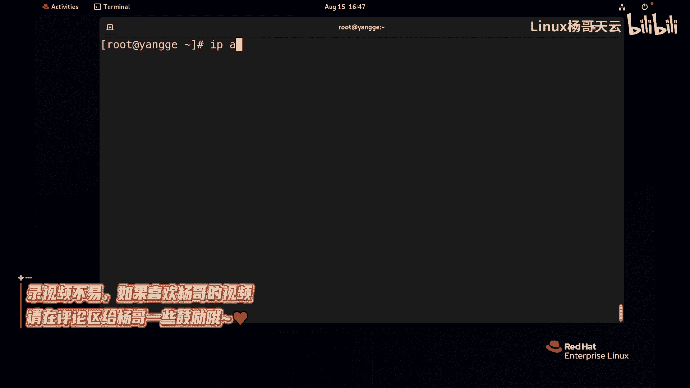
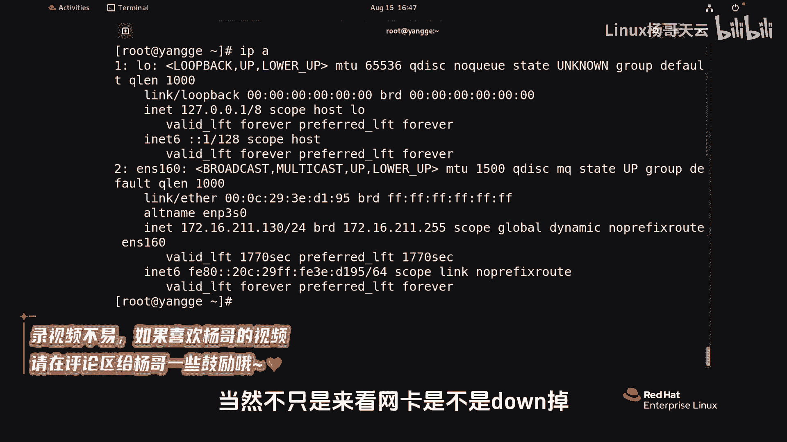
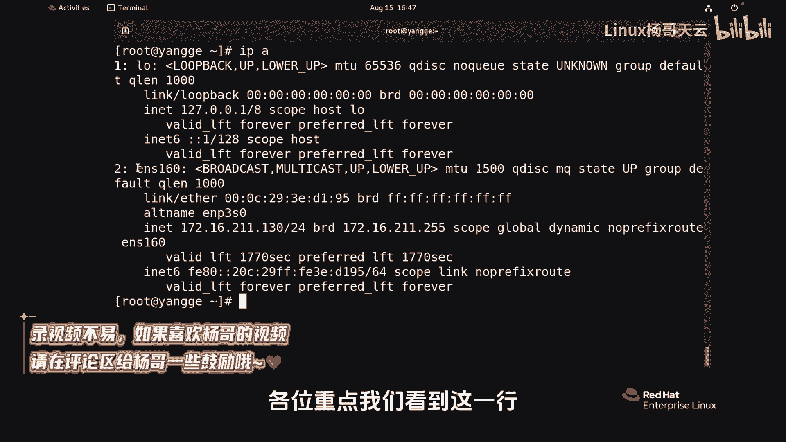
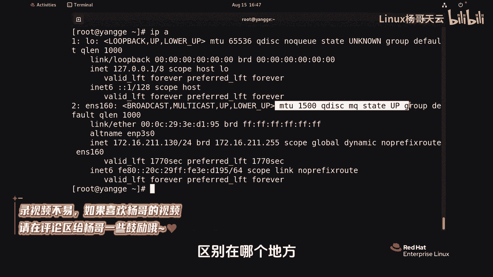
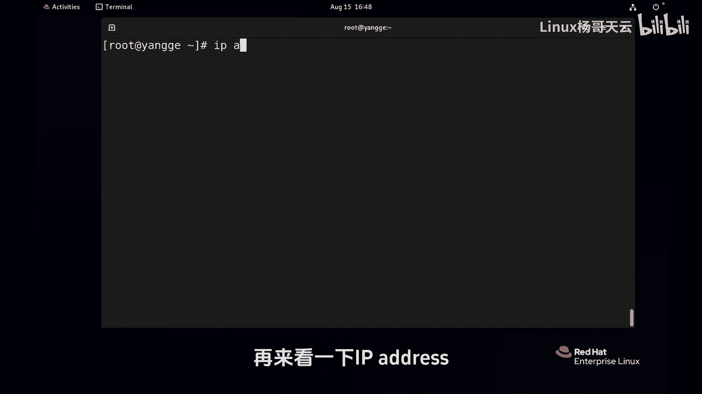
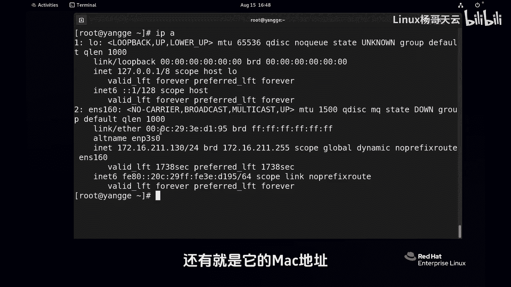

# 史上最强Linux入门教程，杨哥手把手教学，带你极速通关红帽认证RHCE（更新中） - P98：98.如何知道网线是不是断了 - Linux杨哥天云 - BV1FH4y137sA

🎼如何知道我们的网线有没有插好，比如说是不是断了，那我们可以通过IPA，也就是IP address的这个命密来查看相关的信息。那这个信息呢当然不只是来看网卡是不是宕掉啊，还有别的信息。

各位重点我们看到这一行，这是我们的一个网卡，它有相关的一些状态啊，大家可以对比一下啊，这边我想说的是当前这个网卡是网线是连着的。好，同学们可以对比一下，区别在哪个地方。下面呢我认为的将这个网卡给它断掉。

好，再来看一下IP address。相信大家应该能看的很清楚啊，这边有一些信息呢已经展示了网卡其实是宕掉的。比如说状态是宕。还有呢look这是没有什么没有载体，那是没有载体，所以它的这个状态是宕掉的啊。

这是一个。😊。

🎼特别的一个简单的一个方式啊。当然除此以外呢，我们还能看到这个网卡的一些信息，比方说他的IP地址啊，它的广播地址啊，还有呢就是它的mac地址这样一些信息啊，这是一个最基本的方式。😊。

