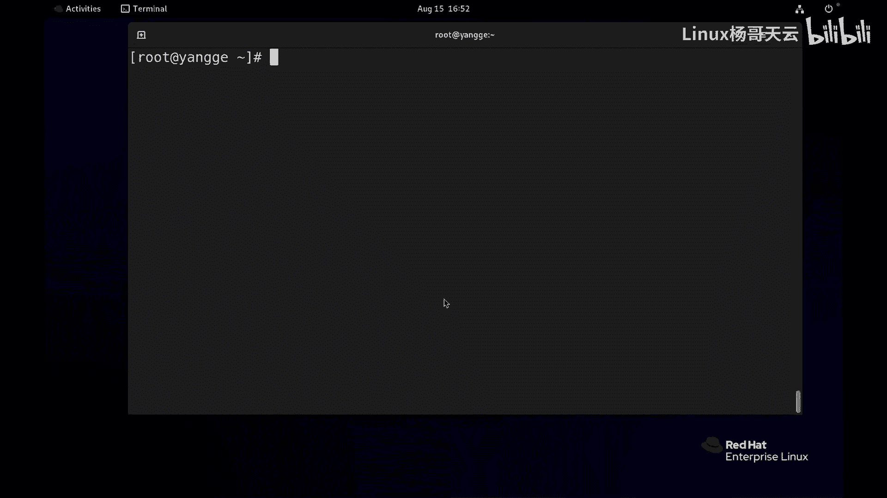
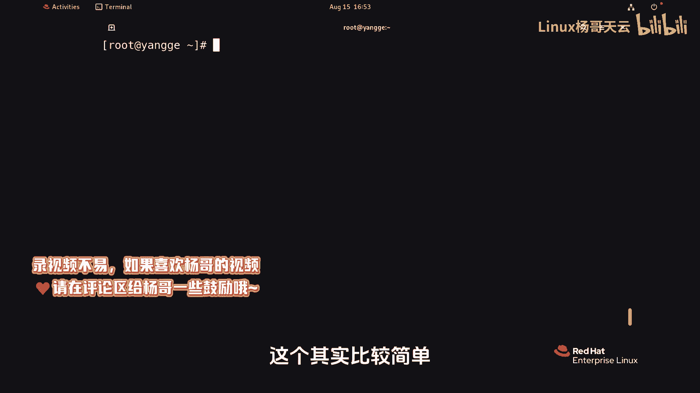
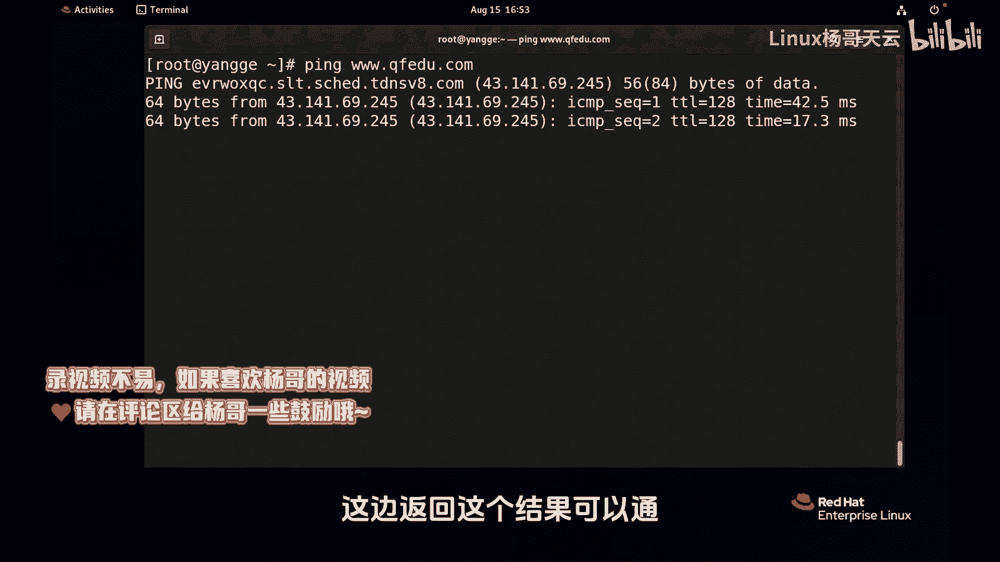
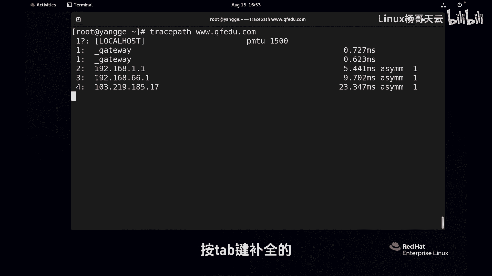
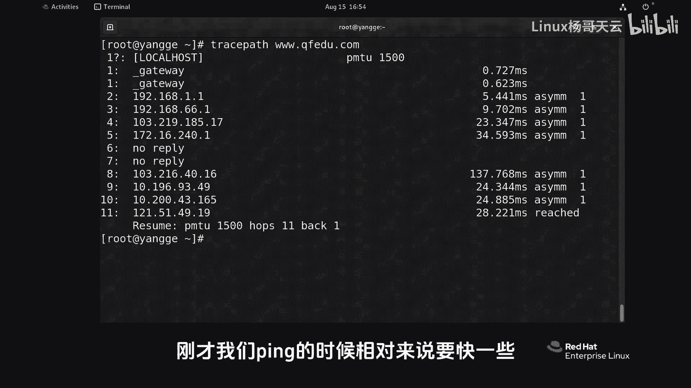
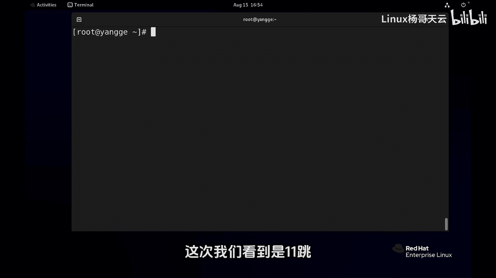
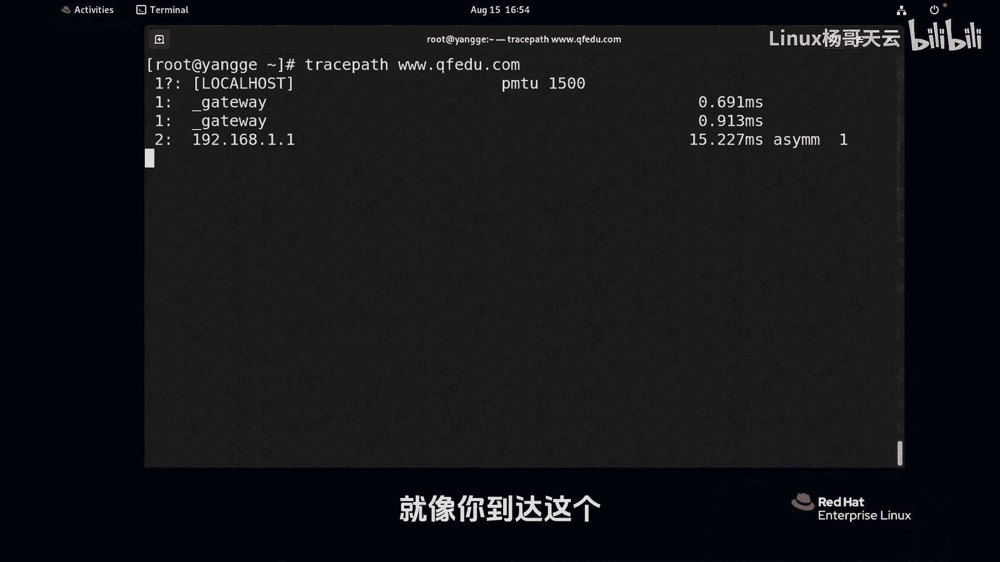
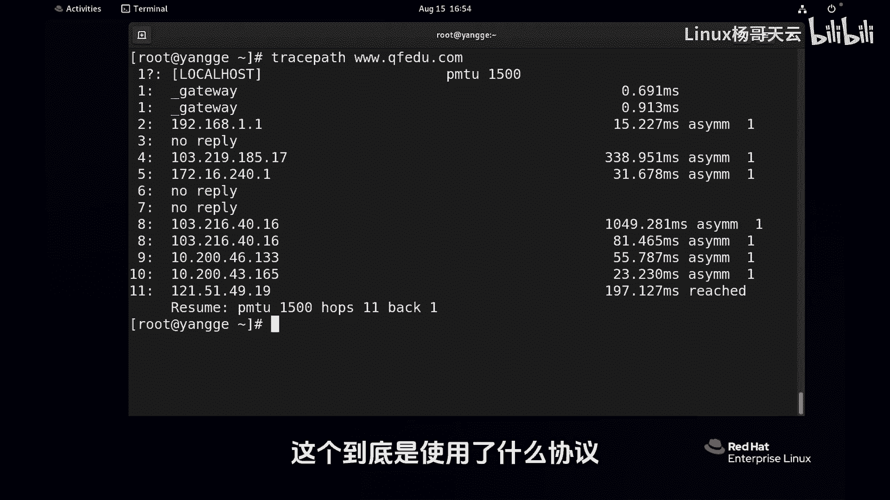
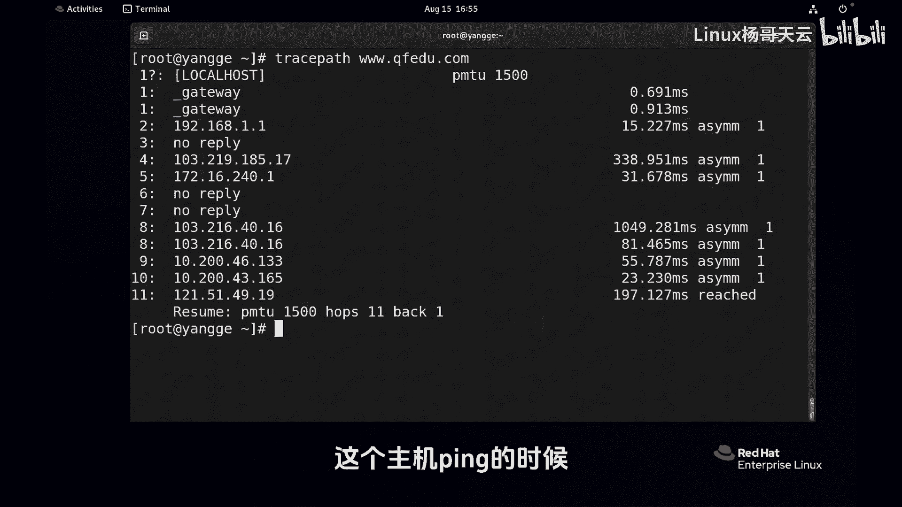
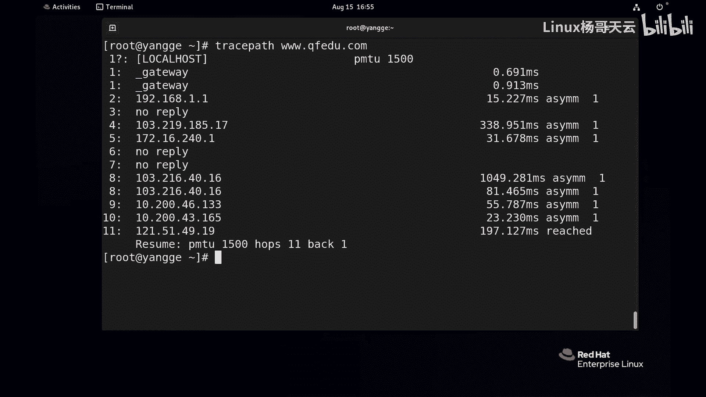

# 史上最强Linux入门教程，杨哥手把手教学，带你极速通关红帽认证RHCE（更新中） - P99：99.如何知道到达目标经过了哪些地方？ - Linux杨哥天云 - BV1FH4y137sA

如果我想要知道和目标主机是不是通，其实这个比较简单，我们可以使用P。但是如果我们想知道到达目标主机当中走过了谁经过了哪些路由器，这该怎么查看呢？首先我们想要知道到达目标主机能不能通，这个其实比较简单。

直接使用P目标主机就可以，可以使用IP或者是域名啊，这边返回这个结果可以通crC。那刚才我们讲的我们想要知道到达目标主机到达这个主机要经过。😊。

🎼哪些路由器它是怎么走的？所以我们有另外一条命令叫tra啊，就可以补全truss pass这样一个命令。好玩，table键补全的，大家可以等待一下，其实这个结果大家发现比刚才要慢。

刚才呢我们拼的时候相对来说快一些，但现在呢慢了一点，有同学知知为什么吗？😊。

🎼或者说这个是喜用什么协议吗？😡，🎼很显然，他最后踏测出来了，我们整个路上要经过。😊，🎼多少跳可能每次还不一样。这次呢我们看到是11跳，我们有可能下一次呢有可能走的是另外一条线。就像你到达到达这个啊。

比如到到内蒙，你可以走这个高速，也可以走那个高速。那结果呢可能到达的这个距离呢上呃是不太一样的，通过的地方是有一些区别的啊，这边还是一样啊，我记得上次我在探测的时候走的是14条啊，十4条。

这个大家可以自己试一下，这个到底是使用了什么协议，它是基于什么原理？另外为什么我们同样去访问这个主机。😊。

🎼拼的时候好像没有花这么长时间，但是我trapa的时候，去探测路径的时候，发现所经过的时间是相对来说比那个要长一点的这是为什么？好，同学们可以在评论区啊去交流啊。😡。

