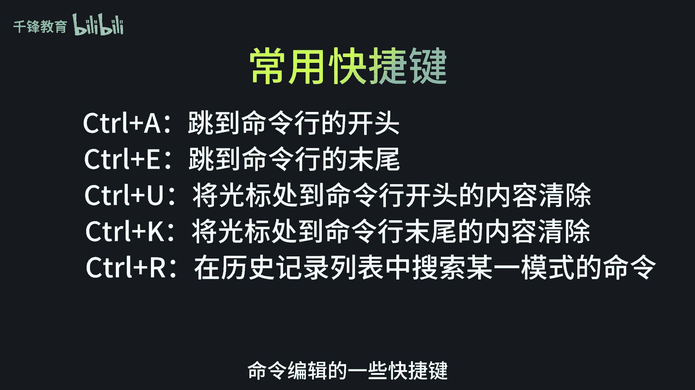
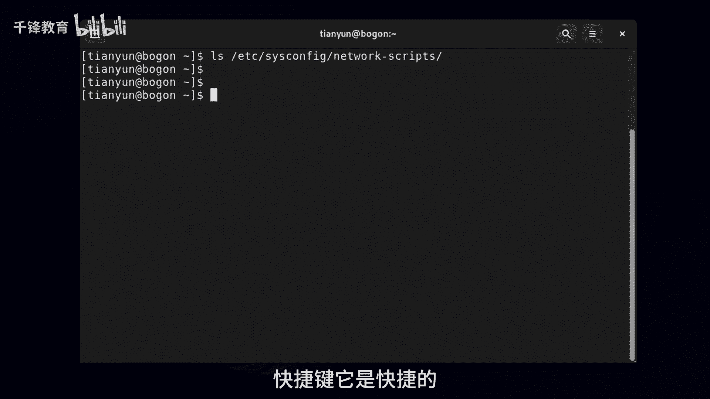
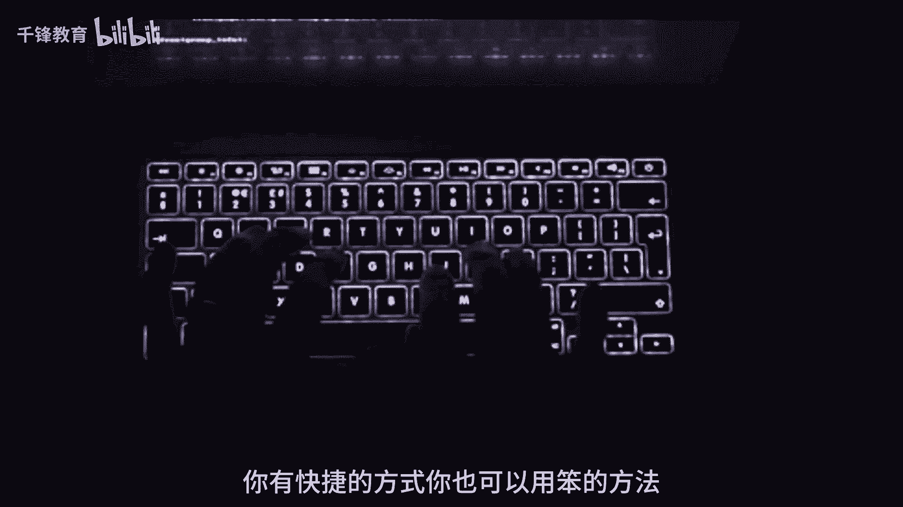
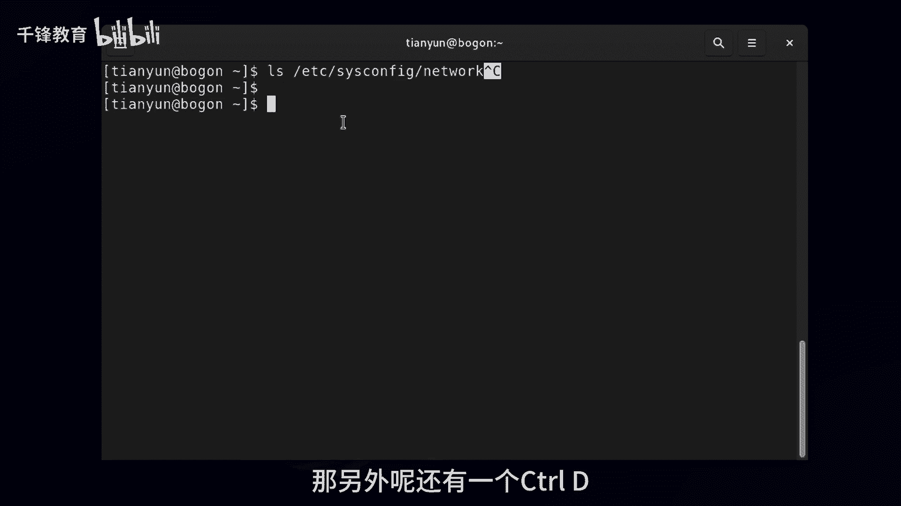
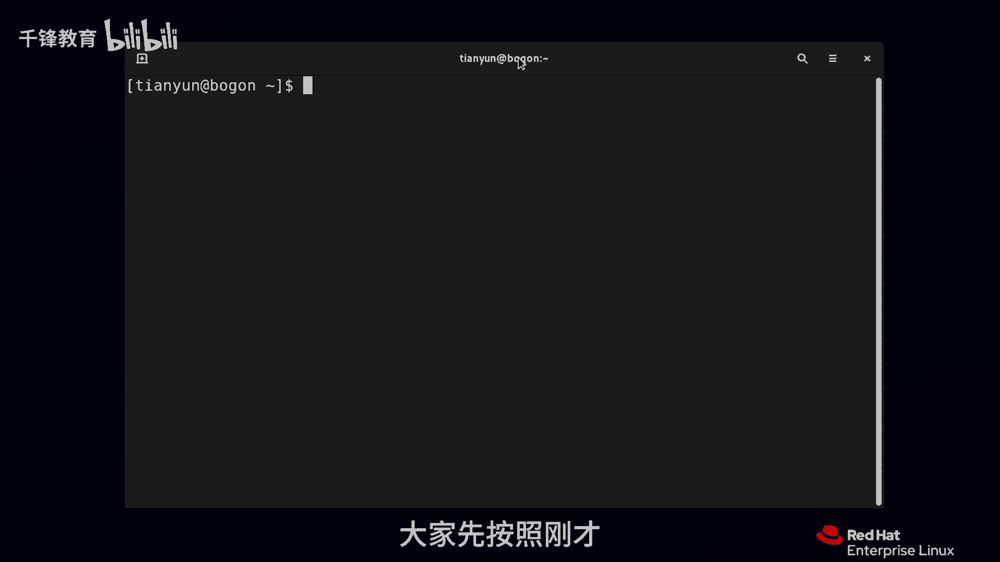

Linux入门与红帽认证：010：Bash Shell常用快捷键 🚀

在本节课中，我们将学习Bash Shell中一些常用的快捷键。掌握这些快捷键可以极大地提高你在命令行中编辑和执行命令的效率，是Linux学习中的必备技能。

上一节我们介绍了命令历史的相关操作，本节中我们来看看如何更高效地编辑当前命令行。

### 光标移动快捷键

在编辑命令时，快速移动光标可以节省大量时间。以下是两个最常用的光标定位快捷键：

*   **`Ctrl + a`**：将光标快速移动到**命令行的最开头**。
*   **`Ctrl + e`**：将光标快速移动到**命令行的最末尾**。

你无需担心光标位置会影响命令执行。无论光标在命令行的哪个位置，按下回车键 `Enter` 都会执行当前命令。

### 文本删除快捷键

当你需要删除部分命令内容时，使用快捷键比逐个字符删除要快得多。

以下是删除文本的快捷键：
*   **`Ctrl + k`**：删除从**当前光标位置到命令行末尾**的所有内容。
*   **`Ctrl + u`**：删除从**当前光标位置到命令行开头**的所有内容。

### 其他实用快捷键

除了编辑，还有一些快捷键用于控制命令的执行和会话。

以下是几个关键的操作快捷键：
*   **`Ctrl + r`**：这是一个非常实用的功能，用于**反向搜索历史命令**。输入关键词后，Shell会动态匹配并显示过往的命令。
*   **`Ctrl + c`**：**终止当前正在运行的命令或取消当前输入的命令行**。系统通常会显示一个 `^C` 作为视觉反馈，以区别于回车执行。
*   **`Ctrl + d`**：发送一个 **EOF（文件结束符）**。在空命令行上按下此组合键，效果等同于输入 `exit` 命令，**会退出当前的终端会话或子Shell**。

请注意，像 `Ctrl+e`、`Ctrl+u` 这样的写法，前面的 `^` 符号代表 `Ctrl` 键，这是一种常见的表示法，在实际操作中需要同时按下 `Ctrl` 键和对应的字母键。

本节课中我们一起学习了Bash Shell的核心编辑快捷键，包括光标移动（`Ctrl+a`/`Ctrl+e`）、文本删除（`Ctrl+k`/`Ctrl+u`）以及命令控制（`Ctrl+r`/`Ctrl+c`/`Ctrl+d`）。多加练习，这些快捷键将成为你高效使用Linux命令行的得力助手。