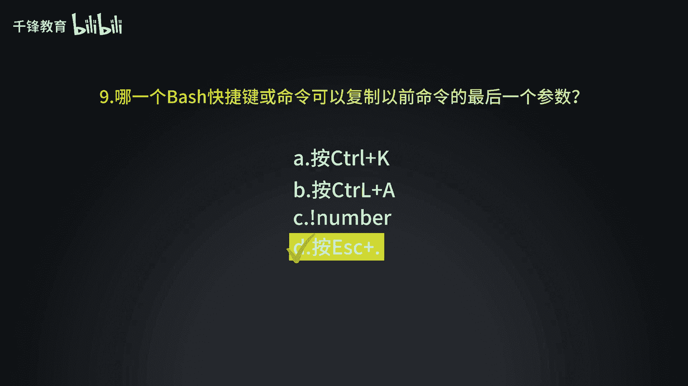

Linux入门与RHCE认证：011：使用Bash Shell执行命令小测验

在本节课中，我们将通过一个小测验来检验你对Bash Shell基础命令的掌握情况。测验包含八个问题，涵盖了命令执行、路径切换、文件操作等核心概念。

---

上一节我们介绍了Bash Shell的基本操作，本节将通过测验来巩固所学知识。请尝试独立回答以下问题。

以下是测验题目：

1.  如何查看当前所在的工作目录？
2.  如何列出当前目录下的所有文件（包括隐藏文件）？
3.  如何切换到用户的家目录？
4.  如何创建一个名为 `testdir` 的新目录？
5.  如何查看文件 `/etc/passwd` 的内容？
6.  如何将“Hello World”这句话输出（回显）到终端？
7.  如何清空终端屏幕？
8.  如何获取 `ls` 命令的详细帮助信息？


---

现在，让我们逐一查看这些问题的答案与解析。

1.  **查看当前工作目录**
    使用 `pwd` 命令可以打印当前工作目录的完整路径。
    ```bash
    pwd
    ```

2.  **列出目录下的所有文件**
    使用 `ls` 命令配合 `-a` 选项可以显示所有文件，包括以点（`.`）开头的隐藏文件。
    ```bash
    ls -a
    ```

3.  **切换到用户家目录**
    使用 `cd` 命令而不加任何参数，或者使用 `cd ~`，都可以快速返回到当前用户的家目录。
    ```bash
    cd
    # 或
    cd ~
    ```

4.  **创建新目录**
    使用 `mkdir` 命令后接目录名，可以创建新的目录。
    ```bash
    mkdir testdir
    ```

5.  **查看文件内容**
    使用 `cat` 命令可以连接并显示文件的内容。
    ```bash
    cat /etc/passwd
    ```

6.  **输出文本到终端**
    使用 `echo` 命令可以将后面的参数（字符串）打印到标准输出（通常是终端屏幕）。
    ```bash
    echo Hello World
    ```



7.  **清空终端屏幕**
    使用 `clear` 命令可以清除当前终端屏幕上的所有内容，让光标回到左上角。
    ```bash
    clear
    ```

8.  **获取命令帮助**
    使用 `man` 命令后接你想了解的命令名，可以查看该命令的详细手册页（manual page）。
    ```bash
    man ls
    ```

---

本节课中我们一起学习了八个基础的Bash Shell命令及其常见用法，包括 `pwd`, `ls -a`, `cd`, `mkdir`, `cat`, `echo`, `clear` 和 `man`。通过这个测验，你可以检查自己对Linux命令行基础操作的熟悉程度。熟练掌握这些命令是进行后续更复杂系统操作和通过RHCE认证的重要基石。